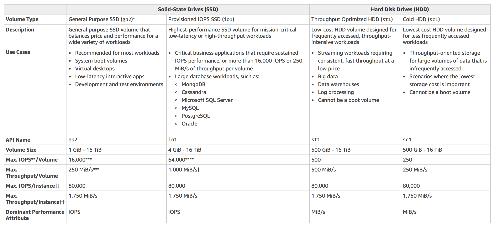
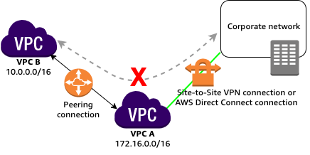
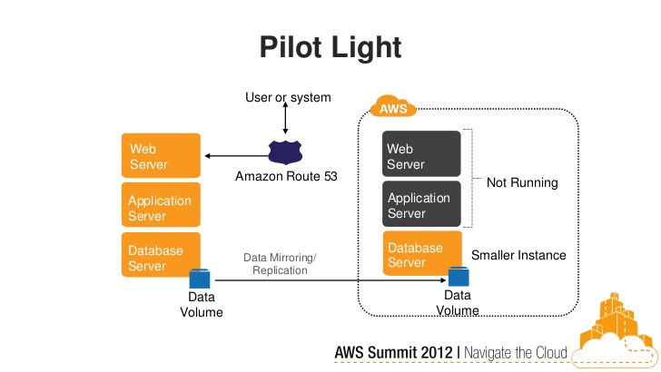

# Practice Test 1

- Took a practice test to check my understanding of the topics after taking and transcribing the first test.
- Failed with a result of **61% correct**.
- Spent 1 hour and 8 minutes in total. Felt pretty tired, took the exam while eating a big lunch. Toward the end I stopped trying to muscle my way through unfamiliar questions. A lot of topics were similar to the first exam though.

This document covers questions that were starred during the exam or failed or had generally interesting information.

## Question 1

- app uses a fleet of EC2 worker instances
- store frequently accessed files in durable storage
- storage must be scalable

Use an S3 bucket for this. EBS and Instance stores are not durable.

## Question 2

- company has on-prem architecture
- configure the VPC with required IAM users/roles/groups/policies

You should configure IAM within the VPC using the principle of least-privilege, granting only the permissions required to perform each task.

## Question 3

- objects uploaded to S3 bucket must be encrypted
- bucket will use server-side encryption with AWS S3-Managed encryption keys (SSE-S3)
- use 256-bit Advanced Encryption Standard (AES-256)

Server-side encryption protects data at rest. If you use Server-Side Encryption with Amazon S3-Managed Encryption Keys (SSE-S3), Amazon S3 will encrypt each object with a unique key and as an additional safeguard, it encrypts the key itself with a master key that it rotates regularly. **AWS S3 uses AES-256** when encrypting data.

If you choose to use **S3-Managed Encryption Keys (SSE-S3)** for server side encryption, you should use the  `x-amz-server-side-encryption` request header to request server-side encryption:

If you choose to use **server-side encryption** with **customer-provided encryption keys (SSE-C)**, you must provide encryption key information using the following request headers:

- `x-amz-server-side​-encryption​-customer-algorithm`
- `x-amz-server-side​-encryption​-customer-key`
- `x-amz-server-side​-encryption​-customer-key-MD5`

## Question 4

- static website hosted in S3
- new web domain name registered in Route 53
- integrate the 2 services

When configuring this kind of setup for a static website:

1. You must have a registered domain name
2. The S3 bucket name must be the same as the domain name or subdomain name

`MX` DNS records specify the mail server responsible for accepting email messages on behalf of a domain name.

You need to enable Cross-Origin Resource Sharing (CORS) when your client web application on one domain interacts with the resources in a different domain.

## Question 5

- application requires a data warehouse that will be used for **infrequently accessed data**
- need an EBS Volume that can handle **large, sequential I/O operations**

You should use Cold HDD (`sc1`) for the EBS. Throughput Optimized HDD (`st1`) is not not appropriate here because the data is infrequently accessed. There is no need for an SSD EBS for this situation.

EBS Chart:

## Question 7

- connectivity problem with an EC2 instance
- app was initially set up with four EC2 instances, each with an EIP address that all belong to a public non-default subnet
- EC2 instances also belong to the same security group
- you launched another instance to handle an increasing workload

The most likely cause for the connectivity issues is probably because the new EC2 instance does not have a public IP address associated with it.

By default, Amazon EC2 and Amazon VPC use the IPv4 addressing protocol. When you create a VPC, you must assign it an IPv4 CIDR block (a range of private IPv4 addresses). Private IPv4 addresses are not reachable over the Internet. To connect to your instance over the Internet, or to enable communication between your instances and other AWS services that have public endpoints, you can assign a globally-unique public IPv4 address to your instance.

All subnets have a modifiable attribute that determines whether a network interface created in that subnet is assigned a public IP address. You can override this setting for a specific instance during launch.

**By default, nondefault subnets have the IP public addressing attribute set to false**. Default subnets have this attribute set to true.

You can tell this is **not** an issue with the route table because the other instances (which are associated with the same route table and security group) do not have any issues. There is also no relationship between Availability Zones (AZ) and Internet Gateways (IGW).

## Question 8

- app uses an RDS database configured with Multi-AZ deployments
- What would happen to RDS if the primary database instance fails?

When failing over, Amazon RDS changes the canonical name record (CNAME) for your DB instance to point at the standby, which is in turn promoted to become the new primary.

## Question 9

Features of API Gateway

- You only pay for the API calls you receive and the amount of data transferred out
- Enables you to build REST APIs and WebSocket APIs that are optimized for serverless workloads

**AWS Global Accelerator** provides you with static anycast IP addresses that serves as a fixed entry point to your applications hosted in one or more AWS Regions. This is not a feature of API Gateway.

**Elastic Fabric Adapter** enables you to run applications requiring high levels of inter-node communications at scale on AWS. This is not a feature of API Gateway.

## Question 11

How to set priority in SQS?

You can't set priority in SQS on a per-item basis. If you're designing an app with a priority system, it'd be best to use multiple SQS Queues for each of your priority levels.

## Question 12

Bastion hosts don't need a lot of CPU resources. Make sure you use private keys instead of passwords for bastion hosts.

## Question 13

AWS Snowball and AWS Snowmobile are useful for transferring TONS of data to AWS. AWS Snowball is a TB-scale data transfer service (AWS sends you a box). AWS Snowmobile is a PB-scale data transfer service (AWS sends you a truck).

As a rule of thumb

- if it takes more than one week to upload your data to AWS using your existing Internet connection, then you should consider using Snowball.
- if it takes more than 100 days to upload your data to AWS using your existing Internet connection, you can make the same transfer by using multiple Snowballs in about a week.

Snowmobile is used when you need to transfer up to **100PB** of data.

## Question 14

You use SSH Key Pairs to log in to EC2 instances. You can't use passwords for EC2 instances by default and you SHOULDN'T go out of your way to make an EC2 instance that uses passwords for SSH login.

## Question 16

- AWS IoT Core is a managed cloud service that lets connected devices easily and securely interact with cloud applications and other devices.
- CloudFormation is used for creating and managing the architecture in AWS.
- Elastic Beanstalk is used as a substitute to Infrastructure-as-a-Service with Platform-as-a-Service, which reduces management complexity without restricting choice or control.
- Container service is used for creating and managing docker instances.

## Question 17

- Amazon Redshift is a fast, scalable data warehouse that makes it simple and cost-effective to analyze all your data across data warehouses/lakes.
- DynamoDB is a NoSQL database which is based on key-value pairs used for fast processing of small data that dynamically grows and changes. If you need to scan large amounts of data (ie a lot of keys all in one query), the performance will not be optimal.
- ElastiCache is used to increase the performance, speed and redundancy with which applications can retrieve data by providing an in-memory database caching system.
- RDS is used for On-Line Transaction Processing (OLTP) applications and not for Online Analytics Processing (OLAP).

## Question 18

- Use AWS Lambda when your app doesn't need to run 24/7, like when you only have a few users using it periodically
- AWS Step Functions service lets you coordinate multiple AWS services into serverless workflows so you can build and update apps quickly

## Question 19

- You have a VPC with a public subnet and an Internet gateway
- You set up an EC2 instance with a public IP
- You are still not able to connect to the instance via the Internet.
- You checked its associated security group and it seems okay.

Check the main route table and ensure that the right route entry to the Internet Gateway (IGW) is configured. Can't connect to a server with a public IP address? Check the gateway config.

## Question 20

- web app used by clients around the world
- app hosted in an Auto Scaling group of EC2 instances behind a Classic Load Balancer
- Secure the application by allowing multiple domains to serve SSL traffic over the same IP address

SNI Custom SSL relies on the SNI extension of the Transport Layer Security protocol, which allows multiple domains to serve SSL traffic over the same IP address by including the hostname which the viewers are trying to connect to. Amazon CloudFront delivers your content from each edge location and offers the same security as the Dedicated IP Custom SSL feature.

- Classic Load Balancer does not support Server Name Indication (SNI).
- An Elastic IP is not a suitable solution to allow multiple domains to serve SSL traffic.

## Question 22

What are the possible Event Notification destinations available for S3 buckets? 

- Lambda
- SQS
- SNS

- Kinesis is not used for event notification
- SES is used for sending emails

## Question 25

Notes about EBS

- When you create an EBS volume in an Availability Zone, it is automatically replicated **within** that zone to prevent data loss due to a failure of any single hardware component.
- An EBS volume can only be attached to one EC2 instance at a time.
- After you create a volume, you can attach it to any EC2 instance **in the same Availability Zone**
- An EBS volume is off-instance storage that can persist independently from the life of an instance. You can specify not to terminate the EBS volume when you terminate the EC2 instance during instance creation.
- EBS volumes support live configuration changes while in production which means that you can modify the volume type, volume size, and IOPS capacity **without service interruptions**.
- Amazon EBS encryption uses 256-bit Advanced Encryption Standard algorithms (AES-256)
- EBS Volumes offer 99.999% SLA.
- EBS Volume snapshots are stored in S3

## Question 29

When it comes to the elastic network interface (ENI) attachment to an EC2 instance, what does 'warm attach' refer to?

- When it's running (hot attach)
- When it's stopped (warm attach)
- When the instance is being launched (cold attach)

There is no specific name for attaching to "idle" EC2 instances. "Idle" is the same as "running".

## Question 30

- accommodate 75 percent of users from Tokyo and Seoul with one EC2 instance
- accommodate the rest of users from Manila and Singapore with another (smaller) EC2 instance
- What routing policy should you use to route traffic to your instances based on the location of your users and instances?

Use Geoproximity routing

**Geoproximity Routing** lets Amazon Route 53 route traffic to your resources based on the geographic location of your users and your resources. You can choose to route more traffic or less to a given resource by specifying a bias. A bias expands or shrinks the size of the geographic region from which traffic is routed to a resource.

**Geolocation Routing** lets you choose the resources that serve your traffic based on the geographic location of your users, meaning the location that DNS queries originate from. You cannot control the coverage size from which traffic is routed to your instance in Geolocation Routing.

**Latency Routing** lets Amazon Route 53 serve user requests from the AWS Region that provides the lowest latency. It does not guarantee that users in the same geographic region will be served from the same location.

**Weighted Routing** lets you associate multiple resources with a single domain name or subdomain name and choose how much traffic is routed to each resource.

## Question 31

- EC2 instance is hosting a web app
- you need to add more elasticity and scalability in your AWS architecture to cope with the demand

**TODO**

- Set up 2 EC2 instances
- put them behind an Elastic Load Balancer (ELB)
- use Route 53 to route traffic based on a Weighted Routing Policy

**Notes**

- Using an S3 Cache in front of the EC2 instance does not provide elasticity and scalability to your EC2 instances.
- AWS Web Application Firewall (WAF) helps protect your web applications from common web exploits
- AWS Glue is a fully managed extract, transform, and load (ETL) service that makes it easy for customers to prepare and load their data for analytics

## Question 33

company has two VPCs (VPC-1, VPC-2) with peering connection between each other.

- VPC-1 only contains private subnets
- VPC-2 only contains public subnets

company uses a single AWS Direct Connect connection and a virtual interface to connect their on-premises network with VPC-1.

How to increase the fault tolerance of the connection to VPC-1:

- Establish another AWS Direct Connect connection and private virtual interface in the same AWS region as VPC-1
- Establish a hardware VPN over the internet between VPC-1 and the on-prem network

Basically, don't bother setting anything up on VPC-2 to help increase fault tolerance, because **you won't be able to connect to VPC-2 from the corporate network**.

A VPC peering connection does not support edge to edge routing. If either VPC in a peering relationship has one of the following connections, you cannot extend the peering relationship to that connection:

- A VPN connection or an AWS Direct Connect connection to a corporate network
- An Internet connection through an Internet gateway
- An Internet connection in a private subnet through a NAT device
- A gateway VPC endpoint to an AWS service; for example, an endpoint to Amazon S3.
- (IPv6) A ClassicLink connection. You can enable IPv4 communication between a linked EC2-Classic instance and instances in a VPC on the other side of a VPC peering connection. However, IPv6 is not supported in EC2-Classic, so you cannot extend this connection for IPv6 communication.

## Question 35

- data analytics app updates a real-time, foreign exchange dashboard
- another app archives data to Amazon Redshift
- both apps are configured to consume data from the same stream concurrently and independently by using Amazon Kinesis Data Streams
- you noticed that there are a lot of occurrences where a shard iterator expires unexpectedly
- you found out that the DynamoDB table used by Kinesis does not have enough capacity to store the lease data

You should **increase the write capacity assigned to the shard table**

> A new shard iterator is returned by every `GetRecords` request (as `NextShardIterator`), which you then use in the next `GetRecords` request (as `ShardIterator`). Typically, this shard iterator does not expire before you use it. You may find that shard iterators expire because you have not called `GetRecords` for more than 5 minutes, or because you've performed a restart of your consumer application.
> 
> If the shard iterator expires immediately before you can use it, this might indicate that the DynamoDB table used by Kinesis does not have enough capacity to store the lease data. This situation is more likely to happen if you have a large number of shards. To solve this problem, increase the write capacity assigned to the shard table.

- DynamoDB is a fully managed service which automatically scales its storage and does not have a concept of "storage capacity".
- DynamoDB Accelerator (DAX) is used for read performance improvement of your DynamoDB table.

## Question 36

- Both historical records and frequently accessed data are stored on an on-premises storage system.
- The amount of current data is growing at an exponential rate.
- As the storage’s capacity is nearing its limit, the company’s Solutions Architect has decided to move the historical records to AWS to free up space for the active data.

You should use **AWS DataSync** to move historical records from on-prem to AWS. Choose **AWS S3 Glacier Deep Archive** to be the destination for the data.

**AWS Storage Gateway** is used in providing low-latency access to data by caching frequently accessed data on-premises while storing archive data securely and durably in Amazon cloud storage services. Storage Gateway optimizes data transfer to AWS by sending only changed data and compressing data. Not really suitable for a big dump.

## Question 37

- You have an Auto Scaling group of EC2 instances
- You want the Auto Scaling group to behave in such a way that it will follow a predefined set of parameters before it scales down the number of EC2 instances, which protects your system from unintended slowdown or unavailability.   

In Auto Scaling, the following statements are correct regarding the cooldown period:

- It ensures that the Auto Scaling group does not launch or terminate additional EC2 instances before the previous scaling activity takes effect.
- Its default value is 300 seconds.
- It is a configurable setting for your Auto Scaling group.

## Question 39

- company wants to have a disaster recovery strategy in AWS for mission-critical applications
- they also want to minimize the monthly costs
- set up a minimal version of the application that is always available in case of any outages
- The Disaster Recovery (DR) site should only run the most critical core elements of your system in AWS to save cost which can be rapidly upgraded to a full-scale production environment in the event of system outages

The term pilot light is often used to describe a DR scenario in which a minimal version of an environment is always running in the cloud.

**Backup & Restore** can be good when migrating an application, but the speed of recovery provided by a backup and restore solution might not meet your RTO and RPO.

**Warm Standby** is a method of redundancy in which the scaled-down secondary system runs in the background of the primary system. Doing so would not optimize cost savings as much as running a pilot light recovery since some of your services are always running in the background.

**Multi Site** is the most expensive solution out of disaster recovery solutions.

## Question 40

To protect your enterprise applications against unauthorized access, you configured multiple rules for your Network ACLs in your VPC. How are the access rules evaluated?

A network access control list (ACL) is an optional layer of security for your VPC that acts as a firewall for controlling traffic in and out of one or more subnets. You might set up network ACLs with rules similar to your security groups in order to add an additional layer of security to your VPC. Network ACL Rules are evaluated by rule number, from **lowest to highest**, and **executed immediately** when a matching allow/deny rule is found.

## Question 42

Elastic Load Balancing (ELB) supports three types of load balancers. You can select the appropriate load balancer based on your application needs.

**Application Load Balancers (ALB)** support path-based routing, host-based routing and support for containerized applications. If you need path-based/host-based routing, you need an ALB.

> **Application Load Balancers (ALB)** routes traffic to targets - EC2 instances, containers, IP addresses and Lambda functions based on the content of the request. Ideal for advanced load balancing of HTTP and HTTPS traffic, Application Load Balancer provides advanced request routing targeted at delivery of modern application architectures, including microservices and container-based applications.
>
> **Classic Load Balancers** provide basic load balancing across multiple Amazon EC2 instances and operates at both the request level and connection level. Classic Load Balancer is intended for applications that were built within the EC2-Classic network.
>
> **Network Load Balancer** operates at the connection level (Layer 4), routing connections to targets - Amazon EC2 instances, microservices, and containers – within Amazon Virtual Private Cloud (Amazon VPC) based on IP protocol data. Ideal for load balancing of both TCP and UDP traffic, Network Load Balancer is capable of handling millions of requests per second while maintaining ultra-low latencies. Network Load Balancer is optimized to handle sudden and volatile traffic patterns while using a single static IP address per Availability Zone. It is integrated with other popular AWS services such as Auto Scaling, Amazon EC2 Container Service (ECS), Amazon CloudFormation and AWS Certificate Manager (ACM).
>
> - https://aws.amazon.com/elasticloadbalancing/features/#compare

## Question 47

- company uses Chef Configuration management in their datacenter
- migrate to AWS without changing configuration management tool

**AWS OpsWorks** is a configuration management service that provides managed instances of Chef and Puppet. Chef and Puppet are automation platforms that allow you to use code to automate the configurations of your servers.

**Amazon Simple Workflow Service (SWF)** is a fully-managed state tracker and task coordinator in the Cloud.

**AWS Elastic Beanstalk** handles an application's deployment details of capacity provisioning, load balancing, auto-scaling, and application health monitoring.

**AWS CloudFormation** is a service that lets you create a collection of related AWS resources and provision them in a predictable fashion using infrastructure as code. It does not let you leverage Chef recipes just like Amazon SWF and AWS Elastic Beanstalk.

## Question 48

- app hosted in an Auto Scaling group of EC2 instances, behind an Application Load Balancer.
- the Solutions Architect identified a series of SQL injection attempts and cross-site scripting attacks to the application

You should set up security rules that block SQL injection and Cross Site Scripting (XSS) attacks in **AWS Web Application Firewall (WAF)**. Associate the rules to the Application Load Balancer (ELB/ALB)

**Amazon Guard​Duty** is a threat detection service that continuously monitors for malicious activity and unauthorized behavior to protect your AWS accounts and workloads.

**AWS Firewall Manager** simplifies your AWS WAF and AWS Shield Advanced administration and maintenance tasks across multiple accounts and resources.

**Network Access Control List (NACL)** is an optional layer of security for your VPC that acts as a firewall for controlling traffic in and out of one or more subnets. NACLs are not effective in blocking SQL injection and XSS attacks.

## Question 50

- EC2 instances require access to various AWS services such as S3 and Redshift.
- provision access to system administrators so they can deploy and test their changes

You should assign an IAM role to the EC2 instances for point 1. You should enable multi factor authentication for point 2.

**AWS ACM** is a service that lets you provision, manage, and deploy public and private SSL/TLS certificates for use with AWS services and your internal connected resources. It is not used as a secure storage for your access keys.

## Question 51

- app is hosted in AWS and uses ECS to host its front-end tier and a Multi-AZ RDS for its database tier, with a standby replica.
- What are the events that will make Amazon RDS automatically perform a failover to the standby replica?

In a Multi-AZ deployment, Amazon RDS automatically provisions and maintains a synchronous standby replica in a different Availability Zone. The primary DB instance is synchronously replicated across Availability Zones.

Amazon RDS automatically performs a failover in the event of any of the following:

- Loss of availability in primary Availability Zone
- Loss of network connectivity to primary
- Compute unit failure on primary
- Storage failure on primary

## Question 52

- company has resources hosted in AWS and on-premises servers. 
- You have been requested to create a decoupled architecture for applications which make use of both resources. 

**Amazon Simple Queue Service (SQS)** and **Amazon Simple Workflow Service (SWF)** are the services that you can use for creating a decoupled architecture in AWS. Decoupled architecture is a type of computing architecture that enables computing components or layers to execute independently while still interfacing with each other.

**Amazon SQS** offers reliable, highly-scalable hosted queues for storing messages while they travel between applications or microservices.

**Amazon SWF** is a web service that makes it easy to coordinate work across distributed application components.

**Note:** This question is not about decoupling from AWS, it's about decoupling components in AWS. There is no such thing as Amazon Simple Decoupling Service. 

## Question 54

> A company has an enterprise web application hosted in an AWS Fargate cluster with an Amazon FSx for Lustre filesystem for its high performance computing workloads. A warm standby environment is running in another AWS region for disaster recovery. A Solutions Architect was assigned to design a system that will automatically route the live traffic to the disaster recovery (DR) environment only in the event that the primary application stack experiences an outage.

You need to:

- set up a failover routing policy configuration in Route 53 by adding a health check on the primary service endpoint.
- Configure Route 53 to direct the DNS queries to the secondary record when the primary resource is unhealthy. 
- Configure the network access control list and the route table to allow Route 53 to send requests to the endpoints specified in the health checks.
- Enable the `Evaluate Target Health` option by setting it to `Yes`.

## Question 56

In Route 53, which record types should you use to point the DNS name of an Application Load Balancer?

Use 2 alias records: one `AAAA` type, one `A` type.

To route domain traffic to an ELB load balancer, use Amazon Route 53 to create an alias (`A`) record that points to your load balancer. An `A` record is a Route 53 extension to DNS. It's similar to a `CNAME` record, but you can create an alias record both for the domain and for subdomains. To enable IPv6 resolution, you would need to create an `ALIAS AAAA` record. This is assuming your Elastic Load Balancer has IPv6 support.

`CNAME` records are only for subdomains.

`MX` records are primarily used for mail servers. It includes a priority number and a domain name.

## Question 61

Which of the following configuration types will allow you to specify the percentage of traffic shifted to your updated Lambda function version before the remaining traffic is shifted in the second increment?

**Canary** Traffic is shifted in two increments. You can choose from predefined canary options that specify the percentage of traffic shifted to your updated Lambda function version in the first increment and the interval, in minutes, before the remaining traffic is shifted in the second increment.

**Linear** Traffic is shifted in equal increments with an equal number of minutes between each increment. You can choose from predefined linear options that specify the percentage of traffic shifted in each increment and the number of minutes between each increment.

**All-at-once** All traffic is shifted from the original Lambda function to the updated Lambda function version at once.

**Blue/Green** is not a predefined deployment type configuration for an AWS Lambda Compute Platform.

## Question 65

What are the things you have to check so that these EC2 instances can communicate inside the VPC?

- Check if all security groups are set to allow the application host to communicate to the database on the right port and protocol.
- Check the Network ACL if it allows communication between the two subnets.
