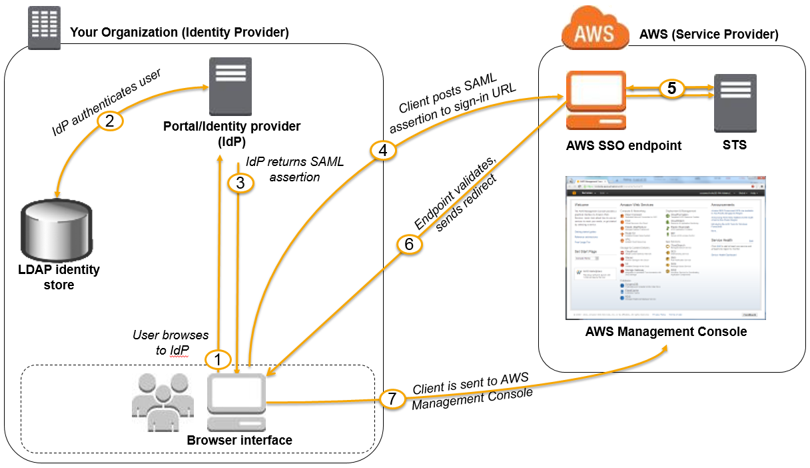
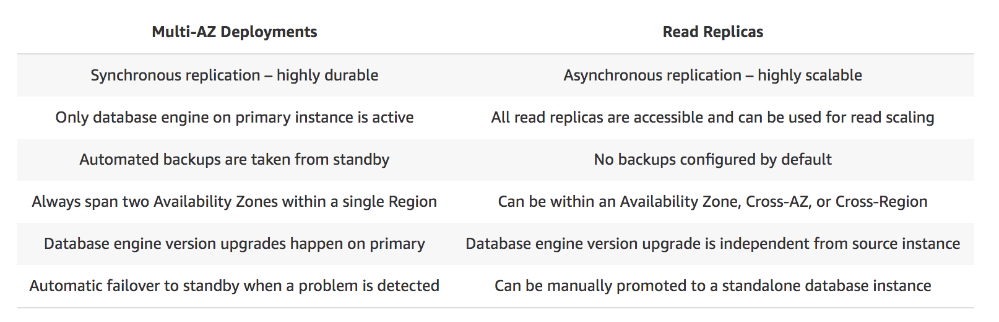
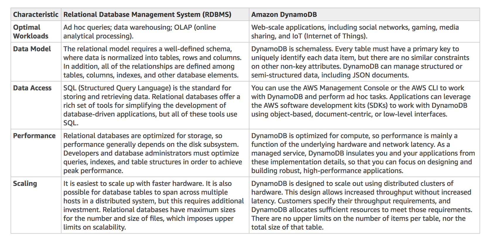
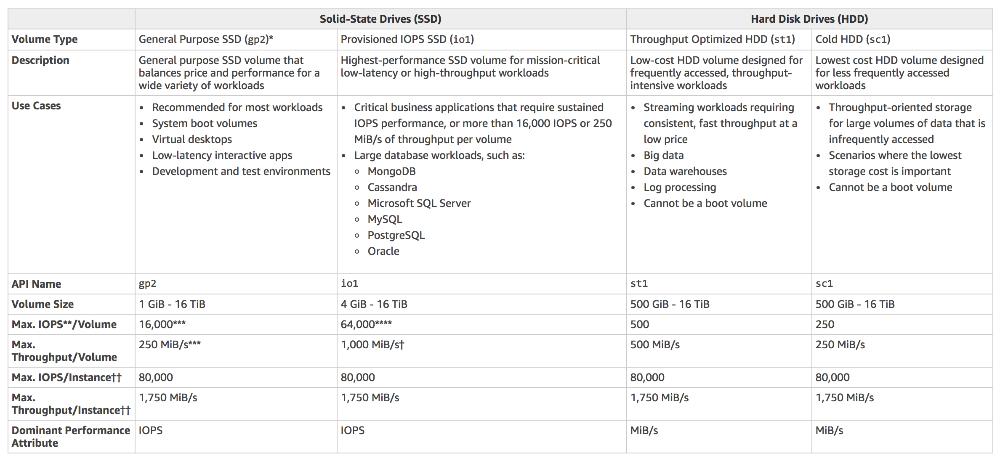
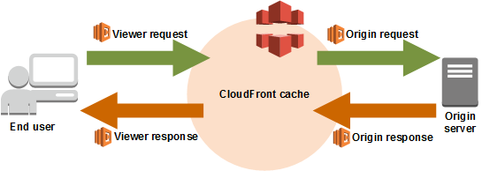

# Practice Test 1

- Took a practice test to check my baseline understanding of the topics on this exam.
- Failed with a result of **55% correct**.
- Spent 2 hours and 10 minutes in total (took breaks, :cat: wanted food)

## Domain 1: Resiliency

- 25 questions
- 52% Correct (Failing)

TODO: Review results, add notes on topics

## Domain 2: Security

- 19 questions
- 53% Correct (Failing)

### Question 4 :x:

- app uses Redshift Cluster for a data warehouse
- best service for monitoring all API calls to the Redshift instance?

**Answer**

CloudTrail for security logs

**Notes**

- Redshift is a data warehouse service
- AWS CloudTrail is a service that enables governance, compliance, operational auditing, and risk auditing of your AWS account
- CloudTrail provides event history of your AWS account activity, including actions taken through the AWS Management Console, AWS SDKs, command line tools, **API calls**, and other AWS services
- CloudWatch **cannot track API calls** to your AWS resources.
- AWS X-Ray helps **developers analyze and debug production, distributed applications**, such as those built using a microservices architecture. X-Ray provides an end-to-end view of requests as they travel through your application, and shows a map of your application’s underlying components. This is not a security monitoring tool.
- Redshift Spectrum **is not a monitoring service**. Is a feature of Amazon Redshift that enables you to query and analyze data in S3

### Question 10 :x:

- On-Demand EC2 instance
- should only allow SSH connections
- should only be accessed from a single IP address

**TODO**

- New security group
- inbound
- tcp port 22
- Source `<IP>/32`
- apply security group to EC2 instance

**Notes**

- SSH uses port 22
- SSH uses TCP, **not UDP**
- `/32` means "only this IP address"
- `/0` means "all IP addresses"

### Question 17 :x:

- store confidential tax documents in AWS
- there is concern from a security perspective on what can be put in AWS
- Which security features should be used?

**Answer**

- S3 Client-Side Encryption
- S3 Server-Side Encryption

**Notes**

- S3 client-side encryption ensures that data in S3 is safe in transit to and from S3
- S3 server-side encryption ensures that data in S3 is safe at rest
- If data is stored in EBS Volumes, you can enable EBS Encryption
- If data is stored in S3, you can use server-side and client-side encryption
- **There is no such thing** as On-Premises Data Encryption for S3 and EBS

### Question 21

- company has resources hosted on-prem and in AWS
- company wants developers to access resources on both environments
- company wants to use on-prem credentials, stored in Active Directory (AD)

**TODO**

- Set up SAML 2.0-Based Federation
- Use Microsoft Active Directory Federation Service (ADFS)

**Notes**



- Microsoft AD implements Security Assertion Markup Language (SAML)
- You can set up SAML-Based Federation for API Access to AWS
- AWS supports identity federation with SAML 2.0, an open standard that many identity providers (IdPs) use
- You need to configure the IdP and the AWS account to trust each other.
- Shibboleth also supports SAML 2.0
- Web Identity Federation is primarily used to let users sign in via a well-known external identity provider (IdP), such as Login with Amazon, Facebook, Google.

### Question 22 :x:

- web app uses CloudFront to distribute static content from an S3 bucket
- content will be distributed globally
- requirements specify that specific users (premium users/members/etc) should have access to special files without changing the content URLs.

**TODO**

- Use signed cookies to control who can access private files in the CloudFront distribution
- modify application to determine whether a user should have access to specific content
- for member/specific/premium users, send the signed cookie via the `Set-Cookie` HTTP header

**Notes**

- CloudFront signed URLs allow app maintainers to control who can access content through CloudFront.
- Signed URLs
  - Used for Real Time Messaging Protocol (RTMP) distributions. Signed cookies aren't supported for RTMP distributions.
  - Help restrict access to individual files, for example, an installation download for your application.
  - Useful in situations where cookies are not supported
- Signed Cookies
  - Useful in situations where you want to provide access to multiple restricted files
  - You don't want to change the URLs
- Match Viewer is an Origin Protocol Policy which configures CloudFront to communicate with your origin using HTTP or HTTPS, depending on the protocol of the viewer request.
- Field-Level Encryption only allows you to securely upload user-submitted sensitive information to your web servers.

### Question 23 :x:

- confidential information is being uploaded to S3
- engineer is tasked with setting up compliance policies that verify sensitive data in a manner that meets compliance standards
- send alerts if compromised files are detected containing PII, PHI, or IP

**TODO**

- Set up and configure Amazon Macie

**Notes**

- Amazon Macie is an ML-powered security service that helps you prevent data loss by automatically discovering, classifying, and protecting sensitive data stored in Amazon S3.
- Amazon Macie continuously monitors data access activity for anomalies, and delivers alerts when it detects risk of unauthorized access or inadvertent data leaks.
- Amazon Rekognition is a service that can identify the objects, people, text, scenes, and activities, as well as detect any inappropriate content on your images or videos.
- Amazon GuardDuty is a threat detection service that continuously monitors for malicious activity and unauthorized behavior to protect your AWS accounts and workloads.
- Amazon Inspector is an automated security assessment service that helps improve the security and compliance of applications deployed on AWS.

### Question 30

What does the following IAM policy allow?

```json

{
  "Version": "2012-10-17",
  "Statement": [
    {
      "Effect": "Allow",
      "Action": [
        "s3:Get*",
        "s3:List*"
      ],
      "Resource": "*"
    },
    {
      "Effect": "Allow",
      "Action": "s3:PutObject",
      "Resource": "arn:aws:s3:::tutorialsdojo/*"
    }
  ]
}
```

**Answer**

This policy allows entities with this policy to
- get/list objects from **any** S3 bucket
- write objects into the `tutorialsdojo` bucket

This policy does not contain permissions for
- changing access rights on any bucket
- deleting objects in any bucket

### Question 32 :x:

- app uses ElastiCache for Redis as its distributed session management component
- requirements require you to secure the session data in the app by requiring other engineers to enter a password before they are granted permissions to execute redis commands

**TODO**

- Create a new Redis Cluster with `--transit-encryption-enabled` and `--auth-token` parameters enabled
- Require users to authenticate using Redis `AUTH` command

**Notes**

- Redis `AUTH` command requires users to enter a password before they are granted permission to execute Redis commands on a password-protected Redis server.
- To require that users enter a password on a password-protected Redis server, include the parameter `--auth-token` with the correct password when you create your replication group or cluster and on all subsequent commands to the replication group or cluster.
- It is not possible to set this up using IAM
- The Redis `At-Rest Encryption` feature secures data inside the in-memory data store.

### Question 33

Protect against accidental S3 deletions in an S3 bucket

**TODO**

- Enable S3 Versioning on bucket
- Enable Multi-Factor Auth Delete on bucket

**Notes**

- You can use versioning to preserve, retrieve, and restore every version of every object stored in your Amazon S3 bucket. With versioning, you can easily recover from both unintended user actions and application failures.
- MFA (Multi-Factor Authentication) Delete requires additional authentication for either of the following operations:
  - Change the versioning state of your bucket
  - Permanently delete an object version

### Question 38

- website is hosted in an S3 bucket named `some_bucket`
- users load the website using the URL: `http://some_bucket.s3-website-us-east-1.amazonaws.com`
- new requirement to add JS on the webpages to make authenticated HTTP `GET` requests against the same bucket by using the AWS S3 API endpoint `some_bucket.s3.amazonaws.com`
- Browser is blocking JS

**TODO**

Enable Cross-origin resource sharing (CORS) configuration in the bucket

**Notes**

- Cross-origin resource sharing (CORS) defines a way for client web applications that are loaded in one domain to interact with resources in a different domain.

### Question 43 :x:

- application is composed of an Auto Scaling group of EC2 instances, an Application Load Balancer (ALB), and a MySQL RDS instance in a Multi-AZ deployment configuration
- protect confidential data of customers
- ensure RDS database can only be accessed using profile credentials specific to the EC2 instances, using an auth token

**TODO**

Enable IAM DB Authentication

**Notes**

- You can authenticate to your DB instance using AWS Identity and Access Management (IAM) database authentication. IAM database authentication works with MySQL and PostgreSQL. With this authentication method, you don't need to use a password when you connect to a DB instance. Instead, you use an authentication token.
- Authentication tokens are a unique string of characters that Amazon RDS generates on request. Each token has a lifetime of 15 minutes. You don't need to store user credentials in the database, because authentication is managed externally using IAM. You can also still use standard database authentication.
- You can use SSL to encrypt connections to RDS, which can improve the security of your data in flight.
- You can create and assign an IAM Role to the EC2 instances, granting them exclusive access to the RDS instance, but you still need to configure the RDS to use IAM DB Authentication.
- IAM+STS is not a compatible use case for this scenario

### Question 44 :x:

- company has undertaken a Total Cost of Ownership (TCO) analysis evaluating the use of Amazon S3 versus acquiring more storage hardware.
- 1200 employees are to be given access to use S3 for personal documents
- each user will have restricted access to only their personal folder
- set up a solution that incorporates the company's AD or LDAP directory

**TODO**

- Configure an IAM Role and IAM Policy to access the bucket
- Set up a Federation proxy or an Identity Provider (IdP)
- Use AWS Security Token Service to generate temporary tokens

**Notes**

- This is one of the common scenarios where temporary AWS credentials are used
- Temp credentials are useful in scenarios that involve identity federation, delegation, cross-account access, and IAM roles.
- In this example, it is called "enterprise identity federation", considering that you also need to set up SSO.
- There is no direct way of integrating Amazon S3 with Amazon WorkDocs for this particular scenario. WorkDocs is a fully managed, secure content creation, storage, and collaboration service.
- This solution is similar to what [the company I work for that uses AWS] does with Okta.


### Question 45 :x:

- company is using AWS to serve high-quality photos to website visitors
- other travel sites are linking to the company's photos
- result is increased costs for S3 traffic

**TODO**

- configure s3 bucket to remove public read access
- use pre-signed URLs with expiration dates

**Notes**

- S3 object owners can share objects with others by creating a pre-signed URL, using their own security credentials, to grant time-limited permission to download the objects.
- When you create a pre-signed URL for your object, you must provide your security credentials, specify a bucket name, an object key, specify the HTTP method (GET to download the object) and expiration date and time. The pre-signed URLs are valid only for the specified duration.

### Question 47

- online medical system hosted in AWS stores sensitive PII of the users in S3
- master keys and unencrypted data should never be sent to AWS to comply with compliance and regulatory requirements

**TODO**

Use S3 client-side encryption with a client-side master key

**Notes**

- Client-side encryption is the act of encrypting data before sending it to Amazon S3. To enable client-side encryption, you have the following options:
  - Use an AWS KMS-managed customer master key.
  - Use a client-side master key.
- Client Side Encryption Process
  - Upload
    - The Amazon S3 encryption client generates a one-time-use symmetric key (also known as a data encryption key or data key) locally for each object. It uses the data key of each object to encrypt each object.
    - The client encrypts the data encryption key using the master key that you provide.
    - The client uploads the encrypted data key and its material description as part of the object metadata. The client uses the material description to determine which client-side master key to use for decryption.
    - The client uploads the encrypted data to Amazon S3 and saves the encrypted data key as object metadata (`x-amz-meta-x-amz-key`) in Amazon S3.
  - Download
    - The client downloads the encrypted object from Amazon S3.
    - Using the material description from the object's metadata, the client determines which master key to use to decrypt the data key.
    - The client uses that master key to decrypt the data key and then uses the data key to decrypt the object.
- TLDR: It's possible to store things in S3 and manage the encryption client-side, keeping AWS out of the loop.

### Question 50

- Fortify against DDoS attacks

**TODO**

Use AWS Shield

**Notes**

- AWS Shield protects against attacks targeting applications running on Amazon Elastic Compute Cloud (EC2), Elastic Load Balancing(ELB), Amazon CloudFront, and Amazon Route 53 resources
- AWS Firewall Manager is used to simplify AWS WAF administration and maintenance tasks across multiple accounts and resources
- AWS WAF can help block common attack patterns to VPCs such as SQL injection or cross-site scripting, this isn't enough to withstand DDoS attacks.

### Question 53

- app deployed to EC2 spot instances
- app uses a MySQL RDS database instance
- currently only one RDS instance running in one AZ
- improve database configuration
  - high availability (HA)
  - synchronous data replication to another instance

**TODO**

Configure the RDS DB instance so it's deployed in a Multi-AZ deployment

**Notes**

- When you create or modify your DB instance to run as a Multi-AZ deployment, Amazon RDS automatically provisions and maintains a synchronous standby replica in a different Availability Zone
- RDS Read Replicas provide asynchronous replication instead of synchronous.
- DynamoDB and CloudFront do not have a Read Replica feature.



### Question 57 :x:

- company uses an ECS Cluster, using Fargate to host a website
- database credentials should be supplied using environment variables
- ensure that credentials are secure and cannot be viewed in plaintext on the cluster

**TODO**

- Use AWS Systems Manager Parameter Store
- keep the DB credentials in SysMan, encrypt them with AWS KMS
- Create an IAM Role for the AWS ECS Task execution role and reference it with the task definition, granting the ECS Tasks access to KMS and the Parameter Store
- In the ECS Container Definition, specify secrets with the name of the environment variables to set in the container and the full ARN of the Systems Manager Parameter Store
- Make the app pull the data from the ARN referenced by the envvar

**Notes**

- Amazon ECS enables you to inject sensitive data into your containers by storing your sensitive data in either AWS Secrets Manager secrets or AWS Systems Manager Parameter Store parameters and then referencing them in your container definition.
  - To inject sensitive data into your containers as environment variables, use the `secrets` container definition parameter.
  - To reference sensitive information in the log configuration of a container, use the `secretOptions` container definition parameter.
- You can use Docker Secrets to secure the sensitive database credentials. This feature is only applicable in Docker Swarm.
- Using an IAM Role is a more suitable choice over a resource-based policy for the Amazon ECS task execution role.

### Question 58

- company is migrating apps to AWS
- one app reqires a database that can scale globally and handle frequent schema changes
- application should not have performance issues when there's a schema change in the database

**TODO**

Use AWS DynamoDB (DDB)

**Notes**

For questions about schema changes being an issue, go with the NoSQL option.



### Question 63 :x:

- software team uses AWS Lambda for stuff
- lambda app uses MongoDB Atlas
- developer is creating environment variables to supply API connection information/credentials to lambda app

**TODO**

- Create a new KMS key
- use the key to enable encryption helpers that leverege AWS KMS to store and encrypt the secrets

**Notes**

- When you create or update Lambda functions that use environment variables, AWS Lambda encrypts them using the AWS Key Management Service.
- When your Lambda function is invoked, those values are decrypted and made available to the Lambda code.
- The first time you create or update Lambda functions that use environment variables in a region, a default service key is created for you automatically within AWS KMS. This key is used to encrypt environment variables. However, if you wish to use encryption helpers and use KMS to encrypt environment variables after your Lambda function is created, you must create your own AWS KMS key and choose it instead of the default key.

## Domain 3: High-Performance

- 15 questions
- 60% Correct (Failing)

### Question 8 :x:

- You are using a combination of API Gateway and Lambda for the web services of your online web portal
- It is expected that your web portal will receive a massive number of visitors all around the globe
- How do you protect your backend system?

**TODO**

Use throttling limits in API Gateway

**Notes**

- AWS API Gateway provides controls for throttling
- Throttling limits can be set for standard rates and bursts.
- Throttling ensures that calls to the Amazon EC2 API do not exceed the maximum allowed API request limits.

### Question 11 :x:

- A global IT company with offices around the world has multiple AWS accounts
- set up a solution that centrally manages their AWS resources
- allow them to procure AWS resources centrally and share resources such as AWS Transit Gateways, AWS License Manager configurations, or Amazon Route 53 Resolver rules across their various accounts

**TODO**

- Consolidate accounts using AWS Organizations
- Use AWS Resource Access Manager (RAM) service to share resources between AWS accounts

**Notes**

- AWS Control Tower is the easiest way to set up and govern a new, secure, multi-account AWS environment
- AWS ParallelCluster is an AWS-supported open-source cluster management tool that makes has controls for deploying and managing High-Performance Computing (HPC) clusters on AWS.
- AWS IAM allows you to delegate access to resources that are in different AWS accounts, but it's a tedious process most of the time.
- AWS Organizations allows you to manage multiple AWS Accounts
- AWS Resource Access Manager (RAM) service to easily and securely share your resources with your AWS accounts

### Question 14

- App uses DynamoDB table
- Implement a "follow" feature, where users can subscribe to certain updates made by other users
- Users receive email notifications

**TODO**

- Enable DDB Stream
- create an AWS Lambda function
- Set up permissions for the Lambda Function
- lambda will process data from DDB Stream and will write to an SNS Topic that will notify subscribers

**Notes**

- A DynamoDB Stream is an ordered flow of information about changes to items in an Amazon DynamoDB table. When you enable a stream on a table, DynamoDB captures information about every modification to data items in the table.
- DynamoDB Streams are not enabled by default. Make sure you turn them on if you need to.
- The DynamoDB Accelerator (DAX) feature is primarily used to significantly improve the in-memory read performance of your database

### Question 16

store most frequently used data in an in-memory data store to improve retriaval response time of a web app

**TODO**

use ElastiCache

**Notes**

- Amazon ElastiCache has controls for deploying, operating, and scaling an in-memory data store
- DynamoDB is a managed, NoSQL, document/key-value database
- AWS RDS is a relational database
- AWS Redshift is a data warehouse service

### Question 19

- app hosted on EC2
- app consumes messages from SQS queue
- app posts to SNS topic when process is complete (finished processing messages in SQS)
- app sending too many messages

**Root** Cause

App likely not deleting messages in SQS queue once it has finished processing the messages.

**Notes**

- Always remember to delete SQS messages once you're done processing them
- 3 components to messaging architecture
  - the components in the distributed system (producers/consumers)
  - the messaging queue
  - the messages in the queue

### Question 24

- CRM application in an autoscaling EC2 group, on-demand pricing
- app is used primarily 9am-5pm
- users noticing slowdown in the morning, no slowdown later in the day

**TODO**

Configure a "scheduled scaling" policy to bump the number of EC2 instances before people start showing up at 9am

### Question 26

- data analytics application in AWS
- deployed to autoscaling group in EC2, on-demand pricing
- app uses mongodb
- app requires **high throughput workloads with random IO operations**
- best EBS type for MongoDB database?

**Answer**

Provisioned IOPS SSD EBS (`io1`)

**Notes**

- `gp2` is General Purpose SSD
- `io1` is "Provisioned IOPS SSD". Consistent performance in random and sequential IO operations
- `st1` is Throughput Optimized HDD
- `sc1` is Cold HDD
- The HDD EBS options deliver optimal performance only when I/O operations are **large and sequential**. Best for large streaming workloads. Low price compared to SSDs. Good for big data, data warehouses, log processing. Best when data is infrequently accessed.
- The SSD EBS options are best for small/random I/O operations. Best for transaction workloads. Critical for business applications that require sustained IOPS performace. Good for DB service workloads.



### Question 29

- new e-commerce Angular web app
- deployed to fleet of EC2 instances behind an Application Load Balancer ALB
- configured ALB to perform health checks on the EC2 instances
- what happens if an EC2 instance failed a health check?

**Answer**

The ALB will stop routing traffic to the EC2 instance

**Notes**

- ALBs will stop sending traffic to EC2 instances if they fail a health check.

### Question 36 :x:

- app uses CloudFront web distribution to serve static content to global users
- users are experiencing long wait times for logins
- some users are getting HTTP 504 errors
- reduce user login time and optimize system

**TODO**

- set up an origin failover by creating an origin group with 2 origins
- specify one origin as primary and the other as secondary
- CloudFront will automatically switch to the secondary origin when the primary origin returns specific HTTP status codes
- customize the content that the CloudFront web distribution delivers to your users using Lambda@Edge. This will allow lambda functions to execute authentication closer to each user

**Notes**

> In the given scenario, you can use Lambda@Edge to allow your Lambda functions to customize the content that CloudFront delivers and to execute the authentication process in AWS locations closer to the users. In addition, you can set up an origin failover by creating an origin group with two origins with one as the primary origin and the other as the **second origin which CloudFront automatically switches to when the primary origin fails. This will alleviate the occasional HTTP 504 errors** that users are experiencing.

- Lambda@Edge lets you run lambda functions to customize the content that CloudFront delivers, executing the functions in AWS locations closer to the user.
- You can use lambda functions to change requests and responses brokered by CloudFront between the end user and the origin



### Question 42

Which CloudWatch metrics are available by default for EC2 instances? Which are not?

**Notes**

- The following CloudWatch EC2 Metrics are available by default
  - CPU Utilization of an EC2 instance
  - Disk Reads activity of an EC2 instance
  - Network packets out of an EC2 instance
- The following CloudWatch EC2 Metrics are not available by default, but can be configured by installing a CloudWatch Agent on the EC2 instances.
  - Memory utilization
  - Disk swap utilization
  - Disk space utilization
  - Page file utilization
  - Log collection
- It's possible to write custom metrics in Perl using CloudWatch Monitoring Scripts (please don't do this)

### Question 48 :x:

- application uses a machine learning model
- app's workflow requries high-performance, parallel hot storage to process the training datasets concurrently
- application needs cost-effective cold storage to archive datasets that yield low profit
- best AWS storage services to use for this app?

**Answer**

- Use AWS FSx For Lustre for host storage
- Use AWS S3 for cold storage

**Notes**

- Temperature
  - Hot storage refers to the storage that keeps frequently accessed data ( hot data ).
  - Warm storage refers to the storage that keeps less frequently accessed data ( warm data ).
  - Cold storage refers to the storage that keeps rarely accessed data ( cold data ).
- Amazon FSx For Lustre is a high-performance file system for fast processing of workloads.
- Lustre is a popular open-source parallel file system which stores data across multiple network file servers to maximize performance and reduce bottlenecks.
- Amazon Elastic File System (EFS) is a fully-managed file storage service that makes it easy to set up and scale file storage in the Amazon Cloud.
- EFS supports concurrent access to data, but it does not have the high-performance ability that is required for machine learning workloads.
- AWS S3 is an object storage service.
- Amazon FSx for Windows File Server is a fully managed Microsoft Windows file system with full support for the SMB protocol, Windows NTFS, Microsoft Active Directory (AD) Integration. Amazon FSx For Windows File Server does not have a parallel file system, unlike Lustre.

### Question 51

- app is a CMS hosted on an autoscaling EC2 group (on demand pricing)
- app uses Amazon Aurora as its database
- system stores file documents in various EC2 EBS volumes
- improve architecture and system performance 
- What is AWS's scalable, high-throughput, POSIX-compliant file systems?

**Answer**

EFS

> Amazon Elastic File System (Amazon EFS) provides simple, scalable, elastic file storage for use with AWS Cloud services and on-premises resources. When mounted on Amazon EC2 instances, an Amazon **EFS file system provides a standard file system interface and file system access semantics**, allowing you to seamlessly integrate Amazon EFS with your existing applications and tools. **Multiple Amazon EC2 instances can access an Amazon EFS file system at the same time**, allowing Amazon EFS to provide a common data source for workloads and applications running on more than one Amazon EC2 instance.

### Question 52

- app uses cloudfront, lambda, dynamodb for backend services
- which AWS service reduces DynamoDB response times?

**Answer**

Amazon DynamoDB Accelerator (DAX)

**Notes**

- Amazon DynamoDB Accelerator (DAX) is a fully managed, highly available, in-memory cache that can reduce Amazon DynamoDB response times
- Amazon ElastiCache can be used as a database cache, but if you're trying to accelerate AWS DynamoDB (DDB), you can more easily use DAX.
- AWS Device Farm is an app testing service that lets you test and interact with your Android, iOS, and web apps on many devices at once, or reproduce issues on a device in real time.
- DynamoDB Auto Scaling is primarily used to automate capacity management for your tables and global secondary indexes.

### Question 60 :x:

- app uses an API build with Lambda and API Gateway
- app maintainers are expecting significant increase in traffic in the coming days
- protect the backend from traffic spikes

**TODO**

Enable throttling limits and result caching in API Gateway

**Notes**

- If you see a question related to protecting the backend from traffic spikes, think "throttling"
- AWS API Gateway provides throttling at multiple levels including global and by service call
- API Gateway: https://aws.amazon.com/api-gateway/faqs/

### Question 61 :x:

- containerized app running on AWS ECS cluster behind a load balancer
- app heavily uses DynamoDB
- improve db performace by distributing the workload evenly

**TODO**

Use partition keys with high-cardinality attributes, which have a **large number of distinct values for each item**.

**Notes**

> The partition key portion of a table's primary key determines the logical partitions in which a table's data is stored. This in turn affects the underlying physical partitions. Provisioned I/O capacity for the table is divided evenly among these physical partitions. Therefore **a partition key design that doesn't distribute I/O requests evenly can create "hot" partitions** that result in throttling and use your provisioned I/O capacity **inefficiently**.

- more distinct partition key values -> more even spread across the partitioned space -> better performance
- fewer distinct partition key values -> less even spread across the partitioned space -> slower performance
- a composite primary key will provide more partition for the table and in turn, improves the performance
- to increase performance of DynamoDB:
  - increase distinct partition keys
  - composite primary keys (partition key + sort key), increases partition keys

## Domain 4: Cost-Optimization

- 3 questions
- 100% correct

### Question 46
- App hosted on AWS Fargate (ECS)
- App runs a batch job when object uploaded to S3
- "minimum number of ECS tasks" is set to `1` to save costs
- "minimum number of ECS tasks" should be adjusted based on state of bucket

**TODO**

Set up CloudWatch Event on S3 PUT/DELETE operations, adjusting the "tasks" number on the cluster accordingly

**Notes**

- Cloudwatch Events can target ECS clusters and can adjust the number of tasks on those clusters
- Always remember that CloudWatch Events and CloudWatch Alarms are totally different things.

### Question 49

- Startup with an online portal
- funding is tight and you need to manage your AWS budget

**TODO**

Use "AWS Budgets" service

**Notes**

- AWS Budgets can be used to proactively keep your AWS costs in check. 
- Cost Explorer is a reactive way to check on how much money your AWS resources are using
- Cost Allocation Tags can be used to group costs, helping your organize your expsense reports
- Payment History shows past invoices

### Question 55

Optimize costs related to transferring data from EC2 to S3

**Notes**

- Transferring data from EC2 to S3 within the same region costs $0
- "Transferring data from an EC2 instance to Amazon S3, Amazon Glacier, Amazon DynamoDB, Amazon SES, Amazon SQS, or Amazon SimpleDB in the same AWS Region has no cost at all." Apparently it's all block storage on the backend.

