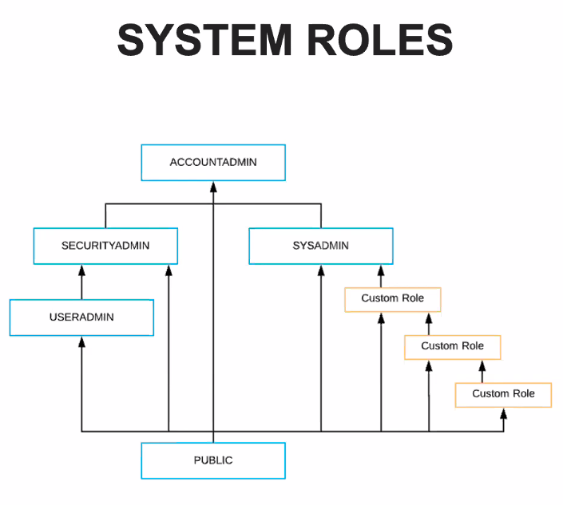
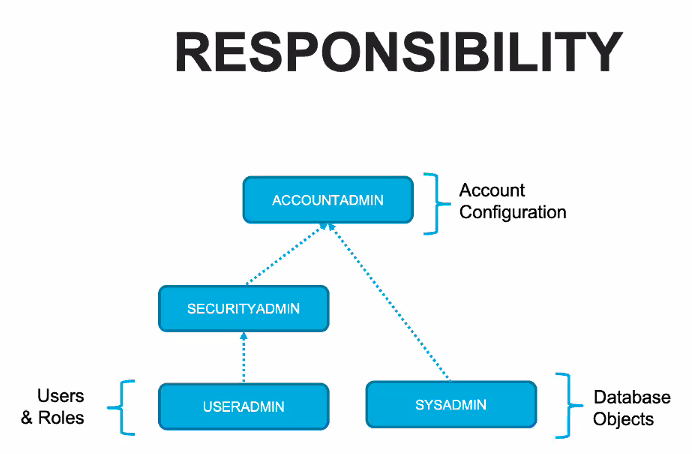
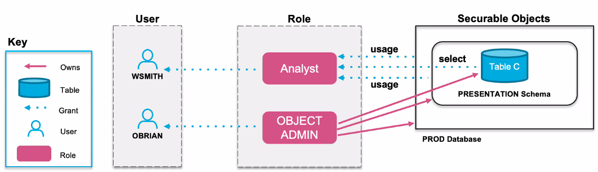
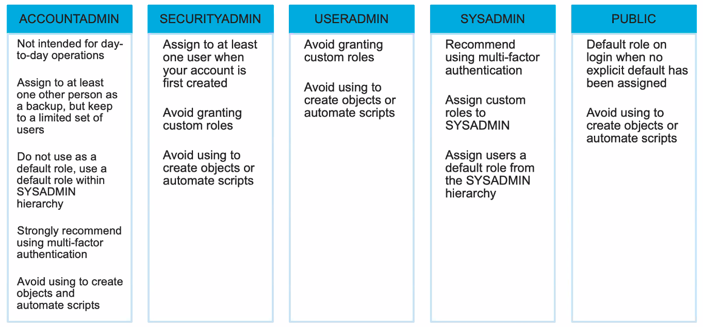

# Snowflake Security: Role Based Access Control (RBAC)

Purpose: Provide high level understanding of the capabilities and features that are relevant to security and access control.

## Layered Security

1. Network (Access/Authenticate Connection): access can be restricted to IP ranges and secure private network
2. Account (Authentication User): Password/MFA/SSO
3. Object (Authorize): restrict access to databases, schemas, tables, views, etc, using roles and priv
4. Data (Encryption)

- Role Based Access Control (RBAC): Access privs are assigned to roles, which are granted to users.
- Discretionary Access Control (DAC): Each object has an owner

## Securing Objects

- every object is a logical container, starting with account
- every object is owned by a single Role

## System Roles

- accountadmin
- securityadmin
  - grants db usage to role
  - grants privs
  - etc
- useradmin
  - creates/grants custom roles to users
- sysadmin
  - creates and owns DB/schema/warehouse
- public





## Roles

You can switch roles with `use role ROLE`

```sql
use role PUBLIC;
```

- a user always has a **current** role
- a **default** role can be assigned to a user. Unless otherwise set, defaults to `PUBLIC`
- current role sets the context for the session
- defines all accessible DB objects and privs
- **Do not set accountadmin as the default role for any user**

## Object Ownership vs Grants



## Schema Level Control

- Centralized: Privs controlled for all objects by type within the schema
- Automatic: Additional grants are optionally automatically applied
- Secure: Control the ability to grant access to other roles
- Simple: Simplify access controls

## Future Grants

simplifies the deployment of new db objects of a specific type by not requiring scripting of the permission grants for each new object

## User/Role Creation

- Manually via UI/SQL scripts in Snowflake
- Via SF SCIM API
  - Okta
  - Azure
  - Custom

## Role Usage Guidelines


