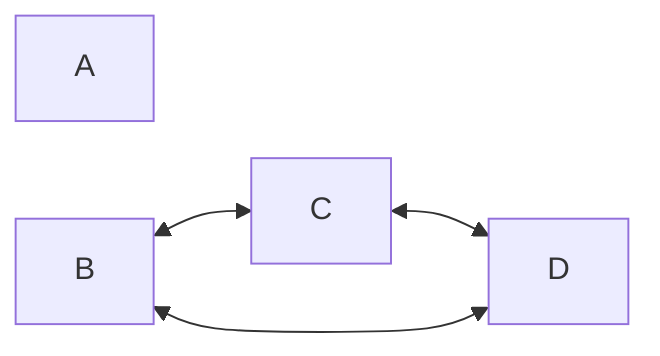
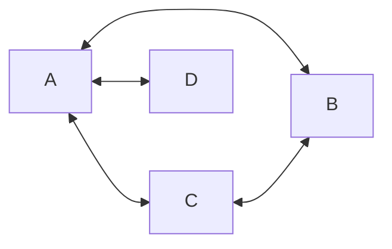

---
tags:
  - OMSCS
  - Algorithms
---
# 00.8 - Math, Logic, and Contrapositives
This document is a "crash course" on understanding logical statements and contrapositives. These concepts are important for fully understanding math properties and proofs in general, especially in graphs. They are also very applicable to the NP and LP sections of the course.

This topic is considered to be prerequisite knowledge for the course. Therefore, it is not explicitly covered in course materials. Assessments in the course assume this knowledge. This document is not required reading, but is strongly recommended for students who are unfamiliar with (or are only weakly familiar with) this topic.

## The If-Then Structure (and iff)
In boolean algebra and propositional logic, we have an operator that looks like this: $p \rightarrow q$. $p$ and $q$ are boolean variables or values. They can be true or false. It can be read as "p implies q", "if p is true, then q is true", or "if p, then q". This is equivalent to $\neg p \vee q$. This boolean operator has the following truth table.

| $p$ | $q$ | $p \rightarrow q$ |
| --- | --- | ----------------- |
| T   | T   | T                 |
| T   | F   | F                 |
| F   | T   | T                 |
| F   | F   | T                 |
Only the assignment $p=T$ and $q=F$ results in $(p \rightarrow q)=F$. An example of this in English:
- $p$ = "I am wearing purple shorts"
- $q$ = "I am visiting my brother"
- $p \rightarrow q$ = "If I am wearing purple shorts, then I am visiting my brother."

The full statement $p \rightarrow q$ is true as long as either $p$ is false (statement is inapplicable) or both are true. However, if we have the scenario of "I am wearing purple shorts and I am not visiting my brother", the the original implication is false. More formally:

$$\neg(p \rightarrow q)=\neg(\neg p \vee q)=p \wedge \neg q$$

Many properties are phrased (or can be phrased) with an if-then structure. For example:

- $p$ = "The graph is a tree."
- $q$ = "The graph has exactly $n-1$ edges."
- $p \rightarrow q$ = "If the graph is a tree, then the graph has exactly $n-1$ edges."

When you have both directions (both $p \rightarrow q$ and $q \rightarrow p$), this is condensed into an "if and only if" expression. In this scenario, the truth table looks like this:

| $p$ | $q$ | $p \iff q$ |
| --- | --- | ---------- |
| T   | T   | T          |
| T   | F   | F          |
| F   | T   | F          |
| F   | F   | T          |

An if-and-only-if statement is only true if both sides have the same truth value.

## For-All vs There-Exists and the Opposites
In predicate logic, there are two related concepts, "for all" ($\forall$) and "there exists" ($\exists$). These concepts frequently show up in math properties and proofs.

### For-All
> **Example:** "For all students enrolled in OMSCS, if their specialization is in Computing Systems, then they must pass CS6515 with a B or higher."

A "for all" statement does not necessarily mean that one exists. "For all" statements can be made on empty sets. Example:

> For all students enrolled in OMSCS, if they were born in Antartica and are named George Burdell, then they automatically receive a C in CS6515.

There probably aren't any students that were born in Antarctica that are named George Burdell, which would make this set of students an empty set. What a "for all" statement is made on an empty set, the statement is called "vacuously true."

Sometimes "for all" statements are easier to express as "for any x." In these cases, we're saying "for any arbitrary x," and if something is true for any arbitrary x, then it is true for all x's. In order for this to work, the x really must be arbitrary, where we know nothing about the x except for the fact that it is indeed an x.

### There-Exists
> **Example:** There exists a sandwich that is made with pepper jack cheese and pickles.

"There exists" guarantees that at least one thing exists in the set, but there could be more. For example: "There exists a square which is also a rectangle." Technically, all squares are rectangles, but since at least one square exists that is also a rectangle, the whole statement is true.

### Negation
To negate a "for all" statement, the change the "for all" to "there exists" and negate the rest of the statement. Likewise, to negate a "there exists" statement, we change the "there exists" to a "for all" and negate the rest. For example:

- **Original:** For all students enrolled in OMSCS, if their specialization is in Computing Systems, then they must take CS6515.
- **Negation:** There exists a student enrolled in OMSCS with the specialization of Computing Systems that does not (did not) need to take CS6515.

These two statements are opposites of each other. They cannot both be true at the same time, and one of them must be true. Apparently, the negated statement is the true one, because it's possible to transfer into the OMSCS with an equivalent credit to CS6515 (Graduate Algorithms).

## Contrapositives vs Converses/Inverses
A **contrapositive** of an implication is a specific way of rewriting an implication that preserves the original true value. Formally,

- **Original:** $p \rightarrow q$
- **Contrapositive:** $\neg q \rightarrow \neg p$ (note the swapped positioning)

| $p$ | $q$ | $p \rightarrow q$ | $\neg q \rightarrow \neg p$ |
| --- | --- | ----------------- | --------------------------- |
| T   | T   | T                 | T                           |
| T   | F   | **F**             | **F**                       |
| F   | T   | T                 | T                           |
| F   | F   | T                 | T                           |

Reprising the English example:
- $p$ = "I am wearing purple shorts"
- $q$ = "I am visiting my brother"
- $p \rightarrow q$ = "If I am wearing purple shorts, then I am visiting my brother."
- $\neg q \rightarrow \neg p$ = "If I am not visiting my brother, I am not wearing purple shorts."

Reprising the properties of trees:
- $p$ = "The graph is a tree."
- $q$ = "The graph has exactly $n-1$ edges."
- $p \rightarrow q$ = "If the graph is a tree, then the graph has exactly $n-1$ edges."
- $\neg q \rightarrow \neg p$ = "If the graph doesn't have exactly $n-1$ edges, then the graph is not a tree."

In contrast, the **inverse** of an implication simply negates both the "if" and the "then" parts of the statement, which does not preserve the truth value of the original implication. If the implication can be written as $p \rightarrow q$, then the inverse would be written as $\neg p \rightarrow \neg q$.

There is also the **converse** of an implication, which simply swaps the "if" and "then" parts of the statement, which also does not preserve the truth value of the original implication. If the implication can be written as $p \rightarrow q$, then the converse would be written as $q \rightarrow p$.

| $p$ | $q$ | $p \rightarrow q$ | $\neg p \rightarrow \neg q$ | $q \rightarrow p$ |
| --- | --- | ----------------- | --------------------------- | ----------------- |
| T   | T   | T                 | T                           | T                 |
| T   | F   | **F**             | T                           | T                 |
| F   | T   | T                 | F                           | F                 |
| F   | F   | T                 | T                           | T                 |

It can be dangerous to mix up the inverse/converse and contrapositive of a statement, especially when working with math properties.
- $p$ = "The graph is a tree."
- $q$ = "The graph has exactly $n-1$ edges."
- $p \rightarrow q$ = "If the graph is a tree, then the graph has exactly $n-1$ edges."
- **Contrapositive:** $\neg q \rightarrow \neg p$ = "If the graph doesn't have exactly $n-1$ edges, then the graph is not a tree."
- **Inverse:** $\neg p \rightarrow \neg q$ = "If the graph is not a tree, then the graph doesn't have exactly $n-1$ edges." (Invalid)
- **Converse:** $q \rightarrow p$ = "If the graph has exactly $n-1$ edges, then the graph is a tree." (Invalid)

Notice that both the original and contrapositive are true, but the inverse and converse are not. We can show that the inverse and converse statements are false with a single counterexample. We can use one example of this, because the Inverse and Converse happen to be Contrapositives of each other, meaning they both refer to the same invalid property.

It's not really that important to know the difference between "inverse" and "converse". The important part of this section is to understand why they are different from the contrapositive, and to avoid accidentally using them in a mathematical context.

## Showing that an if-then statement is true
Suppose that we have the following claim:
> If an undirected graph has less than $n-1$ edges, then there are at least 2 connected components.

In order to show that the statement is true, we do the following:
- Assume that the "if" part is true.
- Show that the "then" part must logically also be true.

We don't care about the scenario where the "if" part is false. In that scenario, the implication is true, due to being inapplicable to a given graph. In this example, we might go about showing that there are at least 2 connected components by reasoning through that it takes at least $n-1$ edges to create a spanning tree for a graph, so having fewer than $n-1$ edges results in at least 2 connected components.

Sometimes, the original statement might be difficult ti reason through to show that the claim is true. In such cases, it's sometimes easier to prove the contrapositive instead.

> **Claim:** If an undirected graph has less than $n-1$ edges, then there are at least 2 connected components.
>
> **Contrapositive:** Given an undirected graph, if there is only one connected component, then the graph must have at least $n-1$ edges.

Note the clever wording on the inverse of "there are at least 2 connected components." A negation doesn't need to have the word "not". For proving the contrapositive of the claim, we once again:
- Assume that the "if" part is true.
- Show that the "then" part must logically also be true.

If you choose to use this approach, it is helpful to explicitly call out the contrapositive and that this is what you intend to show, as it makes the argument easier to follow for anyone who might be trying to read it (e.g. classmates, peer reviewers, the TA's).

## Showing that an if-then statement is false
To prove an implicatino is false, we need to show the case of $p \wedge \neg q$, as this is the one combination of truth values in which an implication is false. Suppose we have the following claim:

> **Claim:** If a graph has $n$ edges, then every vertex is at least degree 2.
> 
> **Rewritten as a For-All:** For all graphs, if the graph has $n$ edges, then every vertex is at least degree 2.

Notice how there's actually 2 "for all" statements in here. One of them is for all graphs. The other is for all vertices within each graph. To prove this claim false, we need to show the inverse of the claim. Both the "for all" statements become independent "there exists" statements.

> **Inverse:** There exists a graph where the graph has $n$ edges and there is a vertex that is not at least degree 2.

In practice, we disprove invalid mathematical properties with counterexamples. The graph below has $n$ vertices, $n$ edges, and $D$ has degree 1.

## Application to NP Reductions
As a refresher, to show that a problem is NP-Hard, or as part of showing that a problem is NP-Complete, we reduce a known NP-Hard problem to the unknown/new problem. The final part of the reduction is a bidirectional proof of correctness, which is proving an if-and-only-if statement.

Let's use 3SAT as our example "unknown/new" problem and SAT as our known NP-Complete problem. A full proof that 3SAT is NP-Hard would involve:

1. Showing how to transform the input for an arbitrary SAT problem into a valid input to 3SAT in polynomial time.
2. Showing how to transform the corresponding output from 3SAT into a corresponding valid output for the original SAT problem in polynomial time.
3. A bidirectional proof of correctness that shows "A solution for SAT exists iff a solution for 3SAT exists."

**We will be focusing on item 3 in this course.** Because this is a bidirectional proof of correctness, there are two if-then statements that need to be shown as true.

1. $A \rightarrow B$
	1. If a solution for SAT exists, then a solution for 3SAT exists.
	2. **Contrapositive:** If no solution exists for 3SAT, then no solution exists for SAT.
2. $B \rightarrow A$
	1. If a solution for 3SAT exists, then a solution for SAT exists.
	2. **Contrapositive:** If no solution exists for SAT, then no solution exists for 3SAT.

This means that there need to be two major steps in a bidirectional proof of correctness, and they may end up looking and feeling very similar. The critical difference is what you get to assume as already true and what you must show exists.

You can also choose to prove the contrapositive in either direction, if it feels easier to prove. Any combination of "original" implications and contrapositives is fine, as long as both directions are proved. Make sure you actually show two different directions, and not the same direction twice. This is all also covered in [[06.1 - NP - Theory Guidance]].

Let's look more closely at the claim "**If a solution for SAT exists, then a solution for 3SAT exists.**" To show this, we do the following.

1. Assume that the "if" part is true. Assume that a solution for SAT exists.
2. Show through reasoning (based on properties, definitions, and the steps detailed in items 1 and 2 of the reduction), that the "then" part is true.

**Notes**
- We do not get to say that we know the solution to SAT as part of proving part A. All we know is that a solution to SAT exists. Our reasoning must show that a solution to 3SAT also exists, without any knowledge of what the original solution to SAT was.
- We do not get to say "only one solution of SAT exists". We must leave open the possibility that there are more than one solution to an arbitrary SAT problem. We can not assume things about the "topology" of all instances of a problem, unless that topology (i.e. solution landscape) is a property of the problem, and invariant regardless of the instance.
- Reductions don't have to be a "one to one" on solutions. For instance, if a particular SAT input had 15 different possible solutions, it's ok if the reduction to 3SAT will only generate one solution. The requirement is "if a solution to SAT exists, then a solution to 3SAT exists." It doesn't matter if there's more solutions for one that the other, as long as the reduction is always generating valid solutions and the bidirectional statement ($A \iff B$) is true.

**Best Practices**
- Clearly write out what claim/if-then statement your are trying to show in a single sentence first, then write out your reasoning in following sentences. This makes it much easier for you to keep track of what you are attempting to show, and for anyone else to follow what you are showing.
- Put each direction in a separate paragraph. The proofs for each direction can end up looking very similar, combining everything into one paragraph can end up being difficult to follow.
- Write items 1 and 2 (input and output transformations, $f$ and $h$ respectively) completely separately from the bidirectional proof of correctness. Put the proof of correctness last. This makes it easier to reference the steps of the transformations as part of your arguments for each direction in the proof of correctness, and makes your reasoning easier to follow.

**Common Mistakes**
- Proving the same direction twice. This happens when the 2 "distinct" directions end up being contrapositives of each other.
- Trying to prove one direction but then mixing it up with the other direction. This can happen if you try to prove $A \rightarrow B$ but start with a solution to $B$.

## Application to LP - Feasibility and Boundedness
In LP, there are a few related properties that we discuss.

- **Feasibility.** This means that a solution exists for the linear program. Recall that this can mean only one solution, or infinitely many solutions. An LP is either feasible or not feasible. It can't be both.
- **Bounded.** This means that there is a limit on how much the objective function can be maximized or minimized. An LP can be bounded, unbounded, or neither. This discussion of boundedness only makes sense for feasible LPs.

The dual of an LP provides an upper limit to the original LP. Therefore, if the original LP is unbounded, there cannot be an upper limit, so the dual LP is infeasible. This gives us the following property:

> If the original LP is unbounded, then the dual LP is infeasible.

We cannot simply take the contrapositive yet because there's some extra properties at play that aren't explicitly stated. The opposite of unbounded is not necessarily just "bounded" because an LP could also be infeasible. It only makes sense to talk about whether an LP is unbounded or not if it is also feasible, and this gives us the following property and its contrapositive.

> **Property:** If the original LP is (feasible and) unbounded, then the dual LP is infeasible.
> 
> **Contrapositive:** If the dual LP is feasible, then the original LP is either infeasible or bounded. 

Recall (LOL, I have no idea what any of this is. How can I recall it?) that just as the dual LP provides an upper limit to the original LP, so also does the original LP provide a lower limit to the objective function of the dual LP. Thus, if the dual LP is unbounded, the original LP is infeasible. In other words, we can always swap the original LP and the dual LP in any of these statements. For instance:

> If the dual LP is (feasible and) unbounded, then the original LP is infeasible.
> 
> If the original LP is feasible, then the dual LP is either infeasible or bounded.

You can generate many LP properties based on these few statements and concepts.

A few more things to note:

- If the original LP is feasible and bounded, then the dual LP is also feasible and bounded.
- It is possible for both the original LP and the dual LP to be infeasible.

With just a few basic properties and the ability to generate the contrapositives, you can determine many other LP properties without needing to explicitly memorize them.