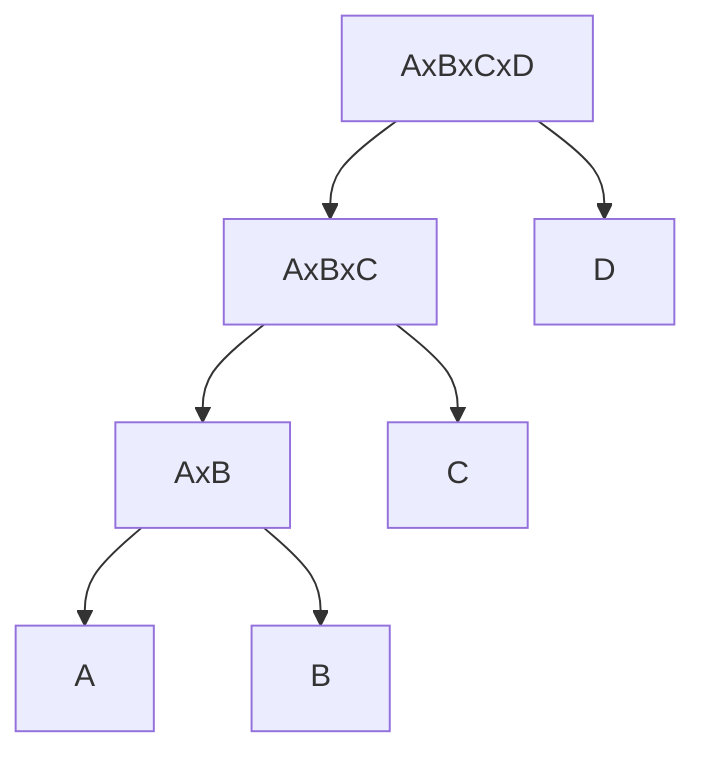
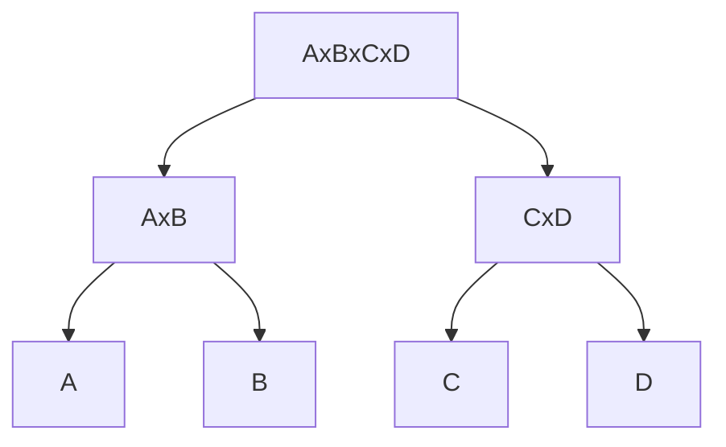

---
tags:
  - OMSCS
  - Algorithms
  - LinAlg
  - Alg-DP
---
# 02.2 - Dynamic Programming 2 - Chain Matrix Multiply
> We move on from using prefixes and onto substrings.

## Example
- 4 matrices: $A, B, C, D$
	- $A:50 \times 20$
	- $B:20\times1$
	- $C:1\times10$
	- $D:10\times100$
- **Goal:** compute $A \times B \times C \times D$

- Which parenthesization is optimal?
	- Standard way: $((A \times B) \times C) \times D$
	- Also valid: $(A \times B) \times (C \times D)$
	- Also valid: $A \times (B \times C)) \times D$
	- Also valid: $A \times (B \times (C \times D))$
- Need to assign a cost to each operation.

## Cost for Matrix Multiply
### Example
- $W$ of size $a \times b$
- $Y$ of size $b \times c$
- $Z=W \times Y$
	- $Z$ is of size $a \times c$
	- $Z_{i,j}=\sum_{k=1}^{b}W_{i,k}Y_{k,j}$
	- $Z_{i,j}$ requires $b$ multiplications and $b-1$ additions
	- $Z$ has $ac$ entries, so it requires
		- $abc$ multiplications
		- $ac(b-1)$ additions
		- Multiplications dominate additions in terms of computational complexity

### General Problem
- For $n$ matrices $A_1,A_2,...,A_n$
- The sizes of the matrices are $(m_0, m_1), (m_1, m_2), ..., (m_{n-1}, m_n)$
- **Input:** $M=m_0,m_1,...,m_n$
- **Output:**
	- Find the minimum cost for computing $A_1\times A_2 \times ... \times A_n$
	- Find the parenthisation which produces that minimum cost.

### Graphical View
- We can represent this as a binary tree.

$((A \times B) \times C) \times D$

$(A \times B) \times (C \times D)$

Both of these trees represent the same product.

## DP Solution - Attempt 1
> Let $C(i)$ = min cost for computing $A_1 \times A_2 \times ... \times A_i$

![[Pasted image 20260121212715.png]]

We don't want to consider prefixes, just substrings.

## DP Solution - Substrings

### Subproblem
- For $i$ and $j$ where $1 \le i \le j \le n$
- Let $C(i,j)=$ min cost for computing $A_i \times A_{i+1} \times ... \times A_j$

### Recurrence for $C(i,j)$

#### Base Case
If there's only one matrix, there's no operations to perform. $C(i,i)=0$. In the DP table, this corresponds to the TL to BR diagonal.

![[Pasted image 20260121212944.png]]

#### Recursive Case
To compute $C(i,j)$
- $A_i \times ... \times A_j$
- We'll have some split $l$
	- On the left, we'll compute $A_i \times ... \times A_l$
	- On the right, we'll compute $A_{l+1} \times ... \times A_j$
- The left subtree costs $C(i,l)$
- The right subtree costs $C(l+1,j)$
- The root costs $(m_{i-1})(m_l)(m_j)$. This is the cost of merging the results of the 2 subtrees.
- Total cost is $(m_{i-1})(m_l)(m_j) + C(i,l)+C(l+1,j)$

$$C(i,j)=\min_l \Big\{ (m_{i-1})(m_l)(m_j) + C(i,l)+C(l+1,j) : i \le l \le (j-1) \Big\}$$

![[Pasted image 20260121213547.png]]

#### How to Fill the Table?
- Base case is the diagonal: $C(i,i)$
- $C(i,i+1)$ uses $C(i,i)$ and $C(i+1,i+1)$
- $C(1,n)$ gives us the result.
- We don't fill in below the diagonal. 
- We fill in the "off diagonals" until we reach the top right corner.
- width $s = j-1$
- $s=0 \rightarrow n-1$

![[Pasted image 20260121214257.png]]

## PseudoCode

$ChainMultiply(m_0,m_1,...,m_n)$
- $\text{For }i=1 \rightarrow n, C(i,i)=0$
- $\text{For } s=1 \rightarrow n-1:$
	- $\text{For } i=1 \rightarrow n-s:$
		- $\text{Let }j=i+s$
		- $C(i,j)=\infty$
		- $\text{For } l=i \rightarrow j-1:$
			- $cur=(m_{i-1})(m_l)(m_j)+C(i,l)+C(l+1,j)$
			- $\text{if } C(i,j) \gt cur \text{ then } C(i,j)=cur$
- $\text{Return}(C(1,n))$

- **Space Complexity:** $O(n^2)$
- **Time Complexity:** $O(n^3)$
- **Result Extraction Time Complexity:** $O(1)$

