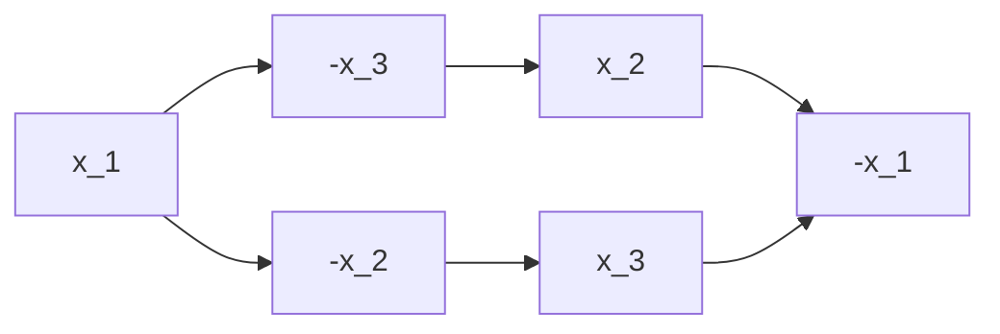

---
tags:
  - OMSCS
  - Algorithms
  - Alg-Graph
---
# 04.2 - Graphs - 2-SAT
- Satisfiability = SAT problem
- Boolean formula
	- n variables $X=[x_1, x_2, ..., x_n]$
	- 2n literals $L=[x_1, \overline{x_1}, x_2, \overline{x_2}, ..., x_n, \overline{x_n}]$
- $\wedge=\text{and}$
- $\vee=\text{or}$
- Conjunctive Normal Form (CNF)
	- each clause is an OR of several literals
	- $f$ in CNF is AND of $m$ OR clauses
- $(x_2)\wedge(\overline{x_3} \vee x_4) \wedge (x_3 \vee \overline{x_5} \vee \overline{x_1} \vee x_2) \wedge (\overline{x_2} \vee x_1)$
- We need to find values for $X$ s.t $f$ is true.

## SAT Problem
**Input:**
- Formula $f$ in CNF with $n$ variables and $m$ clauses
**Output:**
- assignment, assign T or F to each variable s.t. $f(X)=T$ 
	- satisfying if one exists
	- NO if no satisfying solution exists

## Example
$$
f=(\overline{x_1} \vee \overline{x_2} \vee x_3) \wedge (x_2 \vee x_3) \wedge (\overline{x_3} \vee \overline{x_1}) \wedge (\overline{x_3})
$$

- Because of $(\overline{x_3})$, $(x_3=T) \rightarrow \overline{f} \therefore x_3=F$
- $(\overline{x_3} \vee \overline{x_1})$ provides no additional constraints.
- Given that $x_3=F$, $(x_2 \vee x_3)$ requires $x_2=T$
- Given that $x_2=T$ and $x_3=F$, $(\overline{x_1} \vee \overline{x_2} \vee x_3)=(\overline{x_1} \vee F \vee F) \therefore x_1=F$

- **Satisfiable:** $X=[F,T,F]$

## k-SAT
**Input:**
- Formula $f$ in CNF with $n$ variables and $m$ clauses
- Each clause is of size $k$ **at most**. (prior example is a 3-SAT problem)
**Output:**
- assignment, assign T or F to each variable s.t. $f(X)=T$ 
	- satisfying if one exists
	- NO if no satisfying solution exists

- SAT is NP-complete
- $k$-SAT is NP-complete for all $k\ge 3$
- There exists a polynomial time algorithm for 2-SAT

## 2-SAT
- Consider input $f$ for a 2-SAT problem.
- Simplify
	- unit clause = clause with 1 literal
	- unit clauses coerce a value for the one literal that comprises the clause
	- Take a unit clause, literal $a_i$
	- Satisfy it (set $a_i=T$)
		- if $a_i=-x_j$, then $x_j=F$
		- if $a_i=x_j$, then $x_j=T$
	- Create $f'$
		- Remove clauses containing $a_i$
		- Drop $-a_i$
	- Continue until we've satisfied all variables, or until all remaining clauses are exactly size 2.
	- $f$ is satisfiable iff $f'$ is satisfiable
- For 2-SAT problems, we can apply this linear reduction until all clauses are of size exactly 2. Therefore, we can assume that all clauses are of size exactly 2 for this problem.

Simplification Example
- $f=(x_3 \vee -x_2) \wedge (-x_1) \wedge (x_1 \vee x_4) \wedge (-x_4 \vee x_2) \wedge (-x_3 \vee x_4)$
- $x_1=F$
- $f'=(x_3 \vee -x_2) \wedge (T) \wedge (F \vee x_4) \wedge (-x_4 \vee x_2) \wedge (-x_3 \vee x_4)$
- $f'=(x_3 \vee -x_2) \wedge (x_4) \wedge (-x_4 \vee x_2) \wedge (-x_3 \vee x_4)$
- $x_4=T$
- $f''=(x_3 \vee -x_2) \wedge (T) \wedge (F \vee x_2) \wedge (-x_3 \vee T)$
- $f''=(x_3 \vee -x_2) \wedge (x_2) \wedge (T)$
- $f''=(x_3 \vee -x_2) \wedge (x_2)$
- $x_2=T$
- $f'''=(x_3 \vee F) \wedge (T)$
- $f'''=(x_3)$
- $x_3=T$
- $f''''=T$
- **Satisfiable:** $X=[F,T,T,F]$

## Graph of Implications
- Take $f$ with all clauses of size 2.\
	- $n$ variables
	- $m$ clauses
- Create a directed graph
	- $2n$ vertices corresponding to literals
	- $2m$ edges corresponding to 2 "implications" per clause
- Given a clause: $(\alpha \vee \beta)$
	- "If alpha is false, then beta must be true." : $\overline{\alpha} \rightarrow \beta$
	- "If beta is false, then alpha must be true." : $\overline{\beta} \rightarrow \alpha$
	- This applies to every clause type. $\alpha$ and $\beta$ are stand-ins for literals, not variables. If we presume A and B to be variables instead, we see that it still works:
		- If the clause is $(\overline{\alpha} \vee \beta)$, then
			- $(\overline{\overline{\alpha}} \rightarrow \beta)=(\alpha \rightarrow \beta)$
			- $\overline{\beta} \rightarrow \overline{\alpha}$
		- If the clause is $(\alpha \vee \overline{\beta})$ we can commute: $(\overline{\beta} \vee \alpha)$
		- If the clause is $(\overline{\alpha} \vee \overline{\beta})$, then
			- $(\overline{\overline{\alpha}} \rightarrow \overline{\beta}) = (\alpha \rightarrow \overline{\beta})$
			- $(\overline{\overline{\beta}} \rightarrow \overline{\alpha}) = (\beta \rightarrow \overline{\alpha})$

### Example
Given: $f = (-x_1 \vee -x_2) \wedge (x_2 \vee x_3) \wedge (-x_3 \vee -x_1)$
- Clause 1: $(-x_1 \vee -x_2)$
	- $(x_1 = T) \rightarrow (x_2=F)$
	- $(x_2 = T) \rightarrow (x_1=F)$
- Clause 2: $(x_2 \vee x_3)$
	- $(x_2=F) \rightarrow (x_3=T)$
	- $(x_3=F) \rightarrow (x_2=T)$
- Clause 3: $(-x_3 \vee -x_1)$
	- $(x_3=T) \rightarrow (x_1=F)$
	- $(x_1=T) \rightarrow (x_3=F)$



### Path analysis
We have path $x_1 \rightarrow -x_2 \rightarrow x_3 \rightarrow -x_1$.
- If $x_1=T$ then $x_2=F$
- If $x_2=F$ then $x_3=T$
- If $x_3=T$ then $x_1=F$
- $x_1=T$ and $x_1=F$, **contradiction**
- Therefore, $x_1$ **must be false.**

If path $x_1 \rightarrow ... \rightarrow -x_1$ exists and path $-x_1 \rightarrow ... \rightarrow x_1$ exists, then $f$ is unsatisfiable. We can determine this by running SCC. If $x_a$ and $-x_a$ are in the same SCC, then $f$ is unsatisfiable.

## Application for the SCC Algorithm
**Lemma**
- if for some $i$, $x_i$ and $\overline{x_i}$ are in the same SCC, then $f$ is not satisfiable.
- if for all $i$, $x_i$ and $\overline{x_i}$ are in different SCCs, then $f$ is satisfiable.

### Approach 1
1. Take sink SCC $S$
2. set $S=T$, satisfy all literals in $S$
3. Remove $S$ and repeat. Work on the remainder of the graph.

This has the possibility of creating contradictions further up the chain. However, if we flip this logic, we can set the source SCC to false without implication.

### Approach 2
1. Take source SCC $S'$
2. Set S' to False
3. Remove this component. Continue to the rest of the graph.

Consider a source SCC $S'(x_4, -x_2)$. Setting this SCC to F requires that we set $x_4=F$ and $x_2=T$. If there exists SCC $\overline{S'}$, then we know the literals contained are $(-x_4, x_2)$, which is True. This is equivalent to Approach 1 but without introducing contradictions. It does this, because we "don't need to follow the implication" when the source SCC is false. This is why the process works.

![[Pasted image 20260301114203.png]]

## 2SAT Algorithm
**Key Fact:** if for all $i$, $x_i$ and $\overline{x_i}$ are in different SCCs, then if $S$ is a sink SCC, then $\overline{S}$ is a source SCC.

```
2SAT(f):
  1. Construct graph G for f
  2. Take a sink SCC S
     - Set S=T and -S=F
     - remove S and -S
     - repeat until empty
```

$O(n+m)$

## Proof of Key Fact
**Key Fact:** if for all $i$, $x_i$ and $\overline{x_i}$ are in different SCCs, then if $S$ is a sink SCC, then $\overline{S}$ is a source SCC.

### Simpler Claim
> If there's a Path $\alpha$ to $\beta$, then there's a path $\overline{\beta}$ to $\overline{\alpha}$.
> If there's a Path $\overline{\alpha}$ to $\overline{\beta}$, then there's a path $\beta$ to $\alpha$.

Take sink SCC $S$
- For $\alpha,\beta \in S$, there exists paths $\alpha$ to $\beta$ and $\beta$ to $\alpha$ in $G$
- That means there also exists paths between $\overline{\beta}$ and $\overline{\alpha}$ in $G$
- Therefore $\overline{\alpha}$ and $\overline{\beta}$ are in the same SCC
- **$S$ is an SCC, therefore $\overline{S}$ is an SCC**

### Rest of Proof
Take sink SCC $S$
- For $\alpha \in S$, presume there's no edges $\alpha \rightarrow \beta$
- That means there's no edges $\overline{\beta} \rightarrow \overline{\alpha}$
- If there's no outgoing edges from $\alpha$, then there's no incoming edges to $\overline{\alpha}$
- **Therefore $\overline{S}$ must be a source SCC**

### Proof of Claim
> If there's a Path $\alpha$ to $\beta$, then there's a path $\overline{\beta}$ to $\overline{\alpha}$.
> If there's a Path $\overline{\alpha}$ to $\overline{\beta}$, then there's a path $\beta$ to $\alpha$.

Take a path $\alpha$ to $\beta$. Rewrite this path in terms of $\gamma$.

$$\gamma_0 \rightarrow \gamma_1 \rightarrow \gamma_2 \rightarrow ... \rightarrow \gamma_l \text{ where } \gamma_0 = \alpha \text{ and } \gamma_l=\beta$$

- $\gamma_1 \rightarrow \gamma_2$ comes from $(\overline{\gamma_1} \vee \gamma_2)$
- therefore $\overline{\gamma_2} \rightarrow \overline{\gamma_1}$
- This allows us to construct a chain in the opposite direction

$$\overline{\gamma_0} \leftarrow $\overline{\gamma_1} \leftarrow $\overline{\gamma_2} \leftarrow ... \leftarrow $\overline{\gamma_l} \text{ where } \overline{\gamma_0} = \overline{\alpha} \text{ and } \overline{\gamma_l}=\overline{\beta}$$
