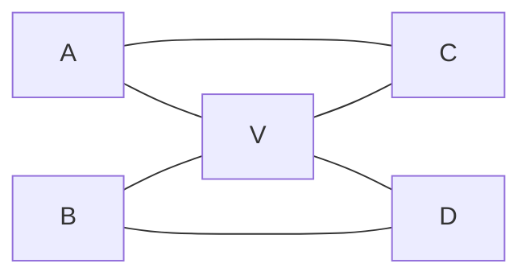
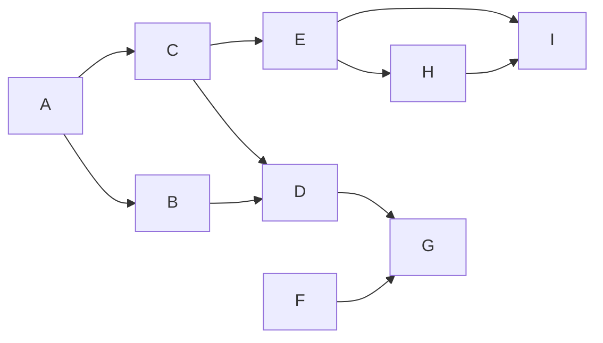
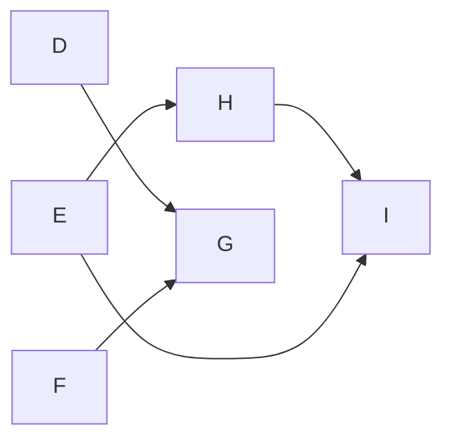
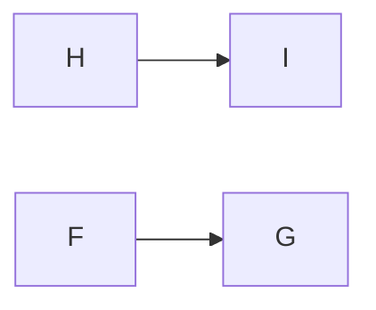
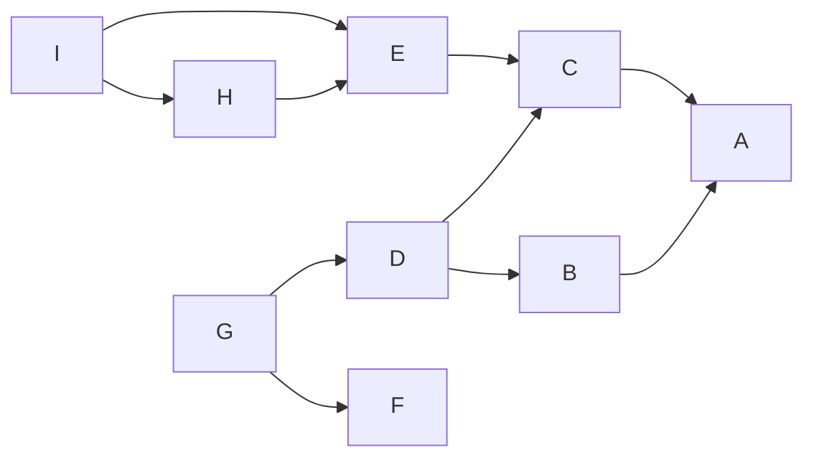
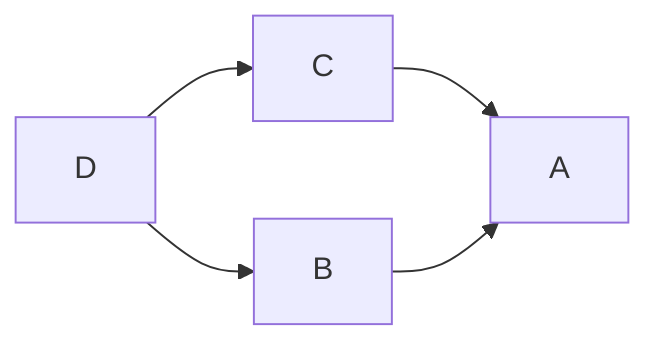
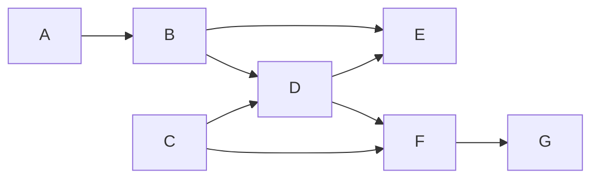

---
tags:
  - OMSCS
  - Algorithms
  - Alg-Graph
  - Alg-DP
---
# 04.4 - Graphs - HW5 Office Hours
This notes are related to HW5 and the office hours which discussed HW5, but do not contain the exact text of HW5. The purpose of this document is to help draft graph algorithms within the context of OMSCS's GA. This will be important for Exam 2.

## Key Ideas
- **Idea:** Every time you have a graph problem, ask whether you can reduce to an acyclic graph. This means whether running SCC makes it easier to understand the problem.
- **Idea:** Is the toposort helpful? This datastructure is included as a result of running SCC.

## Original Problem
> \[Redacted\]

- If you have just one source or one sink, you're done. Those vertices can reach all vertices. Most graphs aren't this simple.
- Look at the graph below. If we partition the graph on vertex V
	- In G_ABV, it's the only sink
	- In G_VCD, it's the only source

- We can rephrase the question in terms of "one source and one sink".
- We can even further simplify. If we have a graph with one source, and reverse the graph, it becomes the only sink in the graph.
- This leads us to our first rephrasing of the problem.

## Rephrasing
> Given a DAG, find **ALL** $v$ such that every vertex "after" $v$ in toposort order is reachable from $v$. Such a vertex which has this property in the forward and reverse direction of G is considered to be WC.

The **ALL** part is important. We need to apply this sub-algorithm to $G_{SCC}$ and $G_{SCC}^R$, to produce 2 sets of vertices. The intersection of those 2 sets of vertices contains the set of SCCs which are the solution to the problem.

**Lemma:** Let $G$ be a DAG with toposort $V=[v_1, v_2, ..., v_n]$. $v_i$ reaches all $v_j, i<j$ iff $v_i$ is the only source in $G(v_i, v_{i+1}, ..., v_n)$.

## Example 1
Here's an example. The vertices in this graph are labeled in alphabetical order matching the vertices' topo order. Looking at A, A can't reach F, so A cannot reach every node after A in the DAG's topo order: $\{A,B,C,D,E,F,G,H,I\}$

Let's skip ahead and look at vertex D. Vertex D's view of the DAG looks like this: Again, D cannot reach every vertex in the graph, as it can't reach F, E, H, nor I.

Skipping ahead, here's F's view of the DAG's topo order. F cannot reach H nor I, so F doesn't have the required property. Same goes for G. However, H and I do have the property. Once we get to H, the only vertices left are H and I. H can reach both, and is therefore the super-source in the remaining subgraph. Same goes for I. Therefore, we find that the set of vertices which are well-connected in the forward direction of $G$'s topo order is $V_{WC}^F=\{H,I\}$.

Now, we need to check this property in the other direction. To do this, we reverse the graph and apply the same procedure in reverse topo order: $\{I,H,G,F,E,D,C,B,A\}$

I cannot reach all future nodes in topo order, nor can H. The first node that we come across which can reach all future nodes is D. B and C cannot. A can as well, simply due to being the only node left in the graph. Therefore, we find that the set of vertices which are well-connected in the direction of $G^R$'s topo order is $V_{WC}^R=\{D,A\}$.

We now have $V_{WC}^R=\{D,A\}$ and $V_{WC}^F=\{H,I\}$. The intersection of these two sets is the null set ($V_{WC}^R \cap V_{WC}^F = \{\}$). Therefore there is no globally WC vertex in $G$.

## Example 2
Here's an example which does actually have a WC vertex. We can visually see that D connects to all vertices both before and after it.

In the forward direction, we can check the topo-order of G to see all the vertices which have the WC property. Those are $V_{WC}^F=\{C,D,F,G\}$. Now we check the reverse, which is the same graph but with reversed topo order vertex names. Those vertices are $V_{WC}^R=\{E,D,B,A\}$. Taking the intersection of those 2 sets yields what we expect. The only WC vertex in this DAG is vertex D.

$$V_{WC}^R \cap V_{WC}^F = \{C,D,F,G\} \cap \{E,D,B,A\} = \{D\}$$

The trick from here is **cleverly** processing the vertices.

## Brute Force
The BF solution involves checking this property via DFS from all $v \in V_{SCC}$. This is $O(n(n+m))$. We want to beat this time.

## In-Degree Hacking
- If we have both $G$ and $G^R$, we can determine the in-degree of every $v \in V$ by checking the length of the adjacency list of each $v$ in $G^R$. This can be symbolized $deg_{in}(v)$, computable in linear time.
- The vertices $\{v \in V : deg_{in}(v)=0\}$ are the source vertices.
- If there's only one source vertex, then it's a candidate WC vertex.

We will eventually move on from a source vertex, onto another vertex in the graph. Suppose we start at $v_1$ in toposort order and then move on to $v_2$ in toposort order. We need to logically delete $v_1$ from $G$ so that we can consider only the information that's further along in the toposort order from $v_1$.

To accomplish this, for every edge coming out of $v_1$ to $v_j$, we can decrement $deg_{in}(v_j)$. This removes the information about nodes prior to $v_{2}$ from $G$. Changing $v_1$ to $v_i$ and $v_2$ to $v_{i+1}$, and we have a generalized process for advancing through the graph.

## N^2 Algorithm
Now, we have an $O(n^2)$ algorithm.

1. Create an empty set of candidate vertices named $V_{WC}$ (boolean array impl, O(n)).
2. Create a reverse graph $G^R$. (O(n+m))
3. Compute the in-degree for each $v \in V$. This array is named $deg_{in}$. (O(n))
4. For each $v_i:1 \le i \le n$
	1. Count the number of source vertices in $deg_{in}$. If there's only one add it to $V_{WC}$ (O(n))
	2. For each vertex $v_j$ adjacent to $v_i$ decrement its in-degree $deg_{in}(v_j) := deg_{in}(v_j) - 1$

 This is slightly better than $O(n(n+m))$. If it weren't for step 4.1, this would be bounded by O(n+m).  
## O(n+m) Algorithm
> Can we do better?

**Yes!**

We simply keep track of the number of source vertices over each iteration. The only vertices which can become source vertices are adjacent to $v_i$. Let's rewrite the procedure.

1. Create an empty set of candidate vertices named $V_{WC}$ (boolean array impl, O(n)).
2. Create a reverse graph $G^R$. (O(n+m))
3. Compute the in-degree for each $v \in V$. This array is named $deg_{in}$. (O(n))
4. Count the number of source vertices $NSources$ in $deg_{in}$. This is guaranteed to be > 0. We're not computing the set of source vertices, just keeping track of the size of what that set would be. We are technically going to be keeping track of it, but recovering that set requires $O(n)$ time to extract it from $deg_{in}$.
5. For each $v_i:1 \le i \le n$
	1. If $NSources=1$, then we add $v_i$ to $V_{WC}$. (O(1))
		1. We can do this because $v_i$ is guaranteed to be a source from $v_i$'s view of the DAG.
		2. We've already logically removed all prior sources from this reductive view of the DAG.
	2. For each vertex $v_j$ adjacent to $v_i$ (O(m/n))
		1. Decrement its in-degree: $deg_{in}(v_j) := deg_{in}(v_j) - 1$
		2. If $deg_{in}(v_j)=0$ as a result of this update, increment $|V_S|$
	3.  Since $v_i$ is guaranteed to be a source from $v_i$'s view of the DAG, we decrement $NSources$ to account for the logical removal of $v_i$ from the DAG.

This procedure finds $V_{WC}$, the set of vertices which are WC in the forward direction only. This procedure also runs in $O(n+m)$ time. The $O(n+m)$ steps are:

- Generating the reverse graph.
- The double loop of iterating over all vertices in $G$ and then over the adjacency list for each of those vertices.

We then perform this same procedure to $G^R$ to generate $V_{WC}^R$. Taking the intersection of $V_{WC}^R$ and $V_{WC}$ gets the set of vertices which are WC in **both** directions. Running this procedure twice is still $O(n+m)$.
