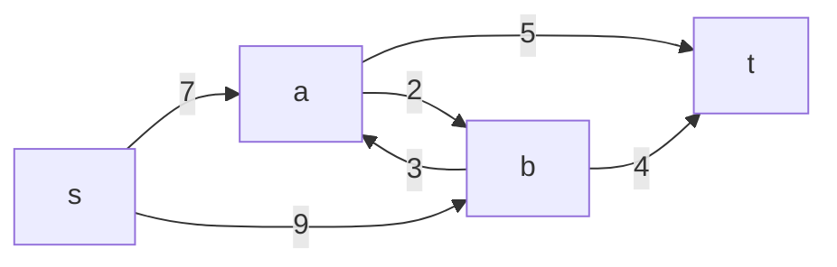
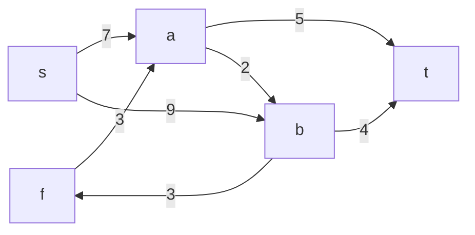
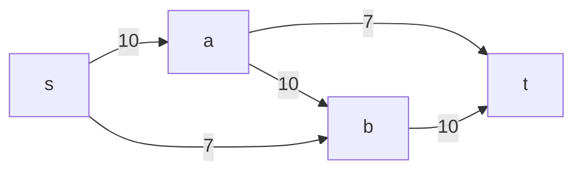
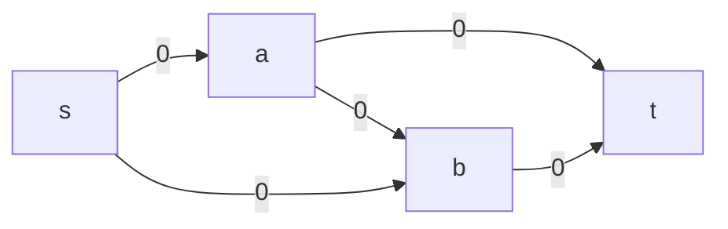
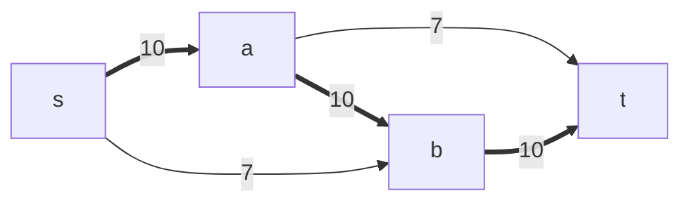
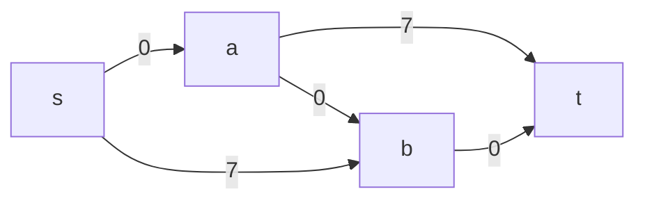
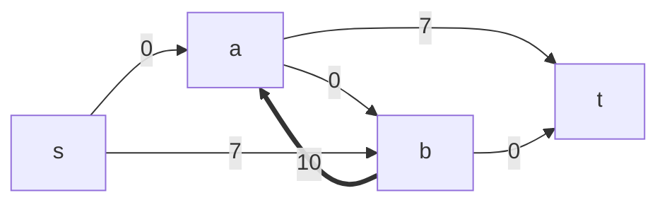
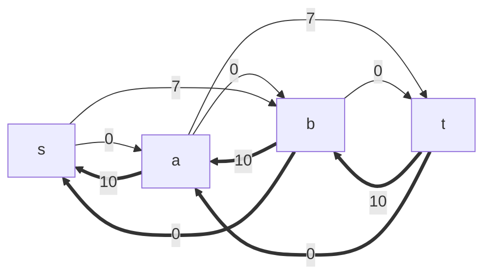

---
tags:
  - OMSCS
  - Algorithms
---
# 05.1 - Max Flow - Ford-Fulkerson
Outline for unit
- ford-fulkerson algorithm
- max-flow = min-cut
	- implies correctness of FF and EK algorithms
- image segmentation
	- application of MaxFlow/MinCut
- max-flow with demands
- edmonds-karp algorithm

## Problem Setup
**Setting:**
- sending supply from vertex $s$ to vertex $t$
- have directed network (possibly a DAG, not necessarily)
- edges have "capacities," instead of weights
- maximize amount sent from $s$ through $G$ to $t$

**Problem Formulation:**
- Flow network:
	- directed graph $G=(V,E)$
	- designated $s,t \in V$
	- for each $e \in E$, capacity $c_e > 0$
- Maximize flow $s$ to $t$
- $f_e=$ flow along edge $e$
- **Input:** Flow network
- **Goal:**
	- find flows $f_e$ for $e \in E$
	- **Capacity Constraint:** for all $e \in E, 0 \le f_e \le c_e$
	- **Conservation of Flow:** for all $v \in V - \{ s \cup t \}$
		- flow-in to $v$ = flow-out of $v$
		- $\sum_{(w, v) \in E}f_{(w,v)}=\sum_{(v, z) \in E} f_{(v,z)}$
	- **Maximize:** find a valid flow of maximum size
		- $size(f)=$ total flow sent
		- = flow-out of $s$
		- = flow-in to $t$

## Example
![[Pasted image 20260309221138.png]]
- Source vs Sink
	- Max flow out of $s$: $6+4+5=15$
	- Max flow in to $t$: $7+5=12$
	- $min(12,15)=12$
	- Can we use all 12 capacity units?
- vertex $d$
	- Max flow in: 10
	- Max flow out: 8
	- min = 8
- vertex $f$
	- Max flow in: 2
	- ...

| Vertex | Max Flow In | Max Flow Out | Max Flow Through |
| ------ | ----------- | ------------ | ---------------- |
| s      | $\infty$    | 6+4+5=15     | 15               |
| a      | 6           | 10           | 6                |
| b      | 4           | 1            | 1                |
| c      | 5+3=8       | 8            | 8                |
| d      | 8+2=10      | 5+3=8        | 8                |
| e      | 2+1+3=6     | 2            | 2                |
| f      | 8           | 7+3=10       | 8                |
| t      | 5+7=12      | $\infty$     | 12               |
- 6 through $(s,a)$, 6 through $(a,d)$.
	- $d$ has 6 flow.
- 1 through $(s,b)$, 1 through $(b,e)$, 1 through $(e,d)$.
	- $d$ has 7 flow.
- 5 through $(d,t)$
	- $t$ has 5 flow.
	- $d$ has 2 remaining.
- 5 through $(s,c)$, 5 through $(c,f)$, 5 through $(f,t)$
	- $t$ has 10 flow.
	- $(c,f)$ has 3 remaining out capacity
	- $(f,t)$ has 2 remaining out capacity
- 2 through $(d,c)$, 2 through $(c,f)$, 2 through $(f,t)$
	- $d$ is empty
	- $t$ has 12 flow

**Total flow: 12** ($size(f)=12$)
**Edges used:**
- $sa=6, sb=1, sc=5$
- $ad=6, ae=0$
- $be=1$
- $cf=7$
- $dc=2, dt=5$
- $ed=1$
- $fe=0, ft=7$

We know that we've achieved the maximum flow because if we subtract the flow from the edges incoming to $t$, then $t$ has no remaining incoming capacity, and is therefore now "cut off" from the rest of the network. The upcoming algorithms will codify that behavior.

## Cycles are OK
In fact, the previous example has a cycle.

- $C \rightarrow F \rightarrow E \rightarrow D \rightarrow C$
- The flow doesn't typically use the cycle.
- If we send a unit of flow out of D, around the cycle, then back out of D through $(d,t)$, why didn't we just send it right out of $(d,t)$ in the first place? Makes no sense.
- Part of the cycle may be utilized. Sometimes you need to pass flow across the network in order to achieve the max flow.

## Anti-Parallel Edges

In the graph below, there are anti-parallel edges between a and b.

For some reason, we want to remove anti-parallel edges. We can remove those edges by interrupting one of the flows with a new node, with the same input-output flow. We'll call this new vertex $f$ in the diagram.

Isn't that much nicer? Apparently this is important. Regardless, this was not a crazy transformation, so we can easily convert the max flow on $G'$ back to $G$.

## Toy Example

## Algorithm Idea
1. Start with $f_e=0$ for all $e \in E$
2. We'll keep track of an "available capacity" for each edge. This is just $c_e - f_e$.
3. Find an st-path ($P$) **with available capacity** (a path from s to t). This can be done with BFS or DFS.
4. Let $c(P)=min_{e \in P}(c_e - f_e)$ be the minimum capacity edge in $P$. This is the maximum amount of flow that can be sent along that path, considering the available capacity of all $e \in P$.
5. Augment $f$ by $c(P)$ along $P$

**Available Capacity**

**Flow**

**P Selection**

**Update Flow**

**Available Capacity**

We've achieved a flow of 10, but now we can't reach t from s.

## Backward Edges
The algorithm selected edge $(a,b)$ and used all of its available capacity. If we now evaluate edge $(s,b)$, there's nowhere to send the available capacity of 7. However, we can consider Backwards Edges. Effectively, now that we've sent 10 units of flow across $(a,b)$, there's now an available capacity of $(b,a)$ of 10. This is effectively sending flow backwards through the pipe, back to where it came from.

In fact we can do this for all edges. The bold edges are the backwards edges.

We refer to this network as the **Residual Network**, renaming it from the **Available Flow** network.

## Residual Network
Definition of residual network: $G^f=(V,E^f)$

For flow network $G=(V,E)$ with $c_e$ for $e \in E$ and flow $f_e$ for $e \in E$
- If $vw \in E$ and $f_{vw} < c_{vw}$, then add $vw$ to $G^f$ with capacity $c_{vw}-f_{vw}$
- If $vw \in E$ and $f_{vw} > 0$, then add $wv$ to $G^f$ with capacity $f_{vw}$

## Ford-Fulkerson Algorithm
1. Set $f_e=0$ for all $e \in E$
2. Build the residual network $G^f$ for current flow $f$
3. Check for a st-path in $G^f$. If no such path, then output $f$
4. Given $P$, let $c(P)=$ min capacity along $P$ in $G^f$
5. Augment $f$ by $c(P)$ units along $P$
6. Repeat from step 2 until no such st-path

### Running Time
- **Correctness:** follows from max-flow = min-cut theorem
- **Major Assumption:**
	- Assume all capacities are integers
	- When we augment flows, we augment them by an integer amount.
	- Flow increases by $\ge 1$ unit per round
- Let $C=$ size of max flow, then $\le C$ rounds.

- **The time needed for one round of the algorithm.**
	- Build residual network...
		- Must be built once at the beginning: $O(n+m)$
		- On each iteration, it only changes based on the changes made along st-path $P$
		- Path is of length at most $n-1$ edges.
		- On each iteration: $O(n)$
	- Finding st-path...
		- DFS or BFS: naively $O(n+m)$
		- Let's assume that $m \ge n-1$. Therefore we're bounded by order $m$ 
		- $O(m)$
	- Augment $f$...
		- $O(n)$
	- Each iteration is dominated by $O(m)$

**Overall:** $O(mC)$

**Complications**
- Run time depends on output
	- $O(mC)$ is pseudo-polynomial
	- Edmonds-Karp: $O(m^2n)$, which may be desirable in some cases.
	- Orlin 2013: $O(mn)$
- Assumes integer capacities.