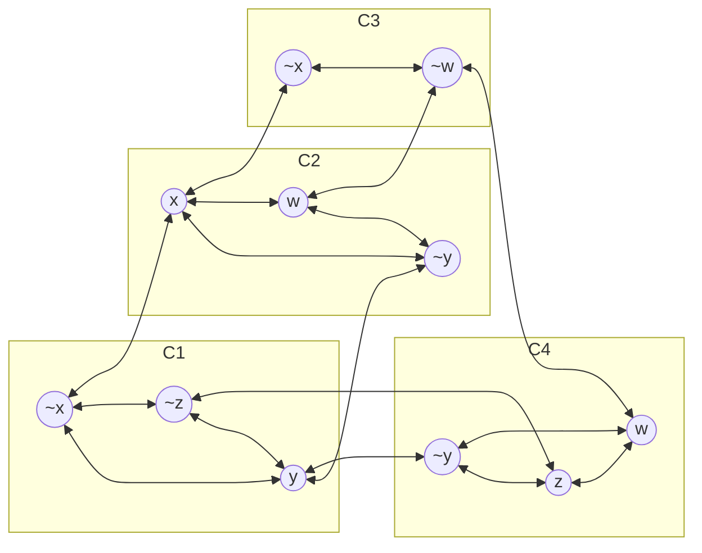
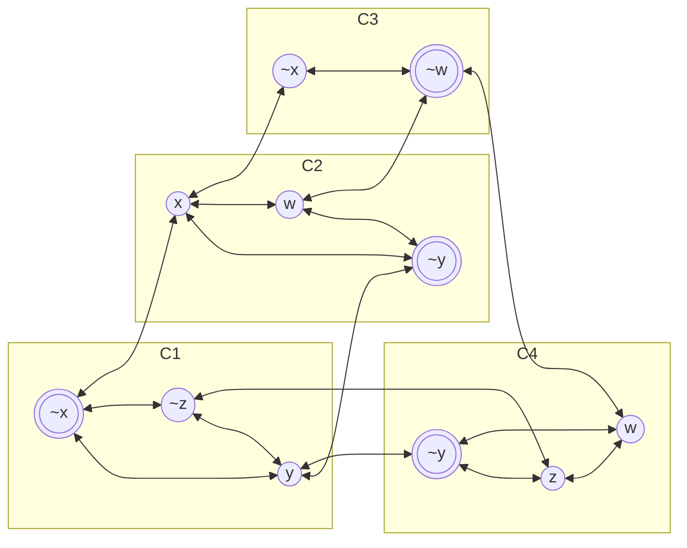

---
tags:
  - OMSCS
  - Algorithms
---
# 06.5 - NP - Graph Problems
- 3SAT is NP-complete
- Independent Sets
- Clique
- Vertex Cover

## Independent Set
- For undirected $G=(V,E)$
- A subset $S \subset V$ is an independent set if no edges are contained in $S$.
- $\forall_{x,y \in S} \space (x,y) \notin E$
- **Input:** Undirected $G=(V,E)$
- **Output:** Independent set $S$ of maximum size

This problem is not in NP, because there's no way to verify that $S$ is of maximum size without running the algorithm again. If we introduce a goal, we can produce an algorithm which is in NP.

## Independent Set (Search)
- **Input:**
	- Undirected $G=(V,E)$
	- Goal $g$
- **Output:**
	- Independent set $S$ where $|S| \ge g$ (if one exists), "No" otherwise

This version of the problem lies in NP, because we can easily validate it.
- $\forall_{x,y \in S} \space (x,y) \notin E$ runs in $O(n^2)$ time
- Checking $|S| \ge g$ runs in $O(n)$ time

Can we reduce from a known NP-complete problem to the independent-set problem?

## 3SAT to IS reduction
- Consider 3SAT input $f$ with variables $x_1,...,x_n$ and clauses $C_1, ..., C_m$
- Each clause has size $|C_i| \le 3$
- We can define a graph $G$ based on $f$, and set the goal to m ($g=m$).
- Idea: For each clause $C_i$, we'll create $|C_i|$ vertices.
- There will be at most $3m$ vertices in $G$
- Different types of edges, the first type being **Clause Edges**

### Clause Edges
![[Pasted image 20260326141036.png]]

- Independent set $S$ has $\le 1$ vertex per clause.
- Since $g=m$, solution has $=1$ vertex per clause.
- Each vertex $v \in S$ defines the "satisfied literal" in a given clause.
- The independent set $S$ must correspond to a valid assignment. In the example above, we can't use $S=\{x_1, x_5, \overline{x_1}\}$, since this sets $(x_1=T) \wedge (\overline{x_1}=T)$
- To account for this, we introduce **Variable Edges**

### Variable Edges
![[Pasted image 20260326141628.png]]

- For each variable $x_i$, we add edges between all literals $x_i$ and all $\overline{x_i}$ in $G$

### Example
- Variables $x,y,w,z$
- $f=(\overline{x} \vee y \vee \overline{z}) \wedge (x \vee \overline{y} \vee w) \wedge (\overline{x} \vee \overline{w}) \wedge (\overline{y} \vee z \vee w)$
- We'll start by encoding the clauses
	- Add a vertex for each literal in each clause
	- Connect all literals in the same clause to each other
- Then we add edges between all literals which are opposite each other.
- The graph below shows the resulting network.
	- The clauses are separated into boxes for visual clarity. 
	- These clausal structures aren't apparent in the graph.
	- Each vertex has a unique label, based on clause and literal

We can then find an independent set in this network. Here's one such IS. This corresponding to assignment:
- $x=F, y=F, w=F, z=?$
- Note that $z$ is floating, and can be T or F

### Correctness
> $f$ has a satisfying assignment $\iff$ $G$ has an independent set of size $\ge g$
### Forward Implication
> $f$ has a satisfying assignment $\rightarrow$ $G$ has an independent set $S$ of size $|S| \ge g$

- Consider a satisfying assignment for $f$
	- For each clause $C$, take 1 of the satisfied literals, and add the corresponding vertex to $S$
	- $|S|=m=g$
- $S$ has $=1$ vertex per clause, and not both $x_i$ and $\overline{x_i}$.
	- "$S$ has $=1$ vertex per clause". This means there are no clause edges connecting the vertices in $S$
	- "not both $x_i$ and $\overline{x_i}$". This means there are no variable edges connecting vertices in $S$.
- Therefore, $S$ is an independent set in $G$
### Reverse Implication
> $f$ has a satisfying assignment $\leftarrow$ $G$ has an independent set $S$ of size $|S| \ge g$

- Consider independent set $S$ of size $\ge g$
- This has $=1$ vertex per clause
- We set the corresponding literal to True
- Therefore every clause is satisfied
- $S$ encodes no contradictory literals, due to the **variable edges**
- Therefore, $S$ defines a valid assignment for $f$
- Note that $S$ doesn't need coverage over the variables that constitute $f$ in order for $S$ to define a **satisfying** assignment for $f$. $f$ may have many different satisfying assignments.

## NP-Hard
- Let's go back and look at the optimization version of IS
	- **Input:** Undirected $G=(V,E)$
	- **Output:** Independent set $S$ of maximum size
- For the IS-Search problem, it's possible to validate a solution in polynomial time
- It's possible to reduce IS-Search to Max-IS
	- If you find the max IS, that either gives you an $|S| \ge g$ or no solution
	- Therefore there exists a reduction from every problem in NP to Max-IS
		- There exists a reduction from every problem in NP to 3SAT
		- There exists a reduction from 3SAT to IS
		- There exists a reduction from IS to Max-IS
- **Theorem:** Max-Independent-Set problem in **NP-Hard**.
- **NP** problems are hard problems which have P-time solutions.
- **NP-Complete** problems are the hardest problems in NP.
- **NP-Hard** means it's at least as hard as every problem in NP.

## Clique Problem
- A clique is a fully-connected subgraph.
- For $G=(V,E)$, $S \subset V$ if for all $\forall_{x,y \in S}\space (x,y) \in E$
- This is the opposite of IS?
- We want **big cliques.**
	- A single vertex forms a clique.
	- 2 connected vertices form a clique.
	- Small cliques are easy, big cliques are the problem
- The highlighted vertices below form a clique

![[Pasted image 20260326151527.png]]

### Clique Problem Formulated
- **Input:**
	- $G=(V,E)$
	- goal $g$
- **Output:**
	- $S \subset V$ where $S$ is a clique of size $|S| \ge g$, if one exists, and "NO" otherwise.

### Clique Proof
> Clique is NP-Complete

We can validate a not-NO solution to this problem in $O(n^3)$ time by checking the definition of a clique: $\forall_{x,y \in S}\space (x,y) \in E$. Better algorithms exist and we could get this down to $O(n^2)$, but the point is we have a "bad" validation algorithm which is polynomial. We can also validate $|S| \ge g$ in $O(n)$ time.

**Therefore Clique is in NP.**

To prove that Clique is NP-Complete, we have to find a reduction from a known NP-Complete problem to Clique. We already have a known graph problem which is NP-Complete within this very document. Can we modify it?

### IS $\rightarrow$ Clique Reduction
- **Key Idea:**
	- Cliques are fully connected in S.
	- IS has no edges within S.
	- Clique is the **opposite** of IS
- For $G=(V,E)$, we assume that we have an algorithm for the clique problem.
- Therefore, to solve the "opposite" problem, we take the opposite of the graph.
- $\overline{G}=(V,\overline{E})$ where $\overline{E}=\{(x,y) : x,y \in V \text{ and } (x,y) \notin E\}$
- $(x,y) \in E \iff (x,y) \notin \overline{E}$
- $S$ is a clique in $\overline{G}$ $\iff$ $S$ is an independent set in $G$
	- If $S$ is an independent set in $G$, then in $\overline{G}$, all of the vertices in $S$ are fully connected
	- If $S$ is fully connected in $G$, then in $\overline{G}$, all of the vertices in $S$ have no edges directly between them.
- Remember that currently, "Clique" is the **unknown** problem, and IS is the **known hard** problem. We need to translate the inputs to IS to the input for Clique, then transform the output of Clique to the output of IS.
	- Given input $G=(V,E)$ and goal $g$ for the IS problem.
	- Let $\overline{G}$ and $g$ be the input to the clique problem
	- We get a set $S$ which is a Clique in $\overline{G}$
	- Returning $S$ gives us an IS in $G$, the solution to the IS problem
	- If we get NO, we return NO.

## Vertex Cover
- For undirected $G=(V,E)$, subset $S \subset V$ is a vertex cover if it "covers every edge".
- $S$ "covers" every edge if $\forall_{a,b \in E} \space (a \in S) \vee (b \in S)$
- $S=V$ is always a valid vertex cover, but not an interesting one.
- The NP-Hard variant of this problem is finding the minimum size $S$.

![[Pasted image 20260326170445.png]]

### Search Version
- **Input**
	- $G=(V,E)$
	- budget $b$
- **Output**
	- vertex cover $S$ of size $|S| \le b$ if one exists
	- No otherwise
- Vertex Cover is in NP
	- Proposed solution: $S$
	- Iterate over all edges: $O(n+m)$
		- See if either its vertices are in $S$
	- Check $|S| \le b$: $O(n)$
	- This is poly-time.
- Is Vertex Cover in NP-Complete? Need to reduce from another problem to Vertex Cover
- Candidate Problems
	- SAT
	- 3SAT
	- IS
	- Clique
- Most natural to take a graph problem, so IS or Clique. Let's try IS

### IS $\rightarrow$ VC
- **Idea:** Model the edges as vertices and the vertices as edges?
- **Claim:** $S$ is a vertex cover $\iff$ $\overline{S}$ is an independent set

The graph below is a minimum vertex cover. The shaded vertices are $S$. $\overline{S}$ is an independent set. How does this work?

 ![[Pasted image 20260326202008.png]]

Suppose that $S$ is a vertex cover. That means that all of the edges in $G$ touch at least one covered vertex. Now suppose that there exists a vertex $a$ which is connected to a vertex $b$, where $a \notin S$ and $b \notin S$. This would mean that $(a,b)$ is not covered by $S$, making $S$ not a vertex cover. This presents a contradiction. Therefore, if $S$ is a vertex cover, there cannot exist any connected pairs of vertices which are not in $S$. This means $\overline{S}$ must be an independent set.

### Forward Implication
> $S$ is a vertex cover $\implies$ $\overline{S}$ is an independent set

- Take vertex cover $S$.
- For edge $(x,y) \in E$
	- $\ge 1$ of x or y are in $S$
	- $\le 1$ of x or y in $\overline{S}$
- This implies that no edge is contained in $\overline{S}$
- Thus, $\overline{S}$ is an independent set.

### Reverse Implication
> $\overline{S}$ is an independent set $\implies$ $S$ is a vertex cover

- Take independent set $\overline{S}$
- For every $(x,y) \in E$
	- $\le 1$ of x or y in $\overline{S}$
	- $\ge 1$ of x or y in $S$
- Therefore, $S$ covers every edge in the graph.

### Reduction
$IS \rightarrow VC$

- For input $G=(V,E)$ and $g$ for independent set
	- let $b = n - g$
	- Run vertex cover on $G,b$
- $G$ has a vertex cover of size $\le n-g$ $\iff$ $G$ has an independent set of size $\ge g$
	- $n-g$ because $|V|=|S|+|\overline{S}|=n=g+(n-g)$
- Given solution $S$ for VC, return $\overline{S}$ as solution to IS problem
- If no solution for VC, then there's no solution for the IS problem

## Practice Problems
- [[8.4 - Clique 3]]
- [[8.10 - NP-Completeness by Generalization]]
- [[8.14 - Clique + IS]]
- [[8.19 - Kite]]

Remember for all of these practice problems, and for future homeworks in this course.
- Follow this general procedure
	- Take a known NP-Complete problem, and an unknown problem.
	- Validate that the unknown problem is in NP.
	- You might need to modify the problem to become a "search" problem by introducing a goal or budget.
	- Then, suppose that an algorithm exists to solve instances of that unknown problem.
	- Use the algorithm for the unknown problem to solve instances of the known NP-Complete problem.
		- Translate instances of the known NP-Complete problem into instances of the unknown NP problem.
		- Translate solutions to the unknown NP problem back into instances of the known NP-Complete problem.
- How to pick which algorithm? Try to pick one which is similar in structure.
	- SAT-like problem? Use SAT or 3SAT
	- Graph problem? IS, Cliques, or Vertex Cover
- Roughly 2 flavors of NP-Completeness reduction
	- Generalization
		- Show that the new problem is more general than the NP-Complete problem.
		- Generally speaking, NP-Complete -> NP reduction is always demonstrating a generalization
		- In this strategy, we're setting the parameters of the unknown problem to handle the parameters of the known problem.
	- Gadget
		- 3SAT proof.
			- [[3SAT is NP.pdf]]
			- [[06.3 - NP - 3SAT]]
		- Take the formula and modify it in some way.
