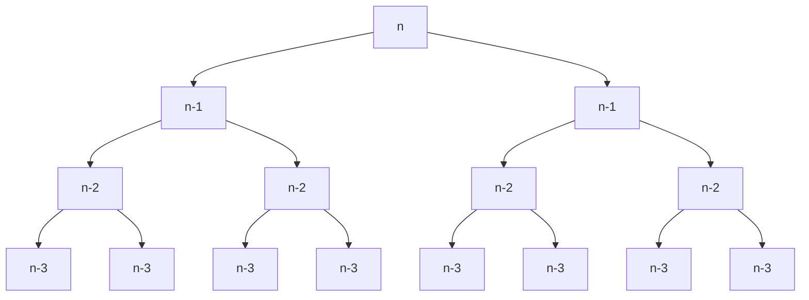

---
tags:
  - OMSCS
  - Algorithms
  - Practice
  - Alg-DC
---
# 2.4 - Choosing Between 3 Algorithms
![[Pasted image 20260207103500.png]]

- Algorithm A
	- $T(n)=5T(n/2)+O(n)$
	- $a=5,b=2,d=1$
	- $log_25 \approx 2.32$
	- $d < log_25$
	- $T(n)=O(n^{log_25})\approx O(n^{2.32})$
- Algorithm B
	- $T(n)=2O(n-1)+O(1)$
	- $a=2,b=1,d=0$
	- $T(n)=O(n^2)$
- Algorithm C
	- $T(n)=9O(n/3)+O(n^2)$
	- $a=9,b=3,d=2$
	- $log_39=2$
	- $d=log_39$
	- $T(n)=O(n^2 \space log \space n)$

The algorithm with the lowest bit-O among these is Algorithm B. Assuming that $n$ is unbounded, Algorithm B is the clear choice.

## Algorithm B's Runtime is Wrong
The answer blindly assumed that there exists a $log_12$. In actuality, $\lim_{x \rightarrow 1}log_x2 \in \{-\infty, \infty\}$, depending on whether $x=1$ is approached from the left or the right. Reviewing the call stack of this answer sheds more light on the situation.

At each level $i$ in the tree, we're processing $2^{i-1}$ subproblems of size $(n-i+1)$ elements. The depth of the tree is $n$, because subproblem size decreases by 1 at each level. At the very bottom of the call stack, we're processing $2^{n-1}$ subproblems of size 1. The amount of additional work processed at each step in the call stack is constant $O(1)$. Therefore the runtime of this algorithm is $O(2^n)$.