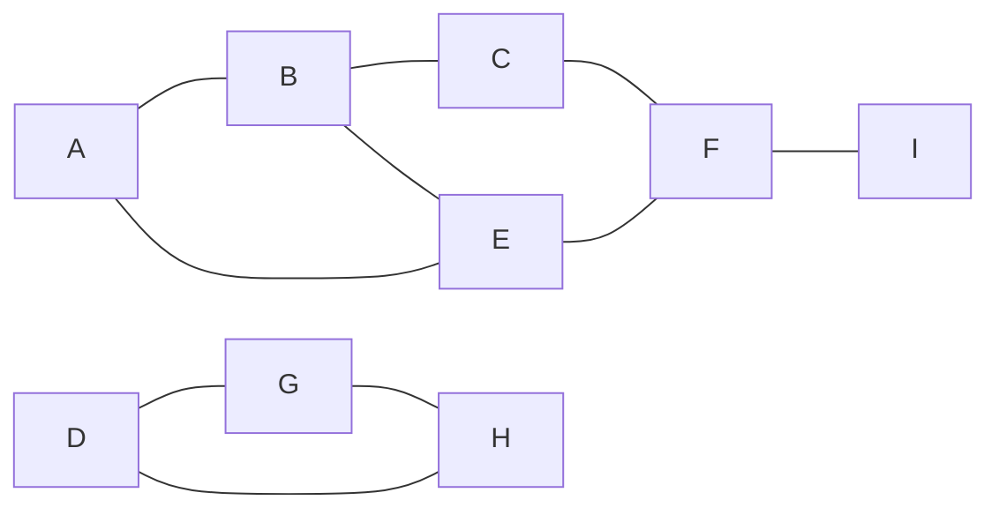
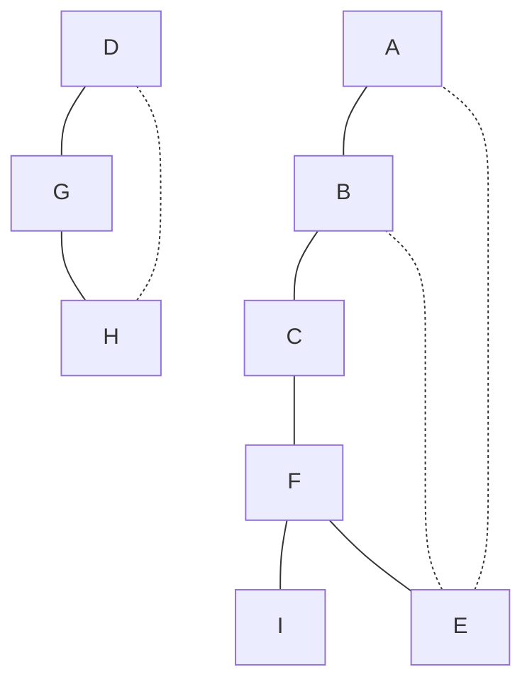

---
tags:
  - OMSCS
  - Algorithms
  - Practice
  - Alg-Graph
---
# 3.1 - DFS on Undirected G
![[Pasted image 20260313091135.png]]

Graph rewritten in mermaid.

Ignore the directed arrows. This graph is meant to be undirected.

| V   | Pre | Post |
| --- | --- | ---- |
| A   | 1   | 12   |
| B   | 2   | 11   |
| C   | 3   | 10   |
| D   | 13  | 18   |
| E   | 5   | 6    |
| F   | 4   | 9    |
| G   | 14  | 17   |
| H   | 15  | 16   |
| I   | 7   | 8    |
- **Tree Edges:**
	- Tree 1: AB, BC, CF, FE, FI
	- Tree 2: DG, GH
- **Back-Edges:**
	- Tree 1: EA, EB
	- Tree 2: HD

