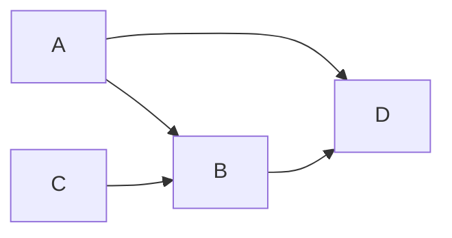
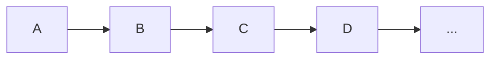
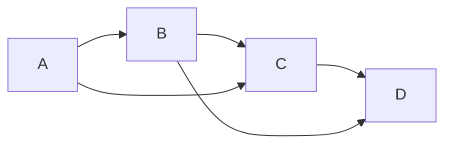
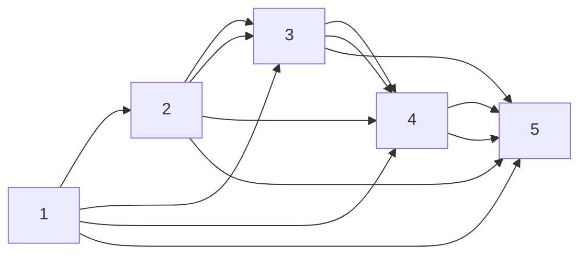
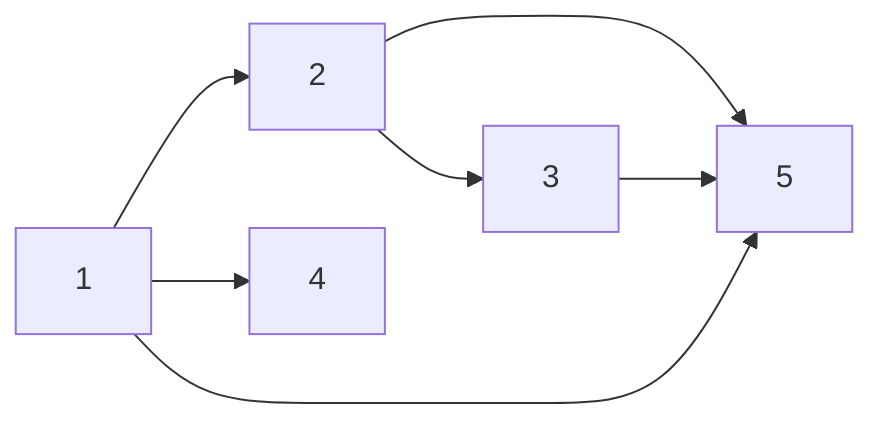
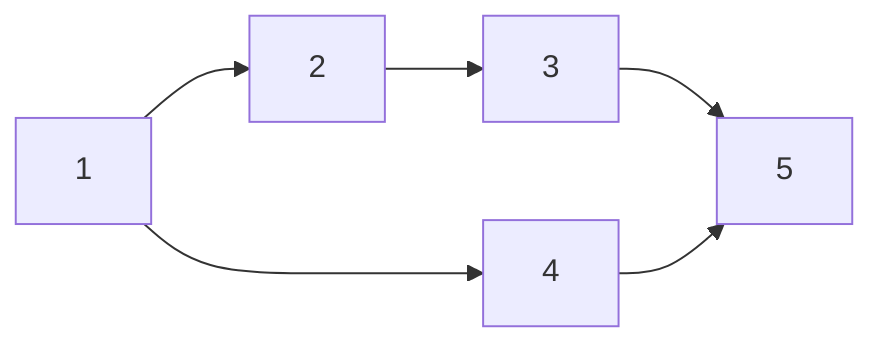
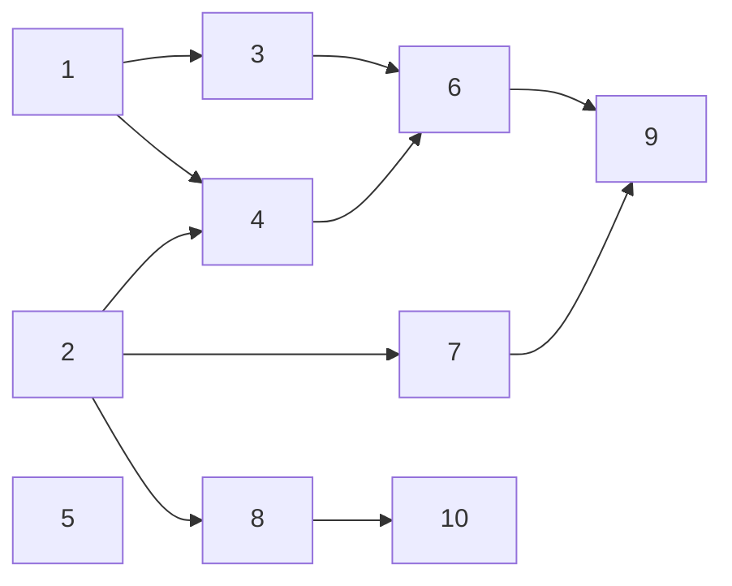

---
tags:
  - OMSCS
  - Algorithms
  - Practice
---
# 3.16 - CS Curriculum
![[Pasted image 20260301134926.png]]

> Suppose a CS curriculum consists of n courses, all of them mandatory. The prerequisite graph G has a vertex for each course, and an edge from course v to course w if and only if v is a prerequisite for w. Find an algorithm that works directly with this graph representation, and computes the minimum number of semesters necessary to complete the curriculum (assume that a student can take any number of courses in one semester). **The running time of your algorithm should be linear.**

## Exploration
### Symbology
- $G=(V,E):$ the graph of course dependencies, comprised of its vertices and edges. This graph is a DAG.
- $TO:$ A topological ordering of $V$
- $TOL:$ A reverse mapping of $O$, mapping $v \in V$ to indices of $O$.
- $G^R=(V,E^R):$ a reversed copy of $G$, containing a copy of the vertices of $G$, but with all edges $(u,v)\in E$ reversed.
- $V_S:$ The initial set of vertices in $V$ which are the initial set of source vertices.
- $V_T:$ The subset of vertices $V$ which have already been taken. This is modeled as an array of booleans.
- $P[v]:$ The set of upstream prerequisites of some vertex $v$. This is simply a shortcut for the following $O(n)$ expression: $P[v] = \{u : (v, u) \in E^R\}$
- $D[v]:$ The set of downstream dependents of some vertex $v$. This is simply a shortcut for the following $O(n)$ expression: $D[v]=\{u:(v,u) \in E\}$

### Topological Ordering
We know that the existing graph representation is $G=(V,E)$ and that it must be a DAG. Otherwise, we can't find a topological ordering of courses, and therefore it will be impossible to graduate. (It may still be impossible to graduate in the event the last course is Algorithms, but that's besides the point.)

Since we know it's a DAG already, there's no reason to run SCC, as doing so would just return the same DAG. However we don't yet have a topological ordering of $G$. We can generate this ordering in $O(n+m)$ time, calling it $TO$. To quickly touch on the usage of $TO:$

- $TO[i]$ returns some $v \in V$
- $TO[1]$ returns a source vertex of $G$.
- $TO[n]$ returns a sink vertex of $G$.
- Everything in the middle is either sources or sinks.

$TO$ represents a unique mapping of topological order index to vertex $v$. In order to lookup a vertex in $TO$, we will need to scan $TO$ to find the index which contains $v$. We can make a reverse mapping in $O(n)$ time, and we can call it $TOL$, which maps a given vertex $v$ to it's topological ordering in $TO$.

### Course Availability
For semester 1, a given course is "available" for a student to take if it's a source vertex in the DAG. Source vertices don't depend on each other, and there's no restrictions on credit hours, so a student can simultaneously take all of the courses which are source vertices at the same time. Removing all current source vertices from the DAG will reveal at least one new source vertex. However, not all of the vertices that have incoming edges from a source vertex will become source vertices if all current source vertices are removed. In the graph below, exploring A and C reveals both B and D. However, D is still blocked by B.

D has a transitive dependency on A through B, so the (A,D) edge is redundant. However, we can't easily remove redundant transitive edges. Doing so would modify G, which is likely not allowed. Further, the best known transitive reduction algorithm has $>O(n^2)$ time complexity. https://en.wikipedia.org/wiki/Transitive_reduction

### Identifying Sources
We first need to identify all of the sources in linear time. This can be done by reversing the DAG ($O(n+m)$) then finding all of the vertices which have no out-edges ($O(n)$). That gives us the set of vertices $V_s$ which are sources in the DAG. We can only do this once though, and can't re-find all sources incrementally. If we have a fully linear graph, we will:

1. find all sources
2. pop the only source off the graph
3. reverse the graph
4. find all sources
5. pop the only source of the graph
6. etc

This would result in an $O(n(n+m))$ algorithm, which is well above the runtime requirements for this algorithm.

### Iterative Pruning
This problem requires that we work with the original graph. What if we could modify the graph? One pretty basic algorithm that could be used to solve this would be to iteratively prune sources from the network. Can this be done in linear time?

For a given set of source vertices $V_S$, we would remove those vertices from $G$, and then find the set of vertices $V_S'$ which are now exposed as new sources. Removing a single vertex from a graph is an $O(1)$ operation, so in principle, removing $n$ vertices from a graph should require $O(n)$ operations. Therefore question is, can we identify $V_S'$ in $O(1)$ time?

Let's look at the toy graph below of a 4-course degree, with redundant edges.

To start, $V_S=[A]$. Removing $A$ from $G$ and $G^R$ requires $O(1)$ work. Before we do that, we should follow the edges from from $A$ in $G$ ($(A, u) \in E$). This results in some union set of vertices that were children of at least one vertex in $V_S$:
$$V_{S,children}=Union \space \{ u : (v \in V_S) \wedge ((v, u) \in E) \}$$
Adding the removed parents to $V_T$ ($V_T := V_T \cup V_S$) allows us to find the the subset of $V_{S,children}$ whose parents will be taken, which will form $V_S'$.

Review the following DAG where every vertex $v$ connects to all vertices after it in the topological order. 

We will find that $V_S=[1]$ in $O(n+m)$ time. When we prune vertex 1, we will find that $V_{S,children}=[2,3,4,5]$. For each of those children, we will need to check and see if is now a source. For vertex 5, the final sink vertex, we will end up checking it $n$-times, as we progress through the DAG.

We have a linear time algorithm for finding the initial sources $V_S$. We have a constant time algorithm for deleting vertices from $G$ and $G^R$. However, we're not pruning now-irrelevant edges from $G^R$ in $E^R$, which would require $O(n+m)$ time. Even if we have a constant time algorithm for checking if a node is now a source, that doesn't change the fact that we're each of the $O(n)$ vertices $O(n)$ times, which is a total bill of $O(n^2)$ work to do.

### Course Readiness
In order to determine whether a course $v$ is ready to be taken, we need to look at its upstream prerequisites to see if all of the prerequisites of $v$ have been taken. We're going to take this time to symbolize the set of vertices that have already been taken as $V_T$.

A given vertex $v$ has a given set of prerequisites $P_v$. Some of those prerequisites might additionally depend on some of the other prerequisites in $P_v$. Naively, we'd need to check every prereq in $P_v$ to see if it's been taken yet.

$$CourseReady(v)=AND \space \{ p \in V_T : p \in P_v \}$$

Doing that would require $O(n)$ checks per course, leading to an $O(n^2)$ algorithm. This means we need to find a shortcut for determining whether a course is ready.

#### Shortcut Attempt 1
**Let's presume for a moment** that $G$ is a weakly-connected DAG. This means the graph is in one piece, with no single-vertex subgraphs that have no dependencies and no dependents.

**Claim:** Given a topological ordering $TO$ of a DAG of course dependencies, **we know that a given vertex $TO[i]$ is available if $TO[i-1]$ has already been taken**, even if $TO[i]$ does not depend on $TO[i-1]$. This is because all of the dependencies of $TO[i]$ must have indices in $TO$ that are $<i$.

Given that multiple courses can be taken at once, this is unfortunately not true. See the graph below.

- At $t=1$, $V_T=[1]$
- At $t=2$, $V_T=[1,2,4]$
- At $t=3$, we'll notice that $TO[4]$ has been taken, and assume that the prereqs of $TO[5]$ have been met. This is not true, because course 3 has not been taken.

**This shortcut does not work.**

#### Shortcut Attempt 2
To determine if vertex $v$ is available or not, However, we might be able to "get away with" checking whether the dependency of $v$ with the maximum topological order has been taken. We can define this pivotal dependency as $P_{max}[v]=max\space\{TOL[p] : p \in P_v\}$.

**Claim:** If $P_{max}[v] \in V_T$, then so have the rest of the courses in $P_v$, and therefore $v$ is available to be taken.

Before validating the claim, can we generate $P_{max}$ in linear time? Using $G^R$, we can iterate over $V$. For each $v \in V$, we can get all edges which start at $(v, p) \in E^R$ that start at $v$. This gives us an iteration through variable $p$, which represents a prereq of $v$. From this, we can find $P_{max}[v] = max \space \{ TOL[p] : (v, p) \in E^R \}$.

This whole process runs in $O(n+m)$ time. For each vertex, we don't need to scan the entirety of $E^R$, given that we can look up adjacency lists for a given $v$ in $O(1)$ time.

Now that we have the data structure, can we break the claim? Of course we can, see the counterexample below. $P_{max}[5]=4$, but $4 \in V_T$ is not enough to "unlock" 5.

- $P_{max}[5]=4$
- At $t=2$
	- $V_T=[1, 2, 4]$
	- $P_5=[3,4]$
	- $P_{max}[5] \in V_T$
	- $3 \notin V_T$

**This shortcut also does not work**, but $P_{max}[v]$ may still prove useful.

### More Linear-Time Information Gathering
Similarly to $P_{max}[v]$ from Attempt 2, we can made a $D_{min}[v]$, to store the minimum dependent of a given vertex $v$. $D_{min}$ can be made in linear time, following the same procedure that was used to construct $P_{max}$, $P_{min}$, and $D_{max}$.

$$P_{min}[v] = min \space \{ TOL[d] : (v, d) \in E^R \}$$
$$P_{max}[v] = max \space \{ TOL[d] : (v, d) \in E^R \}$$
$$D_{min}[v] = min \space \{ TOL[d] : (v, d) \in E \}$$
$$D_{max}[v] = max \space \{ TOL[d] : (v, d) \in E \}$$

It's not yet obvious how this information will be useful, but we have it now. None of these will help with the prior problem.  if we needed, also in linear time. For a given graph $G$, we can generate the following in $O(n+m)$ time:

- $P_{min}:$ The minimum topological order among the $v$'s prerequisites, for all $v \in V$. This gives us the **first** entry of $TO$ that has an edge **TO** $v$.
- $P_{max}:$ The maximum topological order among the $v$'s prerequisites, for all $v \in V$. This gives us the **last** entry of $TO$ that has an edge **TO** $v$. Importantly, $TOL[P_{max}[v]] < TOL[v]$
- $D_{min}:$ The minimum topological order among $v$'s dependents, for all $v \in V$. This gives us the **first** entry of $TO$ that has an edge **FROM** $v$. Importantly, $TOL[D_{min}[v]] > TOL[v]$
- $D_{max}:$ The maximum topological order among $v$'s dependents, for all $v \in V$. This gives us the **last** entry of $TO$ that has an edge **FROM** $v$.

Do any of these help? They provide a lot of information that might be useful in other graph problems, but this information might not be useful for this particular graph problem.

### Connectivity of G
Unfortunately, there's no guarantee that $G$ is weakly-connected. Does this invalidate all of the setup from the previous section.

We can have single isolated courses with no dependencies and no dependents. Those isolated vertices can appear anywhere in $O$, and therefore have an arbitrary value within $TO$. The only guarantee is that this arbitrary $TO$ value is not shared with any other values in $TO$, due to $TO$ being a reverse index mapping. Isolated vertices will be taken in the first timestep. Therefore we can't rely only on a vertex's position in $TO$ to determine whether a given vertex $v$ is available to be taken.

### What's the actual question again?
> Find an algorithm that works directly with this graph representation, and computes the minimum number of semesters necessary to complete the curriculum (assume that a student can take any number of courses in one semester)

Questions in an academic setting test your knowledge, creativity, and critical thinking skills. Questions in an academic setting are also best when the answer is interesting or unexpected. Further, questions in an academic setting aren't being asked by stakeholders nor product managers. Therefore, the question encodes information on its own.

This question is asking how many semesters it would require to take all of the courses in the curriculum. This effectively asks on which semester ($t=?$) the final set of courses will be taken. From the final set of courses taken, the prior set of courses will have been taken at some semester prior. However, we can't assert that all sink vertices in $V$ will need to be taken at the same time, as some sinks will be reached earlier than others.

We know that all source vertices will be taken at $t=1$. We know that the next set of source vertices will be taken at $t=2$. Finding exactly which vertices those are depends on the parents of which vertices have already been taken. But we can progress that information forward through the graph using Dynamic Programming (DP).

### DP Attempt 1
Let's review this graph below. Each vertex $v$ represents a course, but has been given a label based on $TOL[v]$, visually displaying one of the topological orderings of $V$.

We find $V_S=[1,2,5]$ in $O(n+m)$ time. We can populate a $1 * n$ table of the semester that each course was taken. We initialize the values of this table to `nil`, because we don't know when the course will be taken. We can then initialize the value to 1 for all $v \in V_S$, and propagate forward information about the prior set of courses that were taken.

- At $t=1$, $V_S=[1,2,5]$, so we mark those courses as being taken at $t=1$.
- At $t=2$, we follow all of the edges from $v \in V_S$ forward, finding $V_S'=[3, 4, 7, 8]$. Each of those vertices can be taken on semester 2 at the earliest, so we record those values.
- At $t=3$, we follow the edges of $v \in V_S'$ forward, finding $V_S''=[6, 9, 10]$. Each of those vertices can be taken on semester 3 at the earliest, so we record those values.
- At $t=4$, we follow the edges of $v \in V_S''$ forward, and find $V_S'''=[9]$. We record 
- At $t=5$, we find that there's no forward edges leading from $v \in V_S'''$. Therefore we've finished propagating information forward, and we can output the max semester number from the array.

The table below shows the edit history to this $1*n$ table. The table isn't stored at $t*n$ in actuality.

| Vertex | $t=0$   | $t=1$ | $t=2$ | $t=3$ | $t=4$ | $t=5$ |
| ------ | ------- | ----- | ----- | ----- | ----- | ----- |
| 1      | nil     | **1** | 1     | 1     | 1     | 1     |
| 2      | nil  | **1** | 1     | 1     | 1     | 1     |
| 3      | nil     | nil   | **2** | 2     | 2     | 2     |
| 4      | nil  | nil   | **2** | 2     | 2     | 2     |
| 5      | nil  | **1** | 1     | 1     | 1     | 1     |
| 6      | nil  | nil   | nil   | **3** | 3     | 3     |
| 7      | nil  | nil   | **2** | 2     | 2     | 2     |
| 8      | nil  | nil   | **2** | 2     | 2     | 2     |
| 9      | nil  | nil   | nil   | **3** | **4** | 4     |
| 10     | nil  | nil   | nil   | **3** | 3     | 3     |

At each point in the iteration, if we come across a node we've already seen before, we simply overwrite its position with the current value of $t$. For a given $t=x$, we will discover some vertex $v$.

However, this whole algorithm is assuming that we want to propagate forward a set of size $O(n)$ of the nodes we're currently considering. We consider each edge only once, but we need to perform uniqueness checks when building $V_S'$ from $\{u : (v \in V_S) \wedge ((v, u) \in E)\}$, which is an $O(n)$ operation during an $O(n)$ iteration. Is there a way to consider just one node at a time?

### DP Attempt 2
**What if we only consider vertices in topological order?** If we consider nodes in topo order, we know that at the time we see a node, its prerequisites have also already been seen. We still initialize the array to nil, but the way we update the array is different. Once we visit a node, we will need to check the semester that its parents were taken.

- If a course has no prereqs, it will be taken during semester 1.
- If a given course $v$'s prerequisites were taken on a non-unique set of semesters $S$, course $v$ must be taken on semester $max \space \{S[\cdot]\} + 1$.
- At the end, we need to take the maximum semester seen during this process.

This requires that we iterate over the $n$ vertices in $TO$. For each vertex $v$, we need check its prerequisites $P[v]$, and then add 1 the maximum semester found in the DP table. Below is a table which shows how that information propagates through the $1*n$ table.

| Vertex | i=0 | i=1 | i=2 | i=3 | i=4 | i=5 | i=6 | i=7 | i=8 | i=9 | i=10 |
| ------ | --- | --- | --- | --- | --- | --- | --- | --- | --- | --- | ---- |
| 1      | nil | 1   | 1   | 1   | 1   | 1   | 1   | 1   | 1   | 1   | 1    |
| 2      | nil | nil | 1   | 1   | 1   | 1   | 1   | 1   | 1   | 1   | 1    |
| 3      | nil | nil | nil | 2   | 2   | 2   | 2   | 2   | 2   | 2   | 2    |
| 4      | nil | nil | nil | nil | 2   | 2   | 2   | 2   | 2   | 2   | 2    |
| 5      | nil | nil | nil | nil | nil | 1   | 1   | 1   | 1   | 1   | 1    |
| 6      | nil | nil | nil | nil | nil | nil | 3   | 3   | 3   | 3   | 3    |
| 7      | nil | nil | nil | nil | nil | nil | nil | 2   | 2   | 2   | 2    |
| 8      | nil | nil | nil | nil | nil | nil | nil | nil | 2   | 2   | 2    |
| 9      | nil | nil | nil | nil | nil | nil | nil | nil | nil | 4   | 4    |
| 10     | nil | nil | nil | nil | nil | nil | nil | nil | nil | nil | 3    |

This works. In fact, this process effectively finds the highest number of edges that lead backward from a given node (+1).

## Algorithm 1
We use the TopoSort algorithm to generate an array of the vertices of $G$ in topological order, calling it $TO$. We also generate the reverse of $G$, $G^R=(V, E^R)$.

We initialize an array of length $n$, naming this array $ST$. This array holds the minimum semester during which a given course can be taken.

For each course $v$ in $TO$, we use $G^R$ to see if it has prerequisites. If it doesn't, then $v$ is a source vertex, and it can be taken on semester 1. We record this information in the ST table. If $v$ does have prerequisites, we take the maximum from ST among $v$'s prerequisites and add one, recording that value in the ST table.

Now, we have the semesters that each course was taken packaged within $ST$. To find the minimum number of semesters required to complete this CS program, we take the maximum semester number found in $ST$.

## Justification of Correctness
This is an adaptation of the "longest path" algorithm. See notes above.

## Runtime
- Running TopoSort: $O(n+m)$
- Generating $G^R$: $O(n+m)$
- Initializing $ST$: $O(n)$
- Iterating over $TO$, taking the max{ST} for each of a vertex's prerequisites: $O(n+m)$
- Finding the max value in ST: $O(n)$

Overall: $O(n+m)$

## Algorithm 2
**This is a minor simplification of Algorithm 1 which does not require $G^R$.**

We use the TopoSort algorithm to generate an array of the vertices of $G$ in topological order, calling it $TO$.

We initialize an array of length $n$, naming this array $ST$. This array holds the minimum **semester** during which a given course can be **taken**. Each course $v$ starts with $ST[v]=1$.

For each course $u$ in V in $TO$, we check the outgoing edges to each course $v$ which explicitly requires $u$ as a prerequisite. We update $ST[v]$ to the max of $ST[v]$ and $ST[u]+1$.

Now, we have the semesters that each course was taken packaged within $ST$. To find the minimum number of semesters required to complete this CS program, we take the maximum semester number found in $ST$.

## Justification of Correctness
This is an adaptation of the "longest path" algorithm. See notes above. We're simply propagating forward the information about the longest path through a given DAG $G$.

## Runtime
- Running TopoSort: $O(n+m)$
- Initializing $ST$: $O(n)$
- Iterating over $v \in V$ in $TO$, and $(v,u) \in E$, $ST[u] = \max\{ST[u], ST[v]+1\}$ for each of a course's dependents: $O(n+m)$
- Finding the max value in ST: $O(n)$

Overall: $O(n+m)$