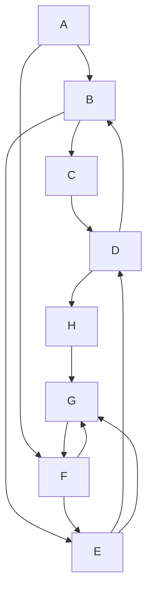
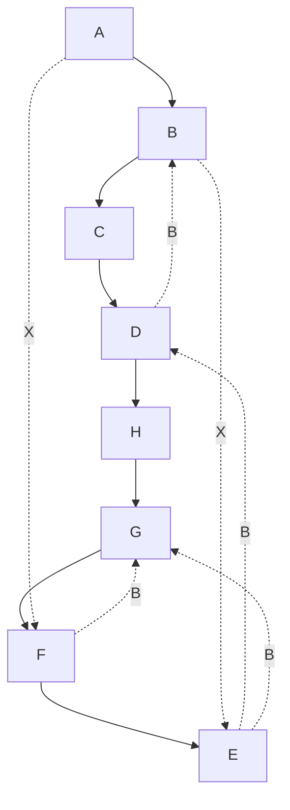
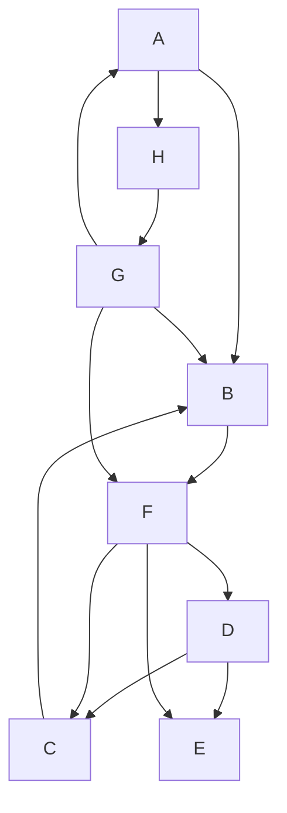
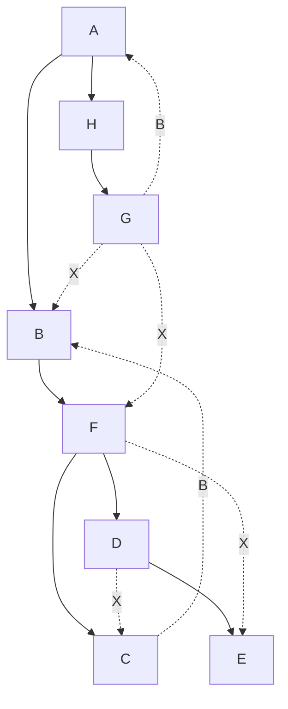

---
tags:
  - OMSCS
  - Algorithms
  - Practice
---
# 3.2 - DFS on Directed Graphs
![[Pasted image 20260313091325.png]]

## 3.2a

There is a route directly through the graph which touches all vertices, and the vertices are labeled in such a way that the DFS takes this route every time. Therefore, the pre/post numbers are kind of obvious, especially when you arrange the table by preorder number.

| V   | Pre | Post |
| --- | --- | ---- |
| A   | 1   | 16   |
| B   | 2   | 15   |
| C   | 3   | 14   |
| D   | 4   | 13   |
| H   | 5   | 12   |
| G   | 6   | 11   |
| F   | 7   | 10   |
| E   | 8   | 9    |

Here's the graph again but with Back (B) and Cross (X) edges labelled accordingly. The unlabeled edges are the tree edges.

## 3.2b

I did all of these on paper first. This was the first problem where I realized that incrementally building the Pre/Post table along with the Tree/Back/Cross edge lists, was the best way to stay organized. Staying organized means you can do this problem manually in linear time, just like the algorithms.

| V   | Pre | Post |
| --- | --- | ---- |
| A   | 1   | 16   |
| B   | 2   | 11   |
| C   | 4   | 5    |
| D   | 6   | 9    |
| E   | 7   | 8    |
| F   | 3   | 10   |
| G   | 13  | 14   |
| H   | 12  | 15   |
- **Tree Edges:** AB, BF, FC, FD, DE, AH, HG
- **Back Edges:** CB, GA
- **Cross Edges:** DC, FE, GB, GF

