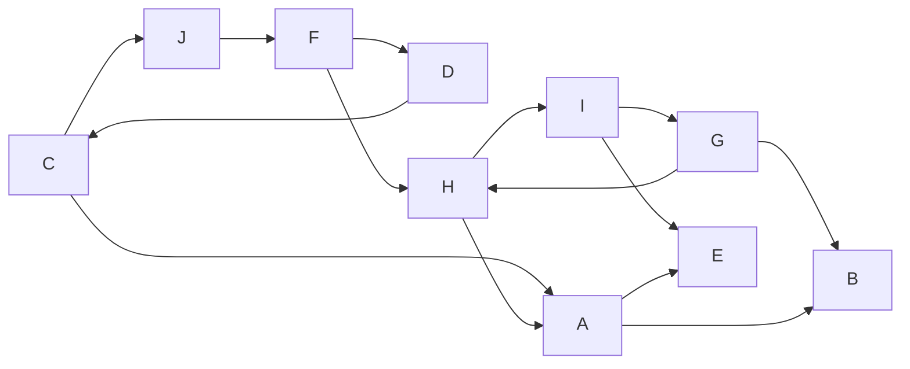
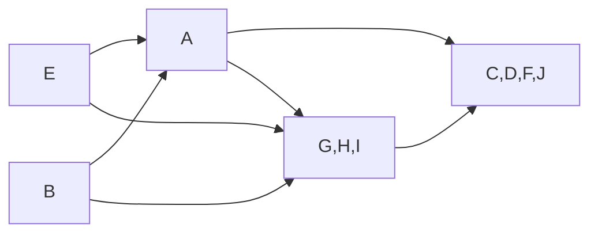
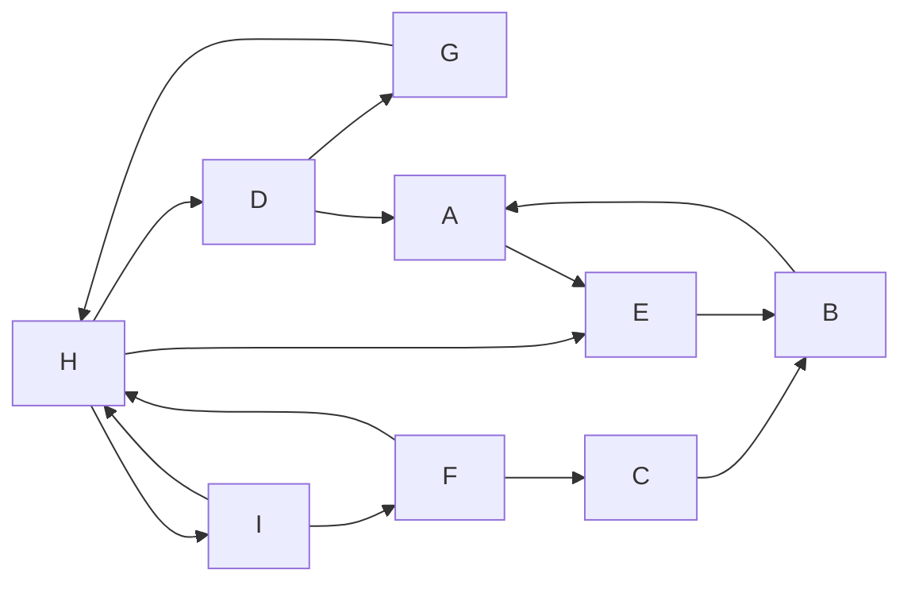
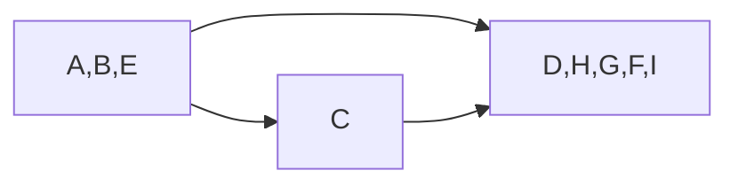

---
tags:
  - OMSCS
  - Algorithms
  - Practice
  - Alg-Graph
---
# 3.4 - Strongly Connected Components
![[Pasted image 20260223151007.png]]
![[Pasted image 20260223151022.png]]

## Graph 1
![[Pasted image 20260223215949.png]]

### DFS on $G^R$

| Node | Pre | Post |
| ---- | --- | ---- |
| A    | 1   | 6    |
| B    | 2   | 3    |
| C    | 7   | 20   |
| D    | 10  | 11   |
| E    | 4   | 5    |
| F    | 9   | 18   |
| G    | 14  | 15   |
| H    | 12  | 17   |
| I    | 13  | 16   |
| J    | 8   | 19   |

Post Ordering: $C,J,F,H,I,G,D,A,E,B$

### DFS on $G$ with `post[]`-ordering

| Node | Pre | Post | CC Num |
| ---- | --- | ---- | ------ |
| C    | 1   | 8    | 1      |
| J    | 4   | 5    | 1      |
| F    | 3   | 6    | 1      |
| H    | 9   | 14   | 2      |
| I    | 11  | 12   | 2      |
| G    | 10  | 13   | 2      |
| D    | 2   | 7    | 1      |
| A    | 15  | 16   | 3      |
| E    | 17  | 18   | 4      |
| B    | 19  | 20   | 5      |

### SCC Discovery Order

1. $[C,J,F,D]$
2. $[H,I,G]$
3. $[A]$
4. $[E]$
5. $[B]$

### Source and Sink SCCs

- Sources: $[E]$ and $[B]$
- Sinks: $[C, D, F, J]$

### Metagraph

**What is the minimum number of edges you must add to this graph to make it strongly connected?**

2 (two)

## Graph 2
![[Pasted image 20260223220011.png]]

### DFS on $G^R$

| Node | Pre | Post |
| ---- | --- | ---- |
| A    | 1   | 6    |
| B    | 3   | 4    |
| C    | 7   | 8    |
| D    | 9   | 18   |
| E    | 2   | 5    |
| F    | 13  | 14   |
| G    | 10  | 17   |
| H    | 11  | 16   |
| I    | 12  | 15   |

Post ordering: $D,G,H,I,F,C,A,E,B$

### DFS on $G$ with `post[]`-ordering

| Node | Pre | Post | CC Num |
| ---- | --- | ---- | ------ |
| D    | 1   | 10   | 1      |
| G    | 3   | 4    | 1      |
| H    | 2   | 9    | 1      |
| I    | 5   | 6    | 1      |
| F    | 7   | 8    | 1      |
| C    | 11  | 12   | 2      |
| A    | 13  | 18   | 3      |
| E    | 15  | 16   | 3      |
| B    | 14  | 17   | 3      |

### SCC Discovery Order

1. $[D, G, H, I, F]$
2. $[C]$
3. $[A, E, B]$

### Source and Sink SCCs

- Sources: $[A,B,E]$
- Sinks: $[D,H,G,F,I]$

### Metagraph

**What is the minimum number of edges you must add to this graph to make it strongly connected?**

1 (one)