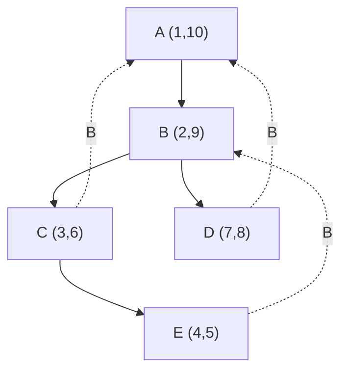
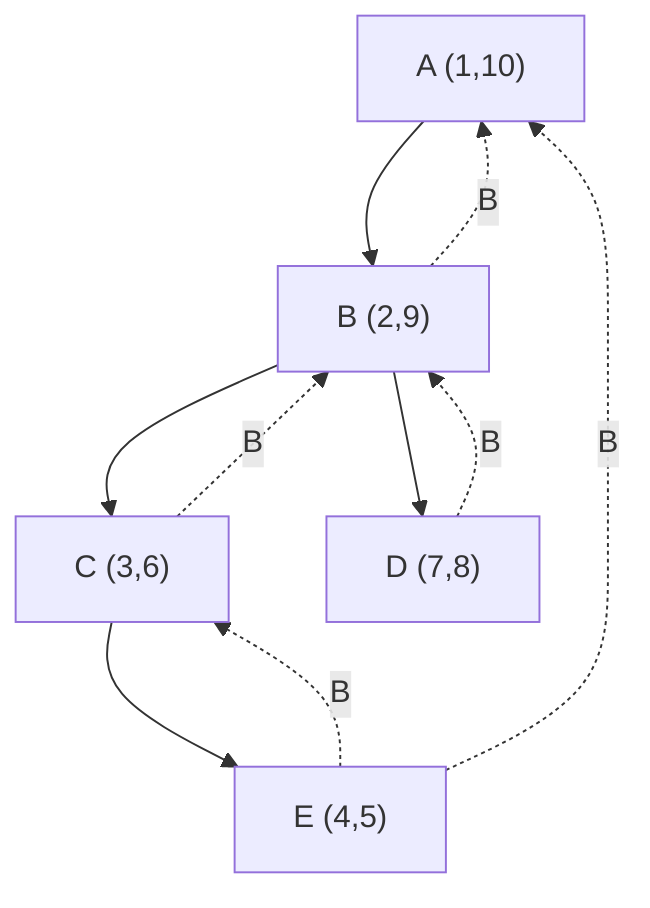

---
tags:
  - OMSCS
  - Algorithms
  - Practice
  - Alg-Graph
---
# 3.7 - Bipartite Graphs
![[Pasted image 20260313092928.png]]

## 3.7a - Give a Linear-Time Algorithm...
> Give a linear-time algorithm to determine whether an undirected graph is bipartite.

The hint for the solution is the non-sequitur at the beginning of the 3.7b prompt.

> There are many other ways to formulate this property. For instance, an undirected graph is bipartite iff it can be colored with just 2 colors.

If you were to color the natural numbers with only 2 colors, you'd color the even numbers black, and the odd numbers white. We can apply this principle here.

### Algorithm 1 (My Work)
Given an undirected graph, first apply BFS to any arbitrary vertex v in G. Modify the output of BFS, setting the distance from v to v to 0. If there are any vertices which were not reached by the BFS, indicated by an infinite distance from v, continue applying this procedure to arbitrary unreached vertices, merging the distance arrays together at the end. Next, we iterate over all edges in G, and see if it connects a vertex with an even distance to a vertex with an even distance, or a vertex with an odd distance to a vertex with an odd distance. If this is the case, then G is not bipartite. If no such edge is found, then G is bipartite.

This algorithm works because we're using ($dist[v] \mod 2$) as a coloring function. If 2 adjacent vertices have the same "color", then the graph cannot be bipartite.

The issue with this algorithm is the possibility of disconnected graphs. If G consists of $n/5$ uniform bipartite subgraphs of 5 vertices each, then we will need to run BFS $O(n/5)=O(n)$ times. Each of the $n/5$ iterations of BFS needs to perform work linear in the size of $G$. This is because each iteration of BFS must initialize `dist[]` and `prev[]` of length $n$, regardless of the number of vertices which end up being reachable from $s$.

Further, there is an issue at the end of merging $n/5$ `dist[]` arrays, each of length $n$. You can probably avoid this merging operation if you check the coloring in between each execution of BFS. There's likely a way to do this in linear time, effectively you'd need to start by iterating over each edge in $G$ performing the coloring check in an outer loop, and only run BFS when you come across a vertex which has no color.

Regardless, you can't get around the fact that BFS starts with no knowledge of the graph, does not restart when its internal queue is empty, and you can't "bring your own" distance/prev arrays in the black-box implementation as stated in [[04.0.1 - Graphs - Black Box Algorithms]].

### Algorithm 2 (From Classmate)
This solution was inspired by a classmate.

Run DFS on the graph, producing the pre-order and post-order numbers. Iterate over all the edges in G.

From [[04.1 - Graphs - SCCs]], we know that an edge $e=(u,v)$ is a "back edge" if the postorder number of v ($post[v]$) is higher than the postorder number of u ($post[u] < post[v]$). Using this property, we can iterate over the edges in $G$ and check whether it's a back edge or not.

Next, we need to check and see if that backedge forms a cycle of odd length. This occurs when the difference between ...

If no such edge is found then the graph is bipartite.

> A bipartate graph is one where it can be split into two sets where there is no edge connecting any of the vertices within the same set. To accomplish this, there cannot be a cycle containing an odd number of vertices.
> 
> To detect this, our algorithm detects all backedges (an indicator that there is a cycle) and checks the difference in post order numbers. If the difference is even, then we know that there are an add number of vertices within the cycle. So long as no backedges meet this criteria then the graph can be made into a bipartate graph.

See the DFS tree below, with (pre,post) order labelling and backedges noted. Note the backedges, and note how the postorder numbers differ by an even amount on all of these backedges. Any single one of those backedges invalidates $G$ from being bipartite.

Here's the same graph but with an alternate set of backedges. None of these backedges invalidate G from being bipartite, as they all connect a vertex with an even postorder to a vertex with an odd postorder. Therefore, none of them form an odd cycle.

### Algorithm 3 (From TA)
We can convert this problem to a 2-SAT problem. See [[04.2 - Graphs - 2-SAT]] for details on that algorithm. To encode this problem as a 2-SAT problem, we need to define the problem in terms of the conjunctive AND of multiple OR clauses, each with 2 literals. How do we do this?

In a bipartite graph, all edges must connect one vertex $v \in S_1$ with a vertex in $u \in S_2$. $V = S_1 \cup S_2$ and $S_1 \cap S_2=\emptyset$. Therefore, we need to model vertex $v$ as being in one set or the other set, and vertex $u$ as being in the opposite set. This can be accomplished as an exclusive-or (XOR).

- The variable $v_i$ indicates the question "Is $v_i \in S_1$?".
- The literal $v_i$ indicates the answer "$v_i \in S_1$" and simultaneously "$v_i \notin S_2$"
- The literal $\overline{v_i}$ indicates the answer "$v_i \notin S_1$" and simultaneously "$v_i \in S_2$"

For each edge $e=(v_a, v_b) \in E$, we know that $G$ must be bipartite if:
$$\big(v_a \wedge \overline{v_b}\big) \vee \big(\overline{v_a} \wedge v_b\big)$$

We can reframe this XOR condition in CNF thusly:
$$\big(v_a \vee v_b\big) \wedge \big(\overline{v_a} \vee \overline{v_b}\big) $$

Taking the AND across all of these CNF-XOR conditions produces a 2-SAT problem. The conversion from $G$ to $f$ takes $O(n+m)$ time. The 2-SAT algorithm takes $O(n+m)$ time.

### Algorithm 4 (From Classmate)
This is an adaptation of my original idea of using BFS. We can circumvent the issue with running BFS n-times by making n disjoint subgraphs based on the output of DFS. All of these steps should execute in linear time.

1. Run $DFS(G)$ to produce $ccnum[]$, identifying all connected components. O(n+m) 
2. For each unique ccnum value $k$ build subgraph $G_k=(V_k,E_k)$.
	1. add vertex $v$ to $V_k$ if $ccnum[v] = k$
	2. add edge $e=(u,v)$ to $E_k$ if $ccnum[u] = ccnum[v] = k$. O(n+m)
3. Initialize $color[v] = -1$ for all $v \in V$. O(n)
4. For each subgraph $G_k$ pick any vertex $s \in V_k$ as a source. Assign $color[s] = 0$. Run $BFS(G_k, s)$, returning $dist_k[]$. The time complexity for this step is O(n+m) total across all subgraphs.
5. For each vertex v in $V_k$ assign $color[v] = dist_k[v] \mod 2$. O(n)
6. For each edge $e=(u,v) \in E_k$ check if $color[u] = color[v]$. If yes return “not bipartite.” O(m)
7. If all subgraphs pass return “bipartite” with $V1 = \{v : color[v] = 0\}$ and $V2 = \{v : color[v] = 1\}$. O(n)

## 3.7b - Odd Cycles
We can't have an odd-length cycle in a bipartite graph, because each edge must connect a vertex $v \in S_1$ with a vertex in $u \in S_2$, where $V = S_1 \cup S_2$ and $S_1 \cap S_2=\emptyset$.

Let's assume that $G$ is a bipartite graph containing an $L$-length cycle, where $L$ is odd. Let's pick some vertex $a$ which is in $S_1$, and is part of the odd-length cycle. If we traverse around the cycle, we reach a vertex in $S_2$, then a vertex in $S_1$, then a vertex in $S_2$. After all even numbered steps, we've reached a vertex in $S_1$. After all odd numbered steps, we've reached a vertex in $S_2$. After $L$ steps, which is an odd number of steps, we've reached vertex $a$, which must be in $S_2$. This presents a contradiction. $a$ must be in both $S_1$ and $S_2$, but the intersection of $S_1$ and $S_2$ is the empty set. Therefore, our initial assumption that $G$ is bipartite is incorrect.

## 3.7c - Coloring Odd-Length Cycles
You need 3 colors. As you traverse around the cycle, you must give each vertex an alternating color. At the end, you will have 2 adjacent vertices which have the same color. You'll need to change one of them to some third color. QED.