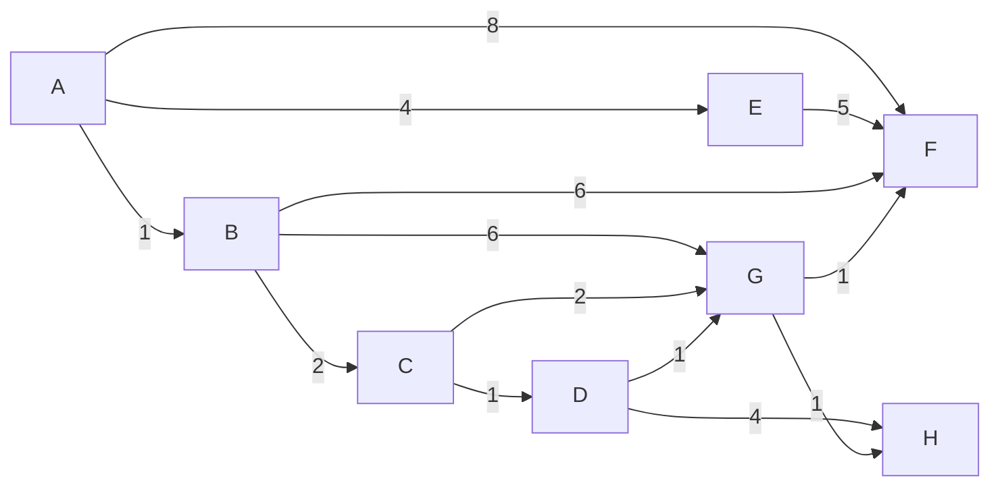
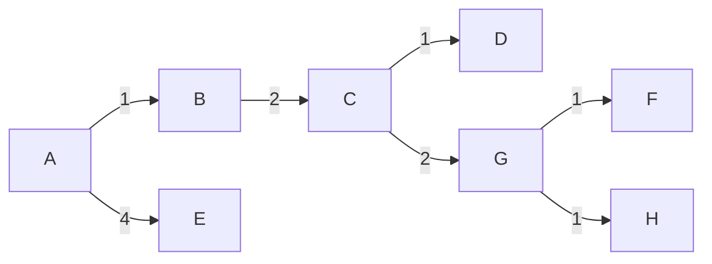

---
tags:
  - OMSCS
  - Algorithms
  - Practice
  - Alg-Graph
---
# 4.1 - Dijkstra Example
![[Pasted image 20260314160848.png]]
## Graph

## 4.1a - Dijkstra Propagation
| t=... | A   | B     | C     | D     | E     | F     | G     | H     |
| ----- | --- | ----- | ----- | ----- | ----- | ----- | ----- | ----- |
| 0     | 0   | inf   | inf   | inf   | inf   | inf   | inf   | inf   |
| 1     | 0   | **1** | inf   | inf   | inf   | inf   | inf   | inf   |
| 2     | 0   | 1     | **3** | inf   | inf   | inf   | inf   | inf   |
| 3     | 0   | 1     | 3     | inf   | **4** | inf   | inf   | inf   |
| 4     | 0   | 1     | 3     | **4** | 4     | inf   | inf   | inf   |
| 5     | 0   | 1     | 3     | 4     | 4     | inf   | **5** | inf   |
| 6     | 0   | 1     | 3     | 4     | 4     | **6** | 5     | inf   |
| 7     | 0   | 1     | 3     | 4     | 4     | 6     | 5     | **6** |
Note, there's a couple options here for propagation, but it depends on how the PQ is managed.

- At t=3, we have the option of selecting AE or CD. This only affects the order in which those edges are selected. There are no other downstream consequences of this decision. I selected AE first, because it was discovered before CD.
- At t=5, we have the option of selecting CG or DG. Both result in an $A \rightarrow G$ distance of 5. However, this does change the path length of $A \rightarrow G$, as well as the path lengths from $A \rightarrow F$ and $A \rightarrow H$. For this example graph, I selected CG because
	- CG was discovered before DG
	- It shortened the SP tree (below)

## 4.1b - SP Tree
