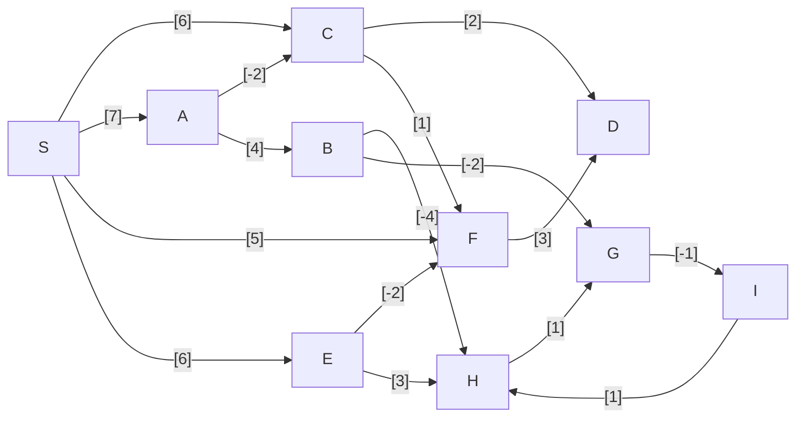
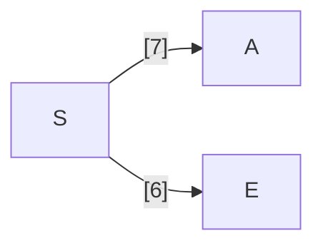
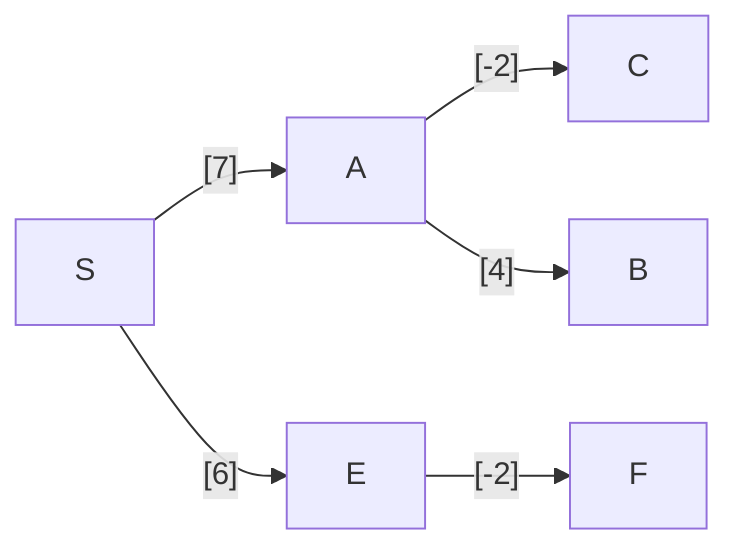
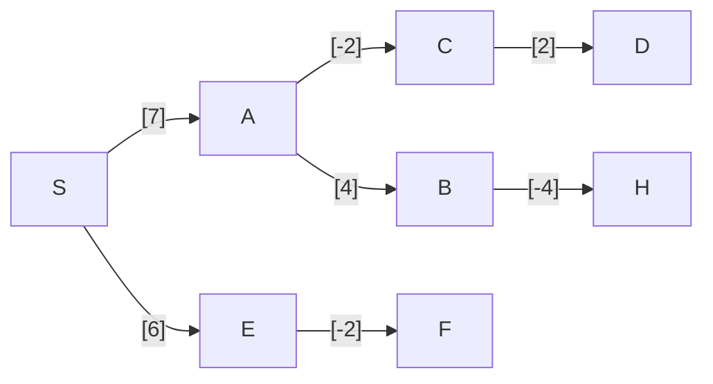
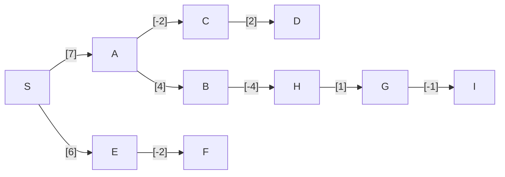

---
tags:
  - OMSCS
  - Algorithms
  - Practice
  - Alg-Graph
---
# 4.2 - Bellman-Ford Example
![[Pasted image 20260314160922.png]]

The "previous problem": [[4.1 - Dijkstra Example]]
## Graph


## 4.2a - BF Propagation
There are 10 vertices, so we need to iterate 9 times. 16 edges by 9 iterations means 144 `update()` operations, where `update()` is defined:

$update((u,v) \in E)$
	$dist(v)=\min\{dist(v), dist(u)+l(u,v)\}$

We can reduce the amount of updates performed if we exit once no updates are performed in a given iteration.

```python
E_RAW = """..."""  # The serialized mermaid diagram
edge_regex = re.compile(r"(\w) --\[(\-?\d+)\]--> (\w)")

E = []
for line in E_RAW.strip().splitlines():
    match = edge_regex.match(line)
    if match:
        source, weight, target = match.groups()
        E.append((source, target, int(weight)))

DIST = {**{v: float("inf") for v in V}, "S": 0}

for iteration in range(0, len(V) - 1):
    update_performed = False
    for u, v, l_uv in E:
        if DIST[v] > DIST[u] + l_uv:
            DIST[v] = DIST[u] + l_uv
            update_performed = True

    if not update_performed:
        break
```

By injecting some print statements into this procedure, we can extract the updates performed to the DIST table, to show how it evolves over time. There are no updates performed during iteration 3, so the last update made during iteration 2 represents the output of the table.

| iter. | Edge       | S   | A       | B        | C       | D       | E       | F       | G       | H       | I       |
| ----- | ---------- | --- | ------- | -------- | ------- | ------- | ------- | ------- | ------- | ------- | ------- |
| t=0   | `nil`      | 0   | inf     | inf      | inf     | inf     | inf     | inf     | inf     | inf     | inf     |
| t=1   | $\vec{SC}$ | 0   | inf     | inf      | **-6-** | inf     | inf     | inf     | inf     | inf     | inf     |
| t=1   | $\vec{SA}$ | 0   | **-7-** | inf      | 6       | inf     | inf     | inf     | inf     | inf     | inf     |
| t=1   | $\vec{SF}$ | 0   | 7       | inf      | 6       | inf     | inf     | **-5-** | inf     | inf     | inf     |
| t=1   | $\vec{SE}$ | 0   | 7       | inf      | 6       | inf     | **-6-** | 5       | inf     | inf     | inf     |
| t=1   | $\vec{AC}$ | 0   | 7       | inf      | **-5-** | inf     | 6       | 5       | inf     | inf     | inf     |
| t=1   | $\vec{AB}$ | 0   | 7       | **-11-** | 5       | inf     | 6       | 5       | inf     | inf     | inf     |
| t=1   | $\vec{BH}$ | 0   | 7       | 11       | 5       | inf     | 6       | 5       | inf     | **-7-** | inf     |
| t=1   | $\vec{BG}$ | 0   | 7       | 11       | 5       | inf     | 6       | 5       | **-9-** | 7       | inf     |
| t=1   | $\vec{CD}$ | 0   | 7       | 11       | 5       | **-7-** | 6       | 5       | 9       | 7       | inf     |
| t=1   | $\vec{EF}$ | 0   | 7       | 11       | 5       | 7       | 6       | **-4-** | 9       | 7       | inf     |
| t=1   | $\vec{GI}$ | 0   | 7       | 11       | 5       | 7       | 6       | 4       | 9       | 7       | **-8-** |
| t=1   | $\vec{HG}$ | 0   | 7       | 11       | 5       | 7       | 6       | 4       | **-8-** | 7       | 8       |
| t=2   | $\vec{GI}$ | 0   | 7       | 11       | 5       | 7       | 6       | 4       | 8       | 7       | **-7-** |

## 4.2b - SP Tree

The BF algorithm also iteratively keeps track of a $prev[]$ vector, building a tree. However, we canalso  reconstruct this tree from the $dist[]$ vector. Starting from S in the table, we can build the SP Tree by checking the edges out of S ($(S,v) \in E$) to see if the distance from S to $v$ matches what's in the table. Here's the final resulting row of the $dist()$ array.

| S   | A   | B   | C   | D   | E   | F   | G   | H   | I   |
| --- | --- | --- | --- | --- | --- | --- | --- | --- | --- |
| 0   | 7   | 11  | 5   | 7   | 6   | 4   | 8   | 7   | 7   |

For the edges leaving S
- $l(\vec{SC}) = 6 \ne dist(C)$
- $l(\vec{SA}) =7 = dist(A)$
- $l(\vec{SF}) = 5 \ne dist(F)$
- $l(\vec{SE}) = 6 = dist(E)$

This leaves us with this tree so far.



Now we can check the edges leaving A and E.
- For the edges leaving A ($dist(A)=7$)
	- $7+l(\vec{AC})=7-2=5=dist(C)$
	- $7 + l(\vec{AB})=7+4=11=dist(B)$
- For the edges leaving E ($dist(E)=6$)
	- $6 + l(\vec{EF}) = 6 - 2 = 4 = dist(F)$
	- $6 + l(\vec{EH}) = 6 + 3 = 9 \ne dist(H)$

We can add C, B, and F to the tree.



Now we can check the edges leaving C, B, and F
- For the edges leaving C ($dist(C)=5$)
	- $5 + l(\vec{CD}) = 5 + 2 = 7 = dist(D)$
	- $\vec{CF}:$ F is already in the tree.
- For the edges leaving B ($dist(B)=11$)
	- $11 + l(\vec{BH}) = 11 - 4 = 7 = dist(H)$
	- $11 + l(\vec{BG}) = 11 - 2 = 9 \ne dist(G)$
- For the edges leaving F ($dist(F)=4$)
	- $4+l(\vec{FD})=4+3=7=dist(D)$

We can now add D and H to the tree, though we arrived at D 2 ways. We'll pick $(S,A,C,D)$ instead of $(S,E,F,D)$, because of node order. This demonstrates the importance of relying on the `prev[]` array instead of trying to rebuild the tree from `dist[]`.



We can check the edge leaving H now, though there's only 1.
- $dist(H)=7$
- $7+l(\vec{HG})=7+1=8=dist(G)$

We can also shortcut the last step, because only $\vec{GI}$ reaches I. Walking through the tree from S to all vertices and keeping track of the distances successfully reconstructs the `dist[]` table.


