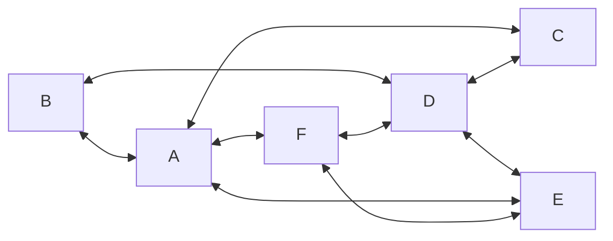
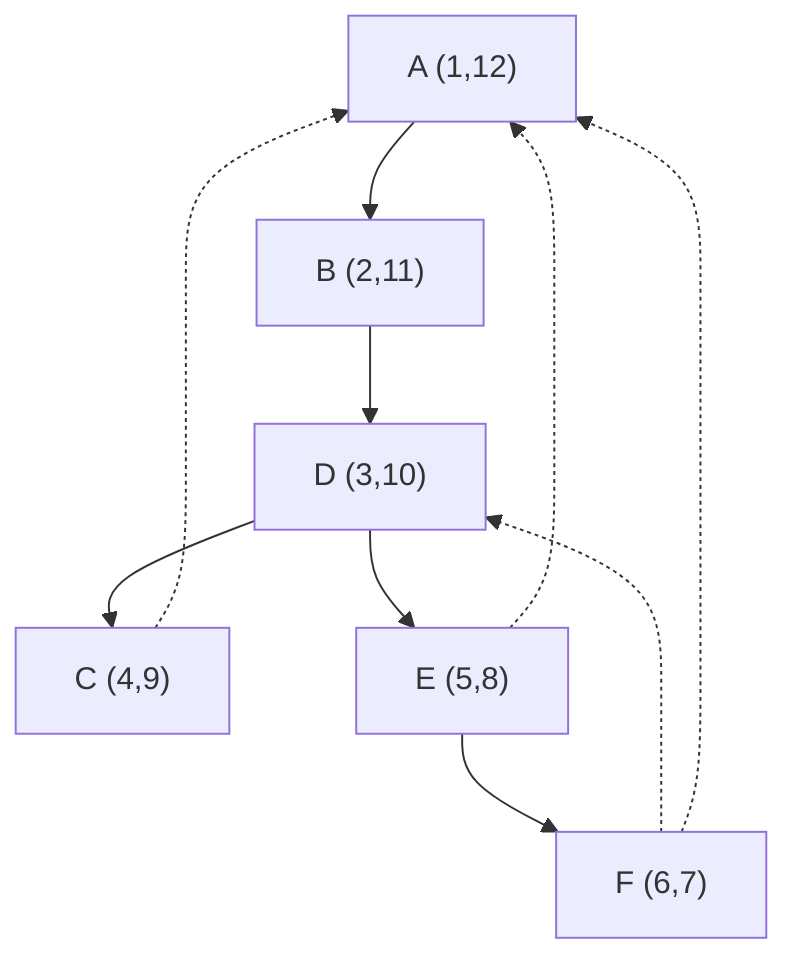

---
tags:
  - OMSCS
  - Algorithms
  - Practice
---
# 4.3 - Squares
> ***Squares***. Design and analyze an algorithm that takes as input an undirected graph $G=(V,E)$ and determines whether $G$ contains a simple cycle (that is, a cycle which doesn’t intersect itself) of length four. Its running time should be at most $O(|V|^3)$. You may assume that the input graph is represented either as an adjacency matrix or with adjacency lists, whichever makes your algorithm simpler.

## Exploration
I initially thought through using DFS on this graph, and seeing if there was some pattern to the pre/post order numbers. All simple 4-cycles include A.

 
 If you run DFS from A, you end up with this DFS tree. The solid arrows are tree-edges. The dotted arrows are back-edges.

From here, I was not able to figure out how to use the pre/post order numbers to find cycles. Nothing jumped out at me intuitively. Consider cycle $(A,B,D,F,A)$. This path traverses 2 backedges. There's probably some basic arithmetic you could do to figure out the cycle from here.

However, we could also run Floyd-Warshall, which has $O(n^3)$ time complexity, but with all edge weights set to 1. This gives us a matrix which shows the distance between all pairs of vertices. On this toy graph, that gives us this table.

|     | A   | B   | C   | D   | E   | F   |
| --- | --- | --- | --- | --- | --- | --- |
| A   | 0   | 1   | 1   | 2   | 1   | 1   |
| B   | 1   | 0   | 2   | 1   | 2   | 2   |
| C   | 1   | 2   | 0   | 1   | 2   | 2   |
| D   | 2   | 1   | 1   | 0   | 1   | 1   |
| E   | 1   | 2   | 2   | 1   | 0   | 1   |
| F   | 1   | 2   | 2   | 1   | 1   | 0   |

In order to detect a 4-cycle, we could look for a trio of vertices $(a,b,c)\in V$, where

- $dist(a,b)=1$
- $dist(a,c)=2$
- $dist(b,c)=1$

However, this doesn't work for fully-connected graphs. In a fully connected graph of size 4 or more, there always exists a simple 4-cycle. However, the FW result will be $dist(a,a)=0 : a \in V$ and $dist(a,b)=1:\{(a,b) \in V \text{ and } a \ne b\}$. Perhaps we should start at FC graphs and work backwards.

## TA Solution
### Idea 1: Adjacency Matrix
- Use the adjacency matrix
- "Find 2 shared neighbors"
- In the adj matrix, we need to find a situation where we have 2 columns $c_1$ and $c_2$, and $i,j$ where $c_1[i]=1$, $c_2[i]=1$, $c_1[j]=1$, and $c_2[j]=1$.
- The runtime of this is running through all possible pairs.
	- $O(n)$ to look through all columns
	- Looking through all possible pairs is $O(n^2)$
	- Overall: $O(n^3)$

![[Pasted image 20260316155330.png]]

## Idea 2: Floyd-Warshall
1. Run FW
2. Find $iter[1][\cdot][\cdot]=2$
	1. Index 1 is the number of intermediate nodes
	2. 
3. 

![[Pasted image 20260316155849.png]]