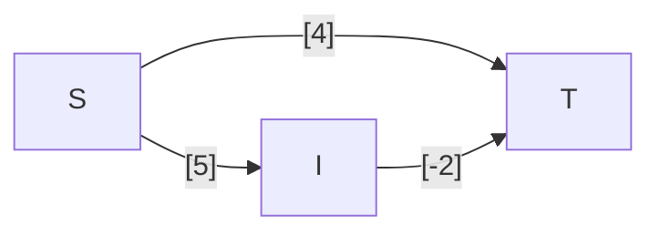
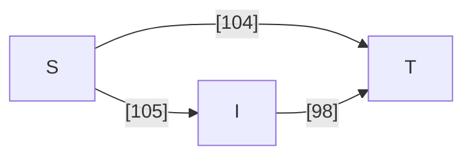

---
tags:
  - OMSCS
  - Algorithms
  - Practice
---
# 4.8 - Dijkstra's with Some Negative Weights
> Professor F. Lake suggests the following algorithm for finding the shortest path from node s to node t in a directed graph with some negative edges: add a large constant to each edge weight so that all the weights become positive, then run Dijkstra’s algorithm starting at node s, and return the shortest path found to node t.
>
> Is this a valid method? Either prove that it works correctly, or give a counterexample.

Let's review this fairly simple example.

In this graph, the cheapest path from $S$ to $T$ flows through some intermediate vertex $I$. However, Dijkstra will pick $S \rightarrow T$ instead, because $\vec{ST}$ is cheaper than $\vec{SI}$. No matter what constant we add to the network, $\vec{ST}$ will be cheaper than $\vec{SI}$. Further, adding a constant $C$ to every edge s.t. $l(\vec{IT})>0$ will result in the cost of $P_1=(S,T)$ being cheaper than $P_2=(S,I,T)$, so not even Bellman-Ford will select the cheapest path in the unmodified $G$. Here's the same example where $C=100$.

