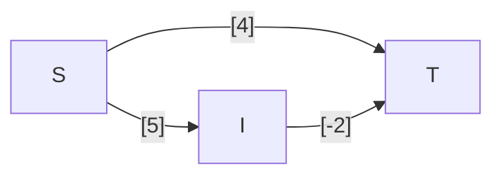

---
tags:
  - OMSCS
  - Algorithms
  - Practice
  - Alg-Graph
---
# 4.9 - Dijkstra's with Some Negative Edges (TODO)
> Consider a directed graph in which the only negative edges are those that leave s; all other edges are positive. Can Dijkstra’s algorithm, started at $s$, fail on such a graph? Prove your answer.

## Notes from Office Hours
- If there's exactly one negative weight edge, then you can still use Dijkstra's. There's some trick to doing this.
- Don't add or multiply edge weights by a constant. That doesn't work.
- There's a special way to manipulate this property which allows us to solve this problem.

## Dijkstra with One Negative Edge
Let's review the graph from [[4.8 - Dijkstra's with Some Negative Weights]]. We know that we can't solve this without modifying G. We also can't solve it by adding some constant across all edge weights.

We had some Theory Crafting from Claire on the Teams call.

> for example: node a, incoming edges 3 and 4. Node b, incoming edges 5 and 6. Edge between a and b is -1. 
> New node a1 with incoming edge 2, edge to b1 as 0, edge out of b1 5 
> New node a2 with incoming edge 2, edge to b1 as 0, edge out of b2 6
> etc...

We know that on the simplest of examples, Dijkstra simply can't handle edges with negatives, and we don't want to modify absolute path lengths. Can we inject new vertices into G which bypass the negative edge(s)?

