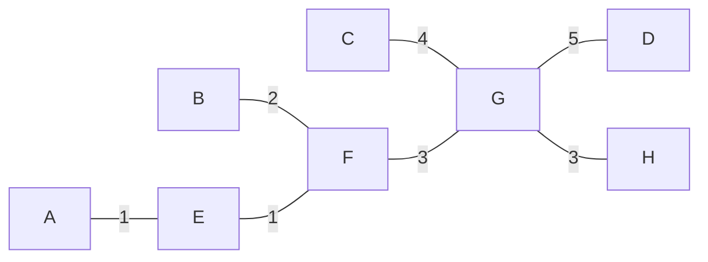
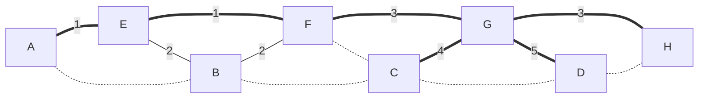

---
tags:
  - OMSCS
  - Algorithms
  - Practice
  - Alg-Graph
---
# 5.1 - MST Practice 1
![[Pasted image 20260302163758.png]]

## Cost of MST
Here's one option for a minimum weight spanning tree.

The cost of this MST is 19.

## Number of MSTs
- There are 2 edges of cost 1. Choosing both doesn't cause any cycles, so $T$ will include both.
- There are 2 edges of cost 2. Choosing both causes a cycle, so we can only include one of them in $T$.
- There are 2 edges of cost 3. Regardless of the choice of 2-cost edge, choosing both will not cause a cycle, so $T$ includes both.
- There is 1 edge of cost 4. Regardless of the choice of 2-cost edge, choosing it will not cause a cycle, so $T$ includes it.
- Up to this point, D is the only vertex in $\overline{S}$. The minimum weight edge in the cut from $S$ to $\overline{S}$ is $G \frac{5}{} D$, so we include that edge of weight 5.

After all of this, we have the following $T$. $(E,B,2)$ and $(B,F,2)$ are the only 2 edges which we need to choose between. All dotted edges are always unused. Therefore, there are 2 possible MSTs for $G$.

## Kruskal's Algorithm

Basically this table is what the question was asking for.

| Edge | Cut                                                |
| ---- | -------------------------------------------------- |
| AE   | $S=\{A\}$ and $\overline{S}=\{E,F,B,G,H,C,D\}$     |
| EF   | $S=\{A,E\}$ and $\overline{S}=\{F,B,G,H,C,D\}$  |
| BE   | $S=\{A,E,F\}$ and $\overline{S}=\{B,G,H,C,D\}$  |
| FG   | $S=\{A,E,F,B\}$ and $\overline{S}=\{G,H,C,D\}$  |
| GH   | $S=\{A,E,F,B,G\}$ and $\overline{S}=\{H,C,D\}$  |
| CG   | $S=\{A,E,F,B,G,H\}$ and $\overline{S}=\{C,D\}$  |
| GD   | $S=\{A,E,F,B,G,H,C\}$ and $\overline{S}=\{D\}$  |
