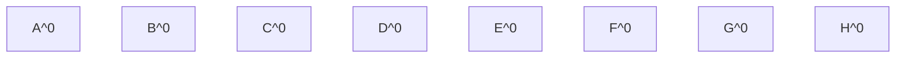
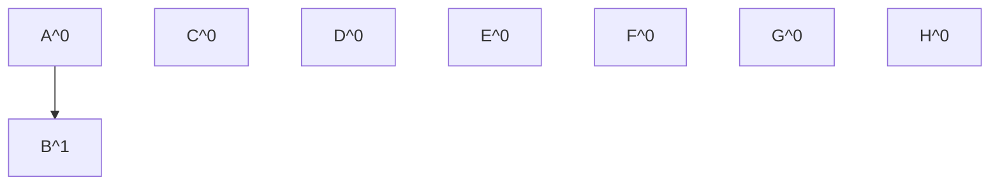
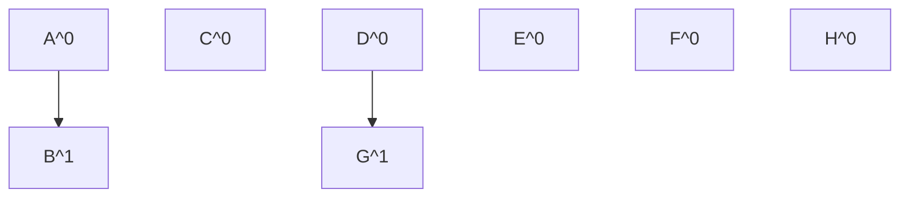
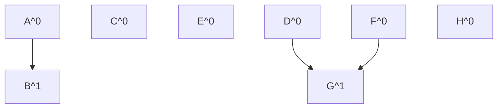
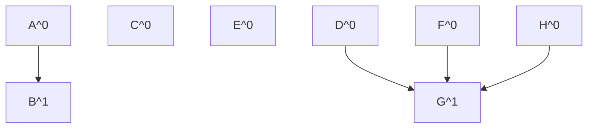
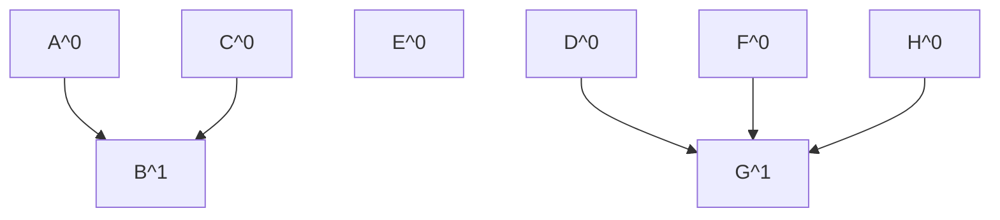
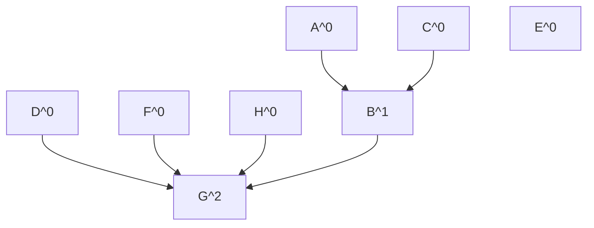
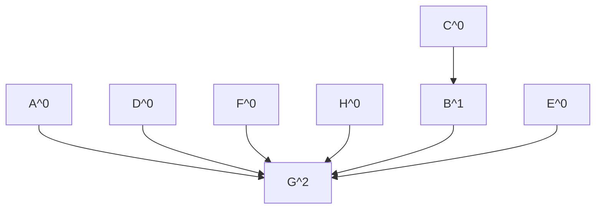

---
tags:
  - OMSCS
  - Algorithms
  - Practice
  - Alg-Graph
---
# 5.2 - MST Practice 2
![[Pasted image 20260302163839.png]]

## Subproblem A
Here's the official solution to this problem, but what does it mean?

![[Pasted image 20260307154223.png]]

## Subproblem B
I didn't get to finish this one. I got called away. The point is that...

This is the (in)famous union-by-rank datastructure / algorithm.

| t   | Edge  | A           | B           | C           | D           | E     | F           | G           | H           |
| --- | ----- | ----------- | ----------- | ----------- | ----------- | ----- | ----------- | ----------- | ----------- |
| 0   | None  | A (0)       | B (0)       | C (0)       | D (0)       | E (0) | F (0)       | G (0)       | H (0)       |
| 1   | (A,B) | ***B (0)*** | ***B (1)*** | C (0)       | D (0)       | E (0) | F (0)       | G (0)       | H (0)       |
| 2   | (D,G) | B (0)       | B (1)       | C (0)       | ***G (0)*** | E (0) | F (0)       | ***G (1)*** | H (0)       |
| 3   | (F,G) | B (0)       | B (1)       | C (0)       | G (0)       | E (0) | ***G (0)*** | G (1)       | H (0)       |
| 4   | (G,H) | B (0)       | B (1)       | C (0)       | G (0)       | E (0) | G (0)       | G (1)       | ***G (0)*** |
| 5   | (B,C) | B (0)       | B (1)       | ***B (0)*** | G (0)       | E (0) | G (0)       | G (1)       | G (0)       |
| 6   | (C,G) | B (0)       | ***G (1)*** | ***G (0)*** | G (0)       | E (0) | G (0)       | ***G (2)*** | G (0)       |
| 7   | ...   | ...         | ...         |             |             |       |             |             |             |

### t=0

### t=1

### t=2

### t=3

### t=4

### t=5

### t=6

### t=7

