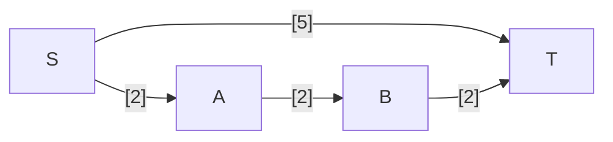

---
tags:
  - OMSCS
  - Algorithms
  - Practice
---

# 5.5 - MST Modifications
![[Pasted image 20260316161327.png]]

This is yet again another question about whether MSTs and Dijkstra's do the same thing. They don't.

If you increase the weight of all edges in G uniformly, then the MST of G will not (necessarily) change. If your MST construction takes some kind of node-order into account when resolving ties (e.g. ties are not resolved randomly), then the MST will not change. The minimum edge across the cut of a graph does not change if all edges across that cut are increased by the same amount.

However, if you increase the weight of all edges in G uniformly, the shortest path from $s$ to some given vertex $t$ might change. This is because paths can traverse different numbers of edges. Increasing all edges by a constant amount gives higher preference to paths that traverse a fewer number of edges.

Consider the graph below. The shortest path from S to T is $(S,A,B,T)$, which has total length 3.

If we increase all edge weights by 1, we get this graph. Now the shortest path from S to T is $(S,T)$, which has total length 5. The original path $(S,A,B,T)$ now has length 6.

