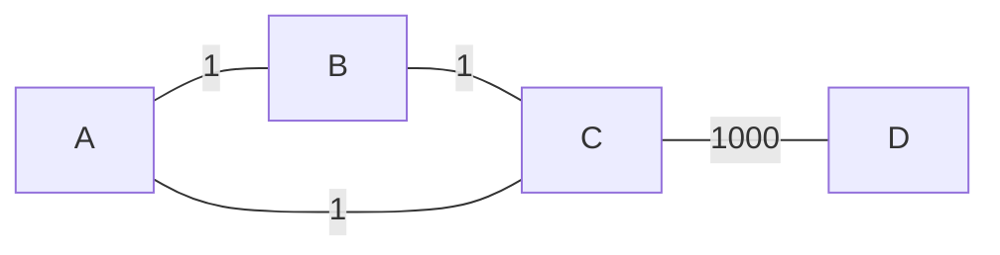
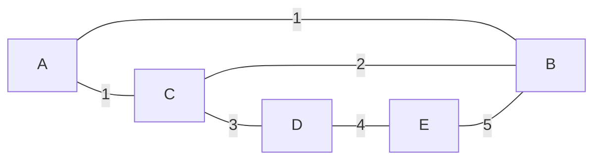
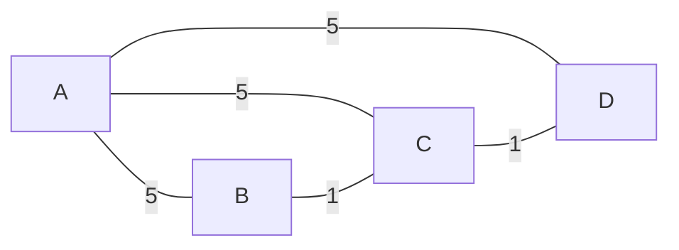
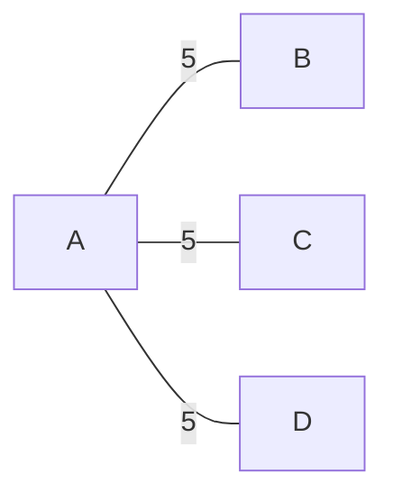

---
tags:
  - OMSCS
  - Algorithms
  - Practice
  - Alg-Graph
---
# 5.9 - Properties of Weighted Undirected Graphs
![[Pasted image 20260302163419.png]]

Relevant Notes: [[04.3 - Graphs - MST]]

> Not that this document shows only directed graphs. This is a limitation of mermaid.js. In your mind, consider that the graphs are weighted and undirected.

## Results
This homework results in the following properties of MSTs.

- **Useful Information**
	- If $G$ has a cycle with a unique heaviest edge $e$, then $e$ cannot be part of any MST.
	- Let $e$ be any edge of minimum weight in $G$. Then $e$ must be part of some MST.
	- If the lightest edge in a graph is unique, then it must be part of every MST.
	- If $e$ is part of some MST of $G$, then it must be a lightest edge across some cut of $G$.
	- Kruskal's algorithm works correctly when there are negative edges.
- **Unhelpful Information**
	- Even if a graph $G$ has more than $|V|-1$ edges, and there is a unique heaviest edge $e$ in $E$, then $e$ may still be part of an MST.
	- Even if $G$ has a cycle with a unique lightest edge $e$, then $e$ might not be part of any MSTs.
	- Dijkstra's output does not necessarily produce MSTs.
	- The shortest path between two nodes is not necessarily part of some MST.

## Problem A
> If a graph $G$ has more than $|V|-1$ edges, and there is a unique heaviest edge, then this edge cannot be part of an MST.

False. This graph has 4 vertices and 4 edges. The unique heaviest edge is the only one that spans $cut([D], \overline{[D]})$, so it will always be part of an MST.

## Problem B
> If $G$ has a cycle with a unique heaviest edge $e$, then $e$ cannot be part of any MST.

True. All other edges in the cycle will added to $X$ before $e$. There will be no reason to add $e$ to $X$.

## Problem C
> Let $e$ be any edge of minimum weight in $G$. Then $e$ must be part of some MST.

True. In the event there are ties between $e$ and some set of edges $E$ of the same weight, you can add any one of them to $X$ and continue.

## Problem D
> If the lightest edge in a graph is unique, then it must be part of every MST.

True. That's literally what the algorithm says it does. It will always be the first edge added to $X$.

## Problem E
>  If $e$ is part of some MST of G, then it must be a lightest edge across some cut of G.

True. This one requires some work. Thankfully it was pivotal for a recent assignment, and the result is applicable to this lemma.

Suppose there exists an edge in an MST $e$. If $e$ is removed from the MST, we partition $V$ into two non-overlapping sets, $S$ and $\overline{S}$. Suppose $e$ is not the lightest edge in the cut between $S$ and $\overline{S}$ ($cut(S, \overline{S})$), and that the largest edge in $cut(S, \overline{S})$ is actually some hypothetical $e^*$. The only reason why Kruskal's would **not** have selected $e^*$ would be if adding $e^*$ created a cycle in the MST. Since $e^*$ has the minimum weight among $cut(S, \overline{S})$, there would not have been any other edges added to the MST from $cut(S, \overline{S})$ prior to Kruskal's considering $e^*$, so there would not have been any possibility of a cycle being created by adding $e^*$ to the MST. If $e^*$ exists, then Kruskal's would never have selected $e$ to be part of the MST, and would have selected $e^*$ instead. By the existence of $e$ within the MST, we can infer that $e^*$ does not exist, and that there does not exist any edges lighter than $e$ in $cut(S, \overline{S})$.

## Problem F
> If $G$ has a cycle with a unique lightest edge $e$, then $e$ must be part of every MST.

I think this is false, but I think the question could be more clear. If we're stating that $e$ is the unique lightest edge within a particular cycle, not the graph as a whole, then it's possible that an MST doesn't contain that edge depending on the rest of the graph.

In this example below, (C,B) is the unique lightest edge in the cycle (B, C, D, E, B). However, (A,B) and (A,C) will be added to $X$ first. Therefore, adding (C,B) would create a cycle in $X$, so it can't be added to the MST.

## Problem G
> The shortest-path tree computed by Dijkstra’s algorithm is necessarily an MST.

No, this is false. MSTs produce a tree over $G$ with the minimum total edge weight. Dijkstra produces the shortest path from a source vertex to any other vertex in $G$. These are not the same results.

Consider the graph below:

Running Kruskal's on the graph produces this MST. Total edge weight is 7.

Running Dijkstra's on this graph, starting from $A$, produces this tree. The total edge weight is 15.

## Problem H
> The shortest path between two nodes is necessarily part of some MST.

This is not true. Review the same graphs from problem G. The shortest path from A to C in $G$ has cost 5. In the MST, the path from A to C has cost 6. It is required for the shortest path from A to some other node in G to exist in the MST of G, but it is impossible for all of the shortest paths from A to any node to exist in the MST of G, since that requires selecting all edges of heaviest weight.

## Problem I
> Prim’s algorithm works correctly when there are negative edges.

Prim's algorithm does not work correctly when there are negative edges, but it probably would still produce a `prev[]` which describes an MST. The issue is that $prev[v_0]$ might not contain `nil`, meaning `prev[]` isn't strictly a tree structure.
 
## Problem J
> (For any $r>0$, define an r-path to be a path whose edges all have weight $<r$.) If $G$ contains an r-path from node $s$ to $t$, then every MST of $G$ must also contain an r-path from node $s$ to node $t$.

Given that the negative of this question is completely uninteresting, that gives us the information that this must be true. However, that's not a proof.

This appears to be an extension of the result of subproblem E. Suppose that there exists an r-path from $s$ to $t$ in G which contains some maximum weight edge $e_{max}$ with $w(e_{max})<r$. When building an MST of G, that edge will be considered among all of the edges which are along in $cut(\{s,...\}, \{t,...\})$. Either $e_{max}$ is a lightest weight edge in that cut, or some other $e'$ will be selected where $w(e') \le w(e_{max})$. This same principle applies to all of the edges in the path from $s$ to $t$, which are all $\le w(e_{max})$. Therefore, there will not ever be a path from $s$ to $t$ in an MST of G which has an edge weight $\ge r$. This ensures that the path from $s$ to $t$ in an MST of G will only have edges of weight $<r$.

