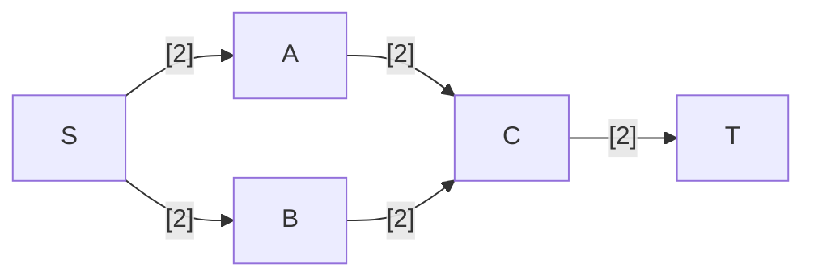
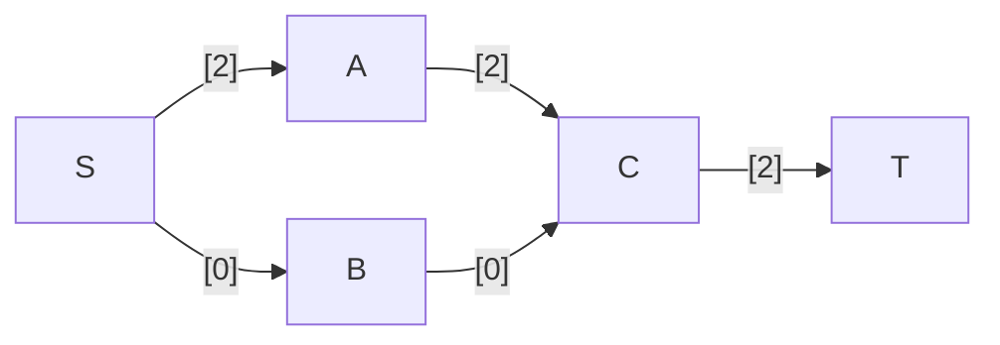

---
tags:
  - OMSCS
  - Algorithms
  - Practice
---
# 7.21 - Critical Edges (TODO)
> An edge of a flow network is called critical if decreasing the capacity of this edge results in a decrease in the maximum flow. Give an efficient algorithm that finds a critical edge in a network.

## Exploration
To find a critical edge, we need to check through the flow network to see if there are any flows that fully utilize the capacity of a given edge. If that is the case, then reducing the capacity of that edge will reduce the overall flow through the network. There is no alternate path that this unit of flow can take. If such a path exists, then the max possible flow through the flow network has not yet been achieved.

Actually this is not true. Just because an edge is fully saturated does not mean that it's critical. See the flow network below.

One valid max flow through this network is this:

$SA$ is fully utilized, but it's not a critical edge. If the capacity of $SA$ is reduced, the flow can reroute through $SB$, which is underutilized. $CT$ is fully utilized, and is in fact a critical edge, since it forms a bottleneck through $G$.
