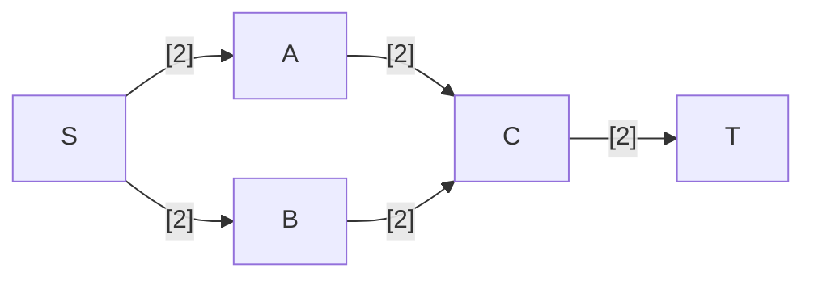
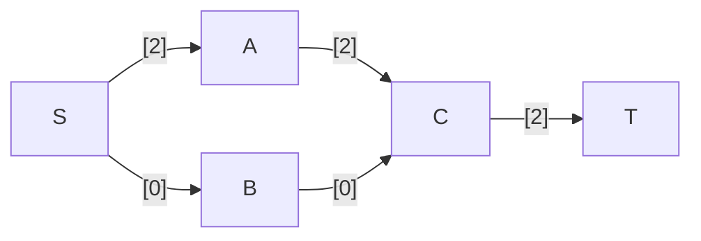
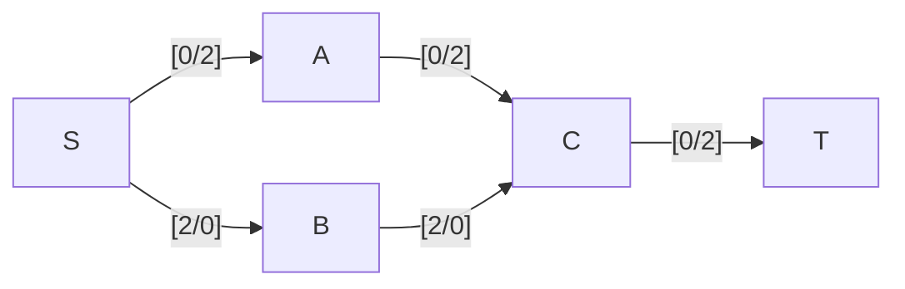

---
tags:
  - OMSCS
  - Algorithms
  - Practice
---
# 7.21 - Critical Edges
> An edge of a flow network is called critical if decreasing the capacity of this edge results in a decrease in the maximum flow. Give an efficient algorithm that finds a critical edge in a network.

## Exploration
To find a critical edge, we need to check through the flow network to see if there are any flows that fully utilize the capacity of a given edge. If that is the case, then reducing the capacity of that edge will reduce the overall flow through the network. There is no alternate path that this unit of flow can take. If such a path exists, then the max possible flow through the flow network has not yet been achieved.

Actually this is not true. Just because an edge is fully saturated does not mean that it's critical. See the flow network below.

One valid max flow through this network is this:

$SA$ is fully utilized, but it's not a critical edge. If the capacity of $SA$ is reduced, the flow can reroute through $SB$, which is underutilized. $CT$ is fully utilized, and is in fact a critical edge, since it forms a bottleneck through $G$.

Let's look at the residual network for this flow. The edges are labelled `[remaining capacity / reverse capacity]`.

In the residual graph, the edges which are "at capacity" have a forward flow of 0. That's a good first indicator that the edge is critical. In this flow, those edges are $SA$, $AC$, and $CT$.

How is criticality visible in the residual graph? The TA mentioned that we can run DFS from a given $u$ for an at-capacity edge $(u,v)$, and seeing if $v$ is reachable. If $v$ is reachable, then $(u,v)$ is not critical. How does that make sense? I believe the rationale here is:

If we have a max flow through a flow network, all st-paths are at capacity. If we subsequently reduce the flow across a given edge $(u,v)$ by some minimum amount $\epsilon$, that introduces both an oversupply of flow at $u$ and a deficit of flow at $v$. These 2 issues can be symbolized by the inequalities $f_{out}(u) < f_{in}(u)$ and $f_{in}(v) < f_{out}(v)$. In the special cases where $u=s$ and/or $v=t$, the appropriate in/out-flow is $C$. For all other vertices $w$ in $G$, $f_{out}(w) = f_{in}(w)$. In order to correct this issues at $u$ and $v$, (i.e. convert those inequalities to equalities), we need to find some alternate route for the $\epsilon$ units of flow through the network from $u$ to $v$. This can be accomplished by running DFS in the residual network from $u$, and checking to see if there exists a path to $v$.

Let's look at $SA$. We can reduce $c_{SA}$ by 1 or 2, and the flow can bypass the edge. With $SA$'s capacity being maximized, $S$ can reach $A$ in the residual network through $(SB,BC,\overline{AC})$.

In practicality, we aren't saying that the $\epsilon$ units of flow needs to be strictly rerouted from $u$ to $v$ through some other pathway in the network. In the given case where $A$ is replaced by by hundreds of vertices lined up in series, we're not going to reroute the flow from $S$ to $A_1$, then back through $[A_2, A_3, ..., A_x, C]$. Instead, the process of updating the residual with the results of DFS will simply reduce the flow through the edges $[SA_1, A_1A_2,A_2A_3,...,A_xC]$, increasing the flow by the same amount through edges $[SB, BC]$. We don't actually need to perform this update on the residual network. We just need to demonstrate that it's possible.

For completeness, when looking at $SA$, $S$ can't reach $T$. We already know this is the case because the flow is maximized, so there's no point in checking for it. However, that doesn't matter, because that's not the question. When evaluating $CT$ for criticality, we'll find that $C$ can't reach $T$ in the residual network, therefore demonstrating that $C$ is a critical edge. This is a special case, and not a general formulation of the process. In the event that $CT$ were bisected by another vertex $D$, we'd note that $C$ cannot reach $D$ in the residual network, thereby making both $CD$ and $DT$ critical.

Note that this problem doesn't specify that the graph weights are integers. Therefore, we must use Edmonds-Karp, and cannot use Ford-Fulkerson.

## Algorithm
- Run Edmonds-Karp on $G$ to produce a maximum flow through $G$.
- Reconstruct the residual network $G^f$.
	- Initialize an empty graph $G^f$
	- Add all the vertices of $G$ to $G^f$
	- For each edge $vw \in E$
		- Add $vw$ to $G^f$
		- Add $wv$ to $G^f$
		- Set $c^f_{vw}=c_{vw}-f_{vw}$ (for the forward flow)
		- Set $c^f_{wv}=f_{vw}$ (for the reverse flow)
- For each edge $uv \in E$ where $c_{uv}=f_{uv}$ (alternate check: $c^f_{uv}=0$
	- Run DFS from $u$ in $G^f$
	- Check whether $v$ is reachable ($post[v]<post[u]$)
	- Return $uv$ if $v$ is not reachable.

## Justification
See above.

## Runtime
- EK: $O(nm^2)$
- Reconstruct residual flow network: $O(n+m)$
- Iterate over edges: $O(m)$
	- Run DFS: $O(n+m)$

Overall:
- $O(nm^2+n+m+m(n+m))$
- $O(nm^2+n+m+mn+m^2)$
- $O(nm^2)$
