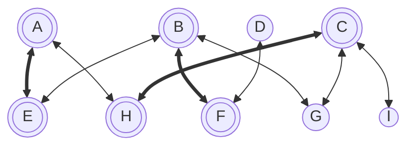
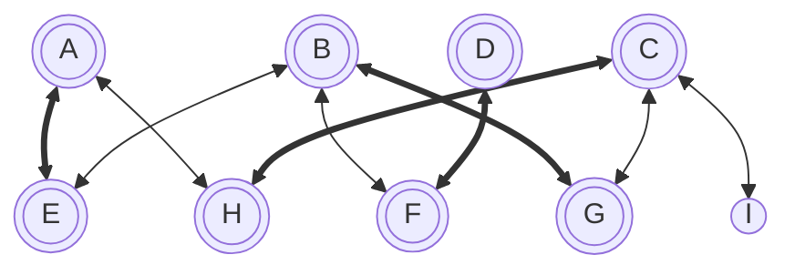
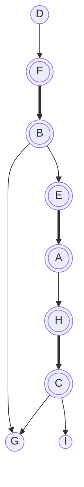
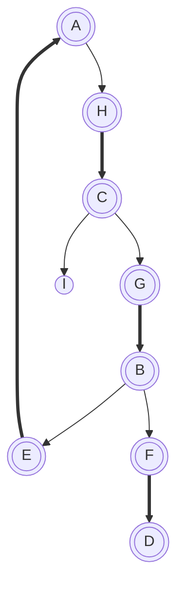

---
tags:
  - OMSCS
  - Algorithms
  - Practice
---
# 7.24 - Direct Bipartite Matching (TODO)
![[Pasted image 20260317232024.png]]
![[Pasted image 20260317232036.png]]

Covered vertices are shown with double circles. Non-covered vertices are shown as single circles. Edges that are in $M$ are shown in bold.

## Notes from Office Hours

## 7.24a - Alternating Path
All must start on $D$ and end on $G$ or $I$. These are the only non-covered vertices. None of these vertices can appear on the middle of the path since they're not covered, and therefore you can't arrive on an edge in $M$ and leave on an edge in $E-M$.

Here's all distinct alternating paths.

- $[D, F, B, E, A, H, C, I]$
- $[D, F, B, E, A, H, C, G]$
- $[D,F,B,G]$

## 7.24b - Maximal Matching
If a bipartite graph has a matching $M$ such there exists no alternating path AP, this could mean a couple of things.

First, there may exist no uncovered vertices in $G$. If this is the case, there's no starting nor ending point for the AP.

There may exist only one vertex $v$ in $G$ which is not covered. If this were the case, then there does not exist a 2nd uncovered vertex that $v$ could connect to via an AP. Further, APs cannot be a cycle. If you have an odd-length cycle in a graph, then the graph is not bipartite. This breaks the requirement that APs be odd in length.

If there are any non-covered vertices which are connected, then $M$ is not maximal, because we can add the edge which connects those vertices to $M$.

If there does exist an alternating path in $G,M$, then we can remove it.  For each edge $e$ along this path
- if $e \in M$, then $M=M-\{e\}$
- otherwise $M=M \cup \{e\}$

Take AP $[D,F,B,G]$ from 7.24a. If we apply this procedure, we take the graph from this:

to this

Each time we apply this procedure, the number of edges in $M$ increases by 1. This is because an AP must be an odd length, and must start and end with an uncovered vertex. Therefore the number of edges in an AP which are in $M$ must be one less than the number of edges in AP which are in $E-M$. 

$$|\{e : e \in M\}|-1=|\{e : e \in (E-M)\}|:e \in AP$$

When we apply this procedure, the edges from AP which are not yet in M become part of M, and the edges from AP which are already in M are removed from M.

We know that we can always apply this procedure to an AP. Given an AP, the first and last vertices are apart of none of the edges in $M$. Each vertex in the interior of the AP is apart of only one edge in $M$. Swapping the edges from one side of each interior vertex to another will not cause any of the vertices to appear in $M$ more than once.

We also know that after applying this procedure to an AP, the number of uncovered vertices in the graph goes down by 2.

Based on all of this, suppose that we have an $M$ which is not optimal in $G$. We can always find an AP in $G,M$, and apply this procedure to increase $|M|$ by one, and decrease the number of uncovered nodes by 2. We can continue applying this procedure until 1 or 0 uncovered vertices remain. At this point, $G,M$ will have no AP, making $M$ a maximal matching of $G$.

## 7.24c - Finding a Matching Path
Something we can do is convert $G$ to a directed graph. We can rebuild $G$ such that

- edges which are in $M$ only connect from a vertex in $V_2$ to a vertex in $V_1$.
- edges which are **not in** $M$ only connect from a vertex in $V_1$ to a vertex in $V_2$.

If we apply this procedure to our example graph, we get this graph, which happens to be a DAG. Finding APs in this graph is now trivial. You can just run BFS from an uncovered node, and traceback from any reachable uncovered vertex.

If we apply this procedure to the variant of G which has no APs, you get this graph. This graph has no AP. You may notice this graph also has a cycle. Curious.

