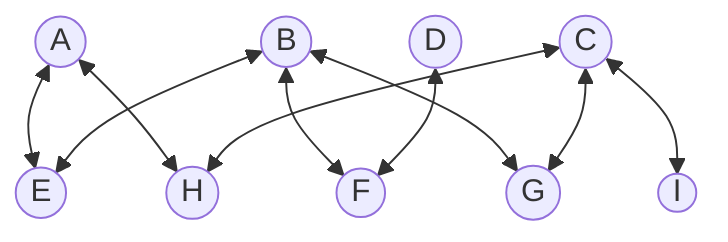
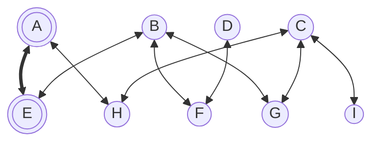
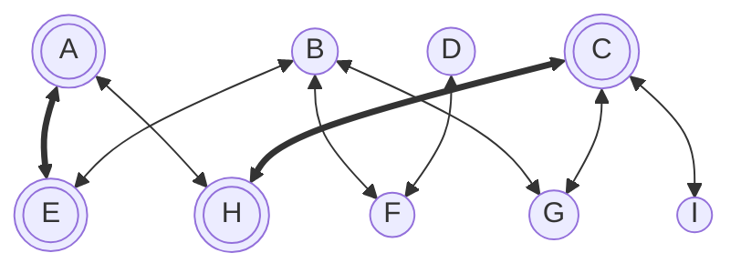
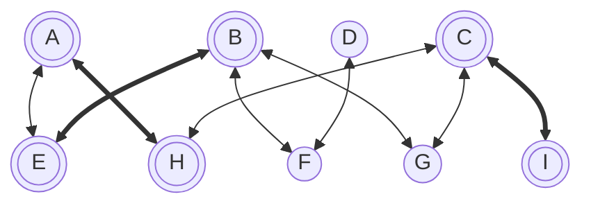
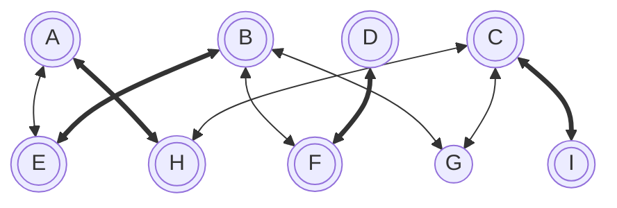
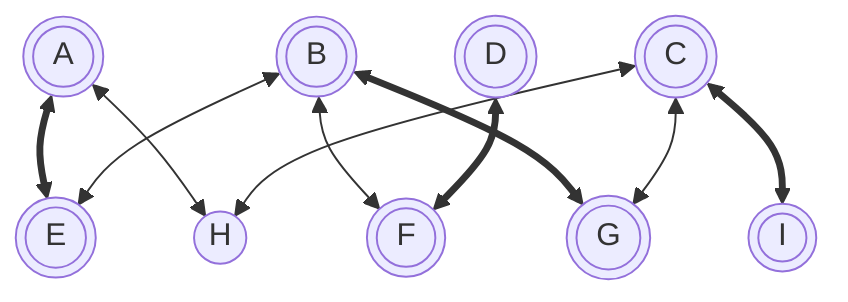

---
tags:
  - OMSCS
  - Algorithms
  - Practice
---
# 7.24 - Example Bipartite Matching
This document shows how to find a maximal matching in a bipartite graph, following the definitions of "Alternating Paths", "Matching Set", "Covered Vertex", and "Maximal Matching" from Practice Problem [[7.24 - Example Bipartite Matching]].

Following an iterative procedure of modifying edges along an alternating path in G, we can start with any G that has a sub-maximal matching set $M$ and arrive at a maximal matching set for G.

We will start with this bipartite graph G, which has an empty matching set ($M=\emptyset$), and therefore no covered vertices.

In this graph, every pair of connected vertices is an Alternating Path (AP) in G. We can arbitrarily select $AP=[A,E]$ as our first AP in G. If we then take all of the edges $e \in AP$, we can add them to $M$ if $e \notin M$ or remove $e$ from $M$ if $e \in M$.

This results in the following graph. Edges in $M$ are bold. Covered vertices are shown as double circles.

We can then apply this procedure again, selecting 2 arbitrary uncovered vertices in G and finding an AP between them. For this iteration, we will pick another easy example: $AP=[H,C]$. Since $HC$ is not already in $M$, we can add it, resulting in the graph shown below.

There still exists APs in G, so we can apply this procedure again. Here are all of the APs that currently exist in G.

- $[G,B]$
- $[B,F]$
- $[D,F]$
- $[I,C,H,A,E,B]$
- $[G, C, H, A, E, B]$

This time we will pick a long AP: $AP=[I,C,H,A,E,B]$. For each of these edges, we alternate its membership within $M$

- Add $IC$ to $M$
- Remove $CH$ from $M$
- Add $HA$ to $M$
- Remove $AE$ from $M$
- Add $EB$ to $M$

This leaves us with the graph below.

Each time we apply this procedure, we first find an AP in G. An AP always has odd length, starts with an edge which is not in $M$, and ends with an edge that is not in $M$. For each subsequent edge in the AP, that edge alternates between being in $M$ and not in $M$. For a given AP of length $2k+1$, the AP has $k$ edges which are in $M$, and $k+1$ edges which are not in $M$. Therefore, we end up removing $k$ edges from $M$, and adding $k+1$ edges to $M$. This results in $|M|$ increasing by 1 each iteration. This also always results both of the endpoints of the AP becoming covered in G after applying this procedure.

Every step of the process increases the amount of G which is covered by $M$, without violating $M$ being defined as a "matching set."

After running the previous iteration, $[F,D]$ is the only AP which exists in G. Applying the procedure to this AP, we end up with this graph.

This leaves us with $M=[AG, EB, FD, CI]$. All **covered** vertices only appear once in $M$, meaning that $M$ is still a valid matching for $G$. We also have just vertex $G$ as the only **uncovered** vertex in G. There cannot exist any other APs in G, because an AP must have odd length. Since G is bipartite, we can't have an AP which starts and ends with a single vertex.

Therefore, $M=[AG, EB, FD, CI]$ is a "maximal matching" for G.

Other valid maximal matchings exist for $G$, including $M=[AE, BG, DF, CI]$, leaving $H$ as the only uncovered vertex in G. Since there do not exist any APs in G, we cannot optimize the solution further, making this $M$ another maximal matching of G.

