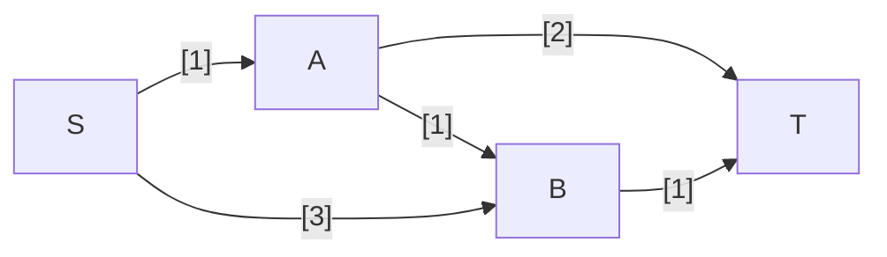

---
tags:
  - OMSCS
  - Algorithms
  - Practice
---
# 7.25 - The Dual of Maximum Flow
Consider the following network with edge capacities.

1. Write the problem of finding the maximum flow from S to T as a linear program.
2. Write down the dual of this linear program. There should be a dual variable for each edge of the network and for each vertex other than $S,T$.

## Max-Flow as LP
This is a laborious process in which we remodel the flow network as a series of equalities, which must then be converted to inequalities to satisfy the format of an LP. We can introduce variables for the in/out flow for each vertex ($S_o,A_i,A_o,B_i,B_o,T_i \ge 0$), but someone on the course forum showed that we can shortcut a little bit by encoding those flows directly from edge to edge.

- Objective: $\max \{AT + BT\}$
- s.t.
	- $SA,SB,AB,AT,BT \ge 0$
	- $SA \le 1$
	- $SB \le 3$
	- $AB \le 1$
	- $AT \le 2$
	- $BT \le 1$
	- $SA = AB + AT$
		- $SA - AB - AT = 0$
		- $SA - AB - AT \le 0$
		- $-SA + AB + AT \le 0$
	- $SB + AB = BT$
		- $SB+AB-BT=0$
		- $SB+AB-BT \le 0$
		- $-SB-AB+BT \le 0$

$$
	\begin{matrix}
		\max\{c^Tx\} \\
		Ax \le b \\
		x \ge 0 \\
		
	\end{matrix} \space\space
	x=\begin{bmatrix}SA \\ SB \\ AB \\ AT \\ BT\end{bmatrix} \space\space
	c=\begin{bmatrix}0 \\ 0 \\ 0 \\ 1 \\ 1\end{bmatrix}
	\space\space
	b=\begin{bmatrix}1 \\ 3 \\ 1 \\ 2 \\ 1 \\ 0 \\ 0 \\ 0 \\ 0\end{bmatrix}
	\space\space
	A=\begin{bmatrix}
		1 & 0 & 0 & 0 & 0 \\
		0 & 1 & 0 & 0 & 0 \\
		0 & 0 & 1 & 0 & 0 \\
		0 & 0 & 0 & 1 & 0 \\
		0 & 0 & 0 & 0 & 1 \\
		1 & 0 & -1 & -1 & 0 \\
		-1 & 0 & 1 & 1 & 0 \\
		0 & 1 & 1 & 0 & -1 \\
		0 & -1 & -1 & 0 & 1 \\
	\end{bmatrix}
$$

## Dual LP
$$
	\begin{matrix}
		\min\{b^Ty\} \\
		A^Ty \ge c \\
		y \ge 0 \\
		
	\end{matrix} \space : \space
	y=\begin{bmatrix}y_1 \\ y_2 \\ y_3 \\ y_4 \\ y_5 \\ y_6 \\ y_7 \\ y_8 \\ y_9 \end{bmatrix} \space\space
	c=\begin{bmatrix}0 \\ 0 \\ 0 \\ 1 \\ 1\end{bmatrix}
	\space\space
	b=\begin{bmatrix}1 \\ 3 \\ 1 \\ 2 \\ 1 \\ 0 \\ 0 \\ 0 \\ 0\end{bmatrix}
	\space\space
	A=\begin{bmatrix}
		1 & 0 & 0 & 0 & 0 \\
		0 & 1 & 0 & 0 & 0 \\
		0 & 0 & 1 & 0 & 0 \\
		0 & 0 & 0 & 1 & 0 \\
		0 & 0 & 0 & 0 & 1 \\
		1 & 0 & -1 & -1 & 0 \\
		-1 & 0 & 1 & 1 & 0 \\
		0 & 1 & 1 & 0 & -1 \\
		0 & -1 & -1 & 0 & 1 \\
	\end{bmatrix}
$$
