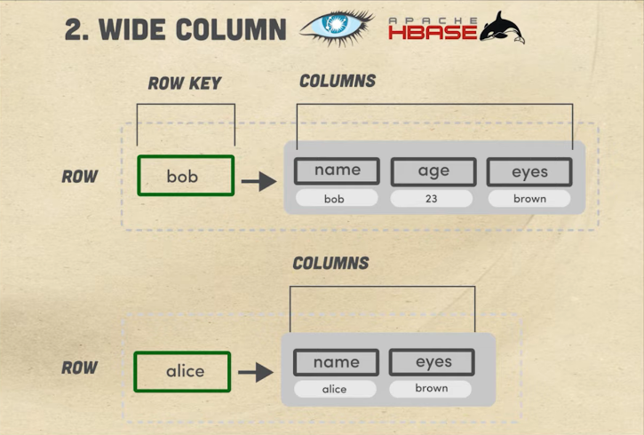

# Database Paradigms

- Contains notes on "7 Database Paradigms" video from "Fireship" on YouTube: https://www.youtube.com/watch?v=W2Z7fbCLSTw
- Database paradigms listed in order of "least to most" complex

## Key-Value Database

Popular vendors include Redis, Memcached, etcd, AWS ElastiCache.

Database is structured as a set of keys that point to single values. You can read and write data using SET/GET commands. Typically does not support queries.

In Redis/Memcached/ElastiCache, all of the data is held in RAM. Limits the data that can be stored, but improves access time. Best for caching data.

## Wide Column Database

Popular vendors include Cassandra, Apache HBASE

Like a key-value database with a 2nd dimension. Outer layer is the key set. Each key points to a column family. Makes it possible to group data together, but there's no schema. Data can be unstructured.

Query language is called CQL. Can't use joins.

Given the simplicity, it's easy to scale.

Best for time-series data, historical records, high-write/low-read. IoT. Weather. Netflix uses it to store the shows each user has watched.

## Document Database

Popular vendors include MongoDB, Firestore, DynamoDB, CouchDB

Database is oriented around "documents", which are containers for key-value pairs. Unstructured and no schema. Documents can be grouped together in collections. Fields within a collection can be indexed. Collections can be organized in a logical hierarchy.

Data is denormalized. Reads are easy. Writes are harder.

Best for apps, games, IoT. Terrible for highly linked data (graphs and denormalized data)

## Relational Database

Popular vendors include (oh god) Postgres, MySQL, MSSQL, OracleDB, AWS RDS, Azure SQL, Snowflake

Most popular type of database by far. General use. Data can be extremely denormalized. Data organized into tables within a schema. Each table typically has a primary key. Tables that link other tables use "foreign keys" which reference keys in other tables.

Query these DBs with multiple variants of SQL.

ACID: Atomicity, Consistency, Isolation, Durability

ACID-compliance means any queries that affect the data in the base will follow these rules. Network hiccups? Don't worry about it.

Hard to scale, but don't you worry, there are plenty of vendors offering managed services who are ready to take your money.

Great for most (all) applications. Bad for unstructured data.

## Graph Database

Popular vendors: Neo4j, Dgraph

Data is represented as nodes and the relationships between them.

Many-to-many relation in a relational database: You set up a table with 2+ columns containing foreign keys for 1+ tables.

In a graph database, many-to-many is kind of the whole point, so you don't need a middleman table. 

Best for modelling graphs on the disk instead of just in-memory, knowledge graphs, recommendation engines, connected/linked data, Resource Description Framework (RDF)

## Search Database / Search Engine

Popular vendors: elastic search, Solr, Lucene, algolia, meilisearch

From a developer perspective, feels similar to a document database. On the backend, the database will pull keywords out of documents, and build an index from those keywords, creating a search index.

A good variant will rank results, handle typos, do other seemingly Google-y things.

Can be expensive at scale. Adds value to user experience. Typeahead search-boxes are a great example.

## Other Notable DB Types

- Data Warehouse
- Time-series database
- Multi-Model Database
  - Don't want to use more than one database? Pick one that has the features/drawbacks of 2 or more, at the same time!
  - Example: FaunaDB
