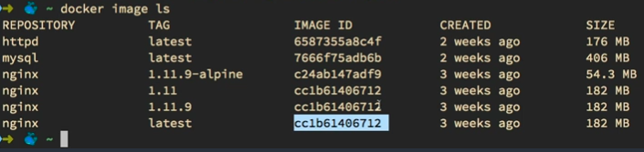

# All* About Docker Hub

https://hub.docker.com

Similar in style to a default repository for a package management system like
the ones used by pip, apt, npm, or nuget.

## Official Docker Images

Anyone can create an account in Docker Hub and post their own images on the hub.
Docker ALSO has their own images. You can tell if an official image is an
official image, because the name will not contain a slash. All other images are
labeled with:

`<author-name>/<image-name>`

The official images are built, tested, and maintained by a team that works at
Docker.

## Alpine

Alpine is a distro of Linux that is very small, very popular on the Docker hub.

## Tagging

Important note, images aren't necessarily "named". An image is named using a
unique image id, which refers to some hash of the image's contents, possibly
relative also to the image's parent layers.

More accurately is that images are "tagged". Also, one discrete image can be
referred to by multiple tags. This is to support workflows where you specify
only the first part of a version string, so you keep getting updates until a
breaking change is made. Alternatively, once you're ready for production, you
can specify the specific point release of the product, so it does not update
itself to versions that have not been tested.

The tagging system is mentioned here, because it provides a sort of versioning
contract between image producers on the hub, and image consumers using the hub.
